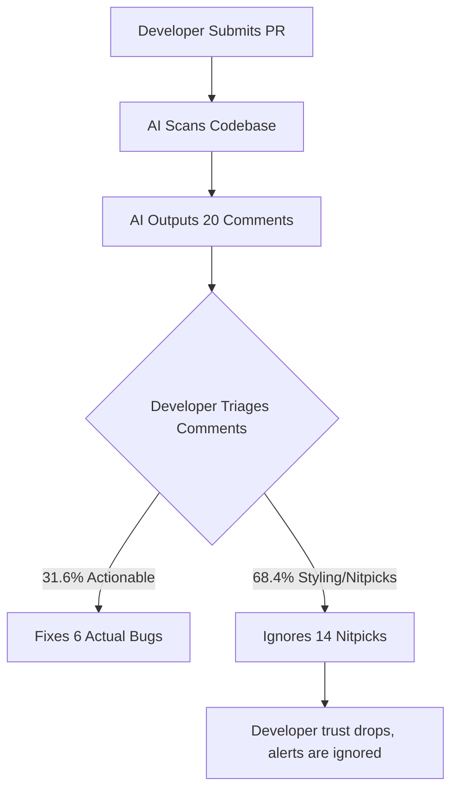

Automating code reviews using large language models is a double-edged sword. While models like **GPT-5.6 Soul** are highly capable of scanning codebases and identifying security flaws, they can also generate a high volume of minor styling comments.

When evaluated as an automated code reviewer, GPT-5.6 Soul scored a low **31.6% in actionable precision**. This means that without strict output filters, developers are hit with a high volume of nitpicks, leading to alert fatigue. 

In this guide, we outline best practices to filter out automated code review noise and keep developer pipelines efficient.

---

## The Danger of Low Precision: Alert Fatigue

In software testing, precision measures how many of the identified issues are actually valid and actionable. When precision drops, developer trust drops with it:



If developers are forced to read through dozens of styling recommendations for every pull request, they will begin to ignore the automated alerts entirely, missing actual critical bugs in the process.

---

## Designing a Gating Schema

To reduce automated code review noise, development teams should implement a gating schema that separates style checks from logic audits:

| Audit Category | Tool / Engine | Blocking Status | Action Required |
| :--- | :--- | :--- | :--- |
| **Formatting & Syntax** | Traditional Linters (ESLint, Prettier) | Blocking | Automated code formatting |
| **Dependency Security** | Static Analysis (Snyk, Dependabot) | Blocking | Update vulnerable packages |
| **Logic & Complexity** | GPT-5.6 Soul (Filtered) | Non-Blocking | Optional developer review |
| **Performance Bottlenecks** | GPT-5.6 Soul (High-Priority) | Non-Blocking | Address performance flaws |

---

## Technical Implementation: Filtering Comments

Below is a configuration schema for a GitHub Action workflow designed to filter out minor styling comments. The script runs the GPT-5.6 API but restricts outputs to issues flagged as `high` or `critical` priority:

```yaml
name: AI Code Review Filter
on:
  pull_request:
    types: [opened, synchronize]

jobs:
  review:
    runs-on: ubuntu-latest
    steps:
      - name: Checkout Code
        uses: actions/checkout@v4

      - name: Run Filtered AI Review
        env:
          OPENAI_API_KEY: ${{ secrets.OPENAI_API_KEY }}
        run: |
          node -e "
            const reviewResults = getAiComments();
            // Filter out minor formatting or style nitpicks
            const actionableComments = reviewResults.filter(
              c => c.category === 'security' || c.severity === 'high'
            );
            postToGithub(actionableComments);
          "
```

### Prompt Instructions for Noise Reduction
When configuring your system prompt for GPT-5.6, include strict instructions to limit styling comments:

```json
{
  "role": "system",
  "content": "You are a senior code reviewer. Focus exclusively on security vulnerabilities, memory leaks, performance bottlenecks, and logical errors. Do not make comments regarding formatting, naming conventions, or style preferences, as these are handled by local linters."
}
```

---

## Pros & Cons of AI Code Reviews

### Pros
- Identifies complex security flaws and logical bugs that static linters miss.
- Runs continuously, providing instant feedback on open pull requests.
- Helps onboard new developers by explaining architectural context.

### Cons
- High rate of minor comments (68.4% noise rate) can cause developer frustration.
- Increases API token costs on large pull requests.

---

## Editorial Image Asset Checklist

### 1. Hero Image
- **Prompt**: Minimalist 3D layout showing PR code lines with comment cards floating in white and sky-blue space. Clean interfaces, natural daylight, soft shadows.
- **Filename**: `/images/best-practices/code-review-noise-hero.png`
- **Alt Text**: Pull request code review comments floating in a clean UI window.
- **Caption**: Figure 1: Setting strict filters reduces automated code review noise.
- **Placement**: Directly below the frontmatter title.
- **Purpose**: Represents the code review and noise-reduction theme of the article.
- **Aspect Ratio**: 16:9

### 2. Supporting Visual 1
- **Prompt**: Sleek 3D funnel icon displaying code alerts entering the top, and only clean checked cards exiting the bottom. Mint and white borders.
- **Filename**: `/images/best-practices/funnel-filter.png`
- **Alt Text**: Graphic representation of a code filter funnel.
- **Caption**: Figure 2: Funneling AI alerts to isolate actionable issues.
- **Placement**: Under the "Designing a Gating Schema" section.
- **Purpose**: Visualizes comment filtering logic.
- **Aspect Ratio**: 16:9

### 3. Supporting Visual 2
- **Prompt**: Modern UI layout showing a toggle button labeled "Filter Style Nitpicks" switched to the active state, sky-blue lighting.
- **Filename**: `/images/best-practices/filter-toggle.png`
- **Alt Text**: UI dashboard showing style filters toggled on.
- **Caption**: Figure 3: Setting style-filtering rules in the review dashboard.
- **Placement**: Under the "Prompt Instructions for Noise Reduction" section.
- **Purpose**: Demonstrates user controls for alert filtering.
- **Aspect Ratio**: 16:9

---

## Key Takeaways
- **Precision Limits**: GPT-5.6 Soul has a 31.6% code review precision score, requiring developers to implement strict filters.
- **Separate Tooling**: Route formatting and syntax checks to traditional linters, and reserve AI for logic audits.
- **Non-Blocking Alerts**: Configure automated comments as non-blocking suggestions to maintain development speed.
- **Strict Prompting**: Direct the model to ignore style and formatting preferences in the system prompt.

---

## Internal Linking Opportunities
- Check out the launch details in our [GPT-5.6 Autonomous Engine launch explainer](file:///c:/Users/jasva/Nadhebe/src/content/youtube-articles/gpt-5-6-autonomous-engine.md).
- Understand safety regulations in our [GPT-5.6 Safety Delay analysis](file:///c:/Users/jasva/Nadhebe/src/content/news/gpt-5-6-trump-administration-safety-delay.md).
- Compare performances in our [GPT-5.6 vs. Claude Fable 5 Benchmark Review](file:///c:/Users/jasva/Nadhebe/src/content/comparisons/gpt-5-6-vs-claude-fable-5-benchmarks.md).
- Learn about API cost optimization in [GPT-5.6 Cost Optimization best practices](file:///c:/Users/jasva/Nadhebe/src/content/best-practices/gpt-5-6-api-cost-optimization.md).
