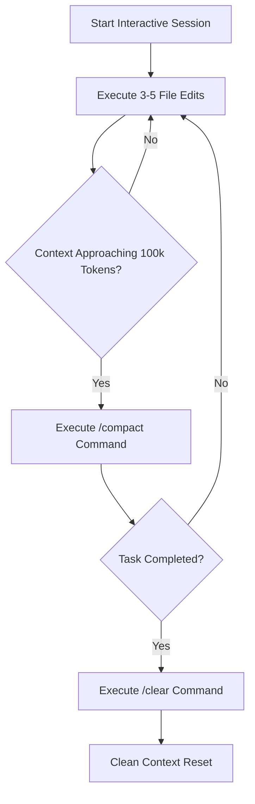

The transition from casual **"Vibe Coding"** (typing loose prompts into AI chat boxes and blindly accepting code edits) to **Production AI Engineering** requires disciplined workflows, strict security guardrails, and deterministic context management. When running Anthropic's **Claude Code** CLI on enterprise software repositories, unconstrained agent execution can lead to git history corruption, accidental credential exposure, or runaway API token costs.

This production engineering guide outlines verified best practices for hardening `CLAUDE.md`, configuring path-specific rules, implementing safety hooks, managing token hygiene, and isolating parallel features using git worktrees.

---

## 🏗️ 1. Hardening `CLAUDE.md` Architecture

A common anti-pattern is pasting a 2,000-line documentation manual directly into `CLAUDE.md`. Because `CLAUDE.md` is loaded at the beginning of *every* agent turn, bloated context files consume API budget and degrade reasoning precision.

```text
Optimized File Architecture:
├── ./CLAUDE.md                  # Root instructions (Strictly under 200 lines)
└── ./.claude/rules/             # Path-specific conditional rules (Loaded on demand)
    ├── api-routes.md            # Active only when touching src/routes/
    ├── database.md              # Active only when touching src/db/
    └── frontend.md              # Active only when touching src/components/
```

### The 200-Line Rule for Root `CLAUDE.md`

Keep root `CLAUDE.md` focused on core build commands and absolute non-negotiable guidelines:

```markdown
# Repository Engineering Rules

## Build & Test Verification
- Run All Tests: `npm test`
- Build Artifacts: `npm run build`
- TypeCheck & Lint: `npm run typecheck`

## Core Architecture Principles
- Language: TypeScript 5.3+ (Strict Mode)
- Framework: React 19 + Next.js App Router
- DB Access: Prisma ORM (`prisma/schema.prisma`)

## Critical Security Guidelines
- NEVER log API keys, JWT tokens, or raw user passwords.
- All public REST endpoints must enforce rate limiting middleware.
- Import Schema Reference: @prisma/schema.prisma
```

---

## 🎯 2. Modular Path-Specific Rules (`.claude/rules/*.md`)

Path-specific rules allow you to specify guidelines that only load when Claude Code accesses files matching designated glob patterns.

Create `.claude/rules/database.md`:

```markdown
---
paths:
  - "prisma/**/*.prisma"
  - "src/db/**/*.ts"
---

# Database Operations & Safety Rules
- All schema migrations MUST be non-breaking (add nullable columns before dropping old fields).
- Never execute raw SQL queries (`prisma.$executeRaw`) without explicit parameterization.
- Always include `createdAt` and `updatedAt` timestamps on new model definitions.
```

---

## 🔒 3. Security & Permission Guardrails

To prevent accidental data loss or unauthorized shell execution on production infrastructure, configure explicit permission policies in `.claude/settings.json`.

```json
{
  "model": "sonnet",
  "effortLevel": "high",
  "permissions": {
    "defaultMode": "manual",
    "allow": [
      "Read",
      "GrepSearch",
      "DirectoryList",
      "Bash(git status)",
      "Bash(git diff *)",
      "Bash(npm test)"
    ],
    "deny": [
      "Bash(rm -rf *)",
      "Bash(sudo *)",
      "Bash(git push --force *)",
      "Bash(chmod *)"
    ]
  }
}
```

### Enforcing Non-Interactive Script Restrictions

When executing headless automation scripts (`claude -p`), explicitly constrain allowed tools via flags:

```bash
# Safe CI lint runner
claude -p "Lint code and fix auto-fixable errors" \
  --allowedTools "Read,Edit,Bash(npm run lint)" \
  --disallowedTools "Bash(rm:*),Bash(sudo:*)" \
  --max-budget-usd 2.00
```

---

## 🧹 4. Context Hygiene & Token Cost Management

As multi-file editing sessions progress, historical context accumulates. Unmanaged sessions increase API token costs exponentially.



### Essential Context Commands

1. **`/compact [focus]`**: Summarizes active conversation history, purging stale file reads while retaining active goals and diff summaries.
2. **`/clear`**: Resets conversation history to zero between unrelated tasks. Never carry debugging context from Task A into Task B.
3. **`/context`**: Visualizes what files and prompt turns are occupying your active context window.

---

## 🌿 5. Parallel Feature Isolation with Git Worktrees (`-w`)

Never run experimental agentic refactoring directly inside your primary working git directory. Using Claude's native git worktree flag (`-w`) creates an isolated working copy:

```bash
# Launch Claude in an isolated git worktree branch
claude -w refactor-auth-module "Refactor JWT verification middleware to use Jose library"
```

Benefits of Worktree Isolation:
* Your primary working branch remains 100% clean and operational.
* If Claude takes an undesirable architectural path, simply discard the worktree branch without needing complex `git reset` maneuvers.
* Run multiple background agents (`claude --bg`) in parallel across separate worktree branches.

---

## Related Guides & Workflows

* For complete command cheat sheets, explore [Claude Code Cheat Sheet](/tutorials/claude-code-cheat-sheet-commands-shortcuts).
* For complete beginner to power user walkthroughs, read [Claude Code Complete Guide](/guides/claude-code-complete-guide-beginner-to-power-user).
* For custom skill authoring, see [How to Build Custom Claude Code Skills](/tutorials/how-to-build-custom-claude-code-skills).
