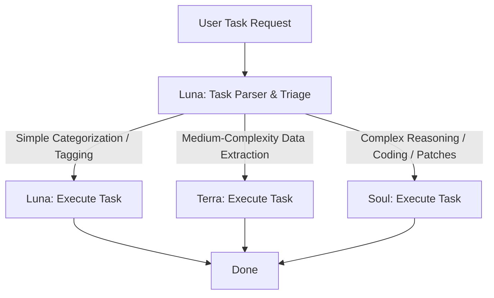

With the release of OpenAI’s **GPT-5.6 Autonomous Engine**, software teams have access to unprecedented reasoning capabilities. However, these agentic workflows are highly resource-intensive. If left unchecked, autonomous agents running in continuous loops can rapidly deplete API limits and exceed cloud budgets.

In this guide, we analyze the economics of the GPT-5.6 tiers (Soul, Terra, and Luna) and outline best practices to optimize your **cost-per-solved-task** metrics.

---

## Token Price vs. Solved Task Efficiency

When evaluating API costs, developers often focus on the list price per million tokens. In agentic workflows, however, this metric is secondary to task efficiency.

### Code Rabbit Benchmark Analysis
A study conducted by **Code Rabbit** evaluated model execution costs over a set of complex software tasks:
- **Terra ($2.50/M input, $15.00/M output)**: Re-evaluated and retried tasks repeatedly, consuming an average of **55,000 output tokens** per solved task due to iteration loops.
- **Soul ($5.00/M input, $30.00/M output)**: Solved 63% of tasks on the first attempt, consuming only **20,000 output tokens** per task.

```mermaid
gantt
    title Iteration Steps vs. Token Burn
    dateFormat  X
    axisFormat %s
    section Terra Model (Iterative Loop)
    Step 1: Code Generation (Fail) :active, 0, 15
    Step 2: Error Correction (Fail) :crit, 15, 35
    Step 3: Verification (Pass)     : 35, 55
    section Soul Model (Direct Resolution)
    Step 1: Planning & Resolution (Pass) :active, 0, 20
```



Despite costing twice as much per token, **Soul was the more cost-effective option** because it avoided expensive iteration loops.

---

## The Tiered Routing Playbook

To optimize costs without sacrificing performance, developers should implement a tiered routing architecture:



### 1. Luna (Preprocessing & Triage)
- **Use Case**: Initial input triage, basic tokenization, repository file listing, and simple text tagging.
- **Cost Impact**: Bypasses expensive reasoning tiers during early preprocessing stages.

### 2. Terra (Balanced Production Processing)
- **Use Case**: Extracting structured metadata, executing unit tests, and writing simple, boilerplate helper code.
- **Cost Impact**: Delivers previous-generation quality at half the cost.

### 3. Soul (High-Reasoning Resolution)
- **Use Case**: Designing system architectures, resolving complex merge conflicts, and writing core logical functions.
- **Cost Impact**: Resolves difficult tasks quickly, avoiding expensive retry loops.

---

## Practical Implementation: Routing Code

Below is a practical example of routing tasks to different tiers using a wrapper function:

```javascript
import { OpenAI } from "openai";
const openai = new OpenAI();

async function routeTask(taskDescription, complexity) {
  let modelName = "gpt-5.6-luna"; // Default budget option
  
  if (complexity === "high") {
    modelName = "gpt-5.6-soul";
  } else if (complexity === "medium") {
    modelName = "gpt-5.6-terra";
  }
  
  const response = await openai.chat.completions.create({
    model: modelName,
    messages: [{ role: "user", content: taskDescription }]
  });
  
  return response.choices[0].message.content;
}
```

---

## Editorial Image Asset Checklist

### 1. Hero Image
- **Prompt**: Sleek 3D illustration of floating dollar signs translating into green, mint, and blue optimization layers. White background, soft shadows, natural daylight, professional technology publication style.
- **Filename**: `/images/best-practices/gpt-5-6-cost-hero.png`
- **Alt Text**: Dollar signs floating and morphing into clean optimization sheets.
- **Caption**: Figure 1: Balancing cost per token with logical resolution efficiency.
- **Placement**: Directly below the frontmatter title.
- **Purpose**: Visually represents the financial and optimization focus of the article.
- **Aspect Ratio**: 16:9

### 2. Supporting Visual 1
- **Prompt**: Clean schematic showing three database canisters color-coded in light blue, mint, and soft purple, representing the data volume routed through Luna, Terra, and Soul. Natural lighting.
- **Filename**: `/images/best-practices/routing-canisters.png`
- **Alt Text**: Cylindrical routing nodes showing the tier volumes.
- **Caption**: Figure 2: Workload volume distribution across model tiers.
- **Placement**: Under the "Tiered Routing Playbook" section.
- **Purpose**: Visualizes workload volume allocation.
- **Aspect Ratio**: 16:9

### 3. Supporting Visual 2
- **Prompt**: Glassmorphic UI dashboard showing token usage spikes returning to a flat line when optimization rules are applied. Soft shadows, light gray background.
- **Filename**: `/images/best-practices/token-stabilization.png`
- **Alt Text**: UI dashboard showing normalized cost graphs.
- **Caption**: Figure 3: Token consumption trends before and after routing optimization.
- **Placement**: Under the "Token Price vs. Solved Task Efficiency" section.
- **Purpose**: Demonstrates the real-world impact of cost optimization strategies.
- **Aspect Ratio**: 16:9

---

## Key Takeaways
- **Efficiency Over Price**: Evaluate models based on the tokens needed to solve a task, not just the list price per token.
- **Tiered Routing**: Establish pipelines that use Luna for triage, Terra for processing, and Soul for logic verification.
- **Breakpoint Caching**: Set explicit cache breakpoints to save up to 80% on prompt costs.
- **Loop Gating**: Monitor agent loop limits to prevent runaway compute costs on difficult tasks.

---

## Internal Linking Opportunities
- Check out the launch highlights in our [GPT-5.6 Autonomous Engine explainer](file:///c:/Users/jasva/Nadhebe/src/content/youtube-articles/gpt-5-6-autonomous-engine.md).
- Understand safety regulations in our [GPT-5.6 Safety Delay analysis](file:///c:/Users/jasva/Nadhebe/src/content/news/gpt-5-6-trump-administration-safety-delay.md).
- Read benchmark scores in [GPT-5.6 vs. Claude Fable 5 Comparison](file:///c:/Users/jasva/Nadhebe/src/content/comparisons/gpt-5-6-vs-claude-fable-5-benchmarks.md).
- Reference the [Programmatic Tool Calling Developer Guide](file:///c:/Users/jasva/Nadhebe/src/content/tools/gpt-5-6-programmatic-tool-calling.md).
