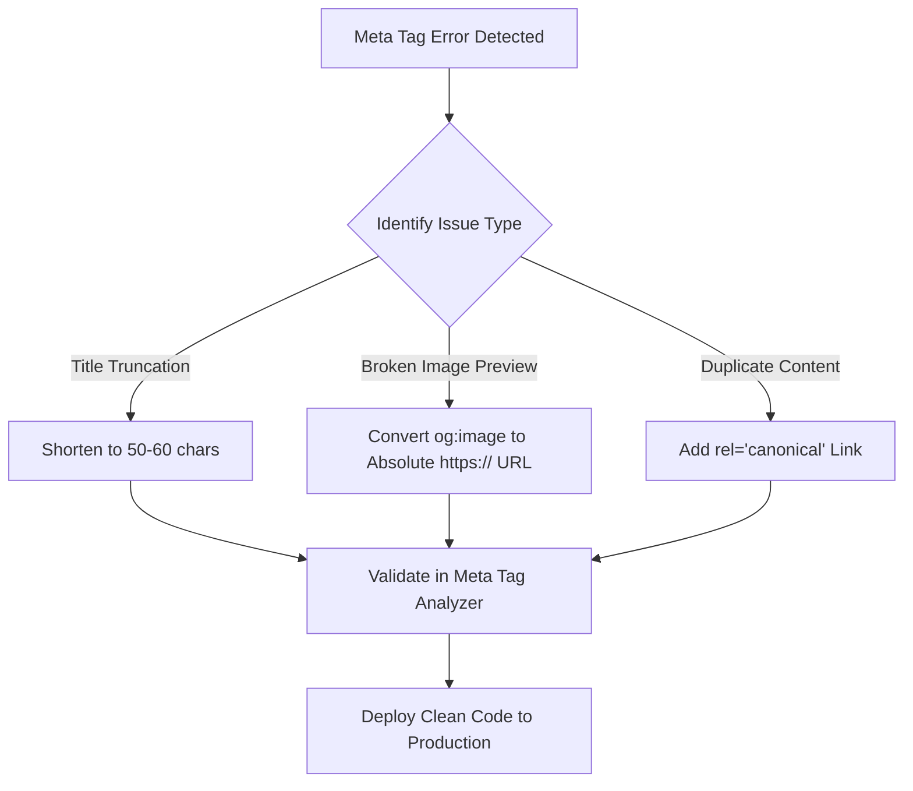

# How to Fix Common Meta Tag Errors: Audit & Resolution Guide

Incorrect HTML head metadata can severely hurt a site's search visibility, lead to duplicate content penalties, and cause embarrassing broken image previews when pages are shared on social media.

This guide identifies the top 5 common meta tag errors and provides actionable code fixes using our client-side [Meta Tag Analyzer](/tools/meta-tag-analyzer/).

---

## Top 5 Common Meta Tag Errors & Solutions

### 1. Title Tag Truncation (Exceeding ~60 Characters)
- **The Issue**: Title tags over 60 characters (or 600 pixels) are truncated by Google, replacing key words with `...`.
- **The Fix**: Trim filler words and place core keywords first. Use our [Meta Tag Analyzer](/tools/meta-tag-analyzer/) to verify character length before deploying.

### 2. Relative URLs in `og:image` Tags
- **The Issue**: Using relative paths like `og:image="/images/hero.jpg"` causes social bots (Slack, Discord, LinkedIn) to fail image fetching.
- **The Fix**: Always provide absolute URLs including protocol: `https://nadhebe.com/images/hero.jpg`.

### 3. Missing or Misconfigured Canonical Tags
- **The Issue**: Query parameters (`?ref=twitter` or `?page=1`) cause crawlers to treat duplicate views as separate thin pages.
- **The Fix**: Include a self-referencing canonical tag pointing to the clean canonical URL:
  ```html
  <link rel="canonical" href="https://nadhebe.com/tools/meta-tag-analyzer/" />
  ```

### 4. Multiple `<title>` Tags in HTML Head
- **The Issue**: Dynamic component frameworks (Astro, Next.js, React Helmet) can accidentally inject multiple `<title>` nodes.
- **The Fix**: Audit your layout wrapper templates to ensure only one root `<title>` tag exists.

### 5. Missing `twitter:card` Property
- **The Issue**: If `twitter:card` is omitted, X (Twitter) defaults to a small square thumbnail instead of a full-width banner.
- **The Fix**: Add `<meta name="twitter:card" content="summary_large_image" />`.

---

## Resolution Matrix

| Error | Root Cause | Impact | Recommended Solution |
| :--- | :--- | :--- | :--- |
| **Title Truncation** | > 60 chars / > 600px | Lower CTR in SERPs | Shorten title to 50–60 characters |
| **Broken og:image** | Relative URL path | Plain text social shares | Convert to absolute `https://` URL |
| **Duplicate Content** | Missing canonical tag | Lower domain authority | Add self-referencing `rel="canonical"` |
| **Small Twitter Card** | Missing `twitter:card` | Low social engagement | Set `twitter:card` = `summary_large_image` |

---

## Troubleshooting Workflow



---

## Frequently Asked Questions

### How long does it take for social platforms to update cached meta tags?
Platforms like LinkedIn and X cache metadata for 24–48 hours. Use their official post inspector tools to clear URL caches after deploying fixes.

### Can I test fixes before pushing to production?
Yes. Copy your updated metadata into our client-side [Meta Tag Analyzer](/tools/meta-tag-analyzer/) to verify character limits and card previews locally.

---

## References

1. Google Search Central — *Title and Snippet Optimization*: https://developers.google.com/search/docs/appearance/title-link
2. Twitter Developer Documentation — *Cards Markup*: https://developer.twitter.com/en/docs/twitter-for-websites/cards/overview/markup
