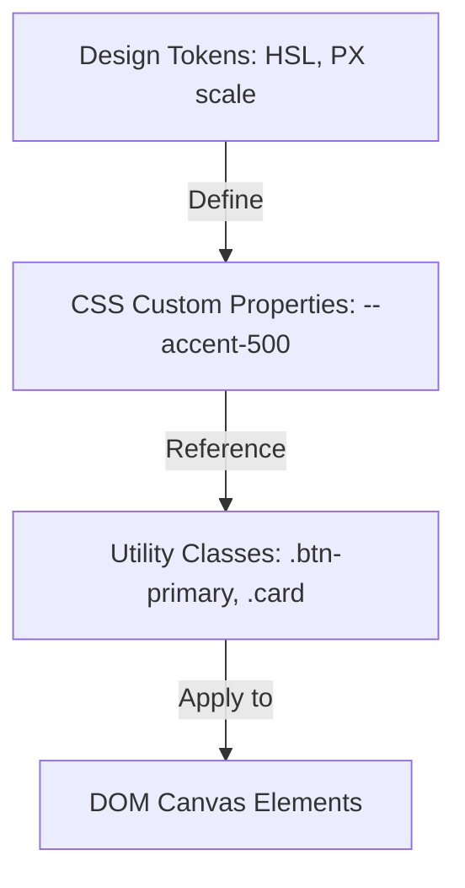

Maintaining visual consistency across dozens of marketing pages is a common challenge for web development teams. Visual page builders often generate irregular styling values because designers apply custom offsets directly to elements.

**Instatic CMS** resolves this by enforcing a strict **class-based style system** backed by design tokens. In this guide, we outline best practices for structuring spacing, typography, and color tokens inside Instatic.

---

## The Token Hierarchy Model

To build a design system that scales, structure your styles starting with base design variables and building up to utility classes:

By binding your visual selections to custom variables instead of applying static values, you ensure that adjustments to layout variables automatically update throughout the project.

---

## Structuring the Core Selector Scale

When designing in Instatic, follow these rules:

1. **Avoid Magic Numbers**: Restrict your canvas selections to a spacing scale based on multiples of 4 or 8 (e.g., `4px`, `8px`, `12px`, `16px`, `24px`, `32px`, `48px`, `64px`, `96px`).
2. **Utilize semantic colors**: Define your color variables by their function (`--bg-surface`, `--text-ink2`, `--border-default`) rather than visual values (`--light-grey`). This makes configuring dark mode toggles straightforward.
3. **Keep selectors single-responsibility**: Instead of building deep, compound classes (e.g., `.feature-card-title-bold`), combine basic typography styles and element utility wrappers (e.g., `.text-h3` and `.font-semibold`).

---

## Class Selector Auditing Checklist

Before publishing changes, use this class hygiene checklist inside the **Selector Manager**:

- [ ] Ensure all custom classes are prefixed or grouped by category (e.g., `btn-`, `card-`, `nav-`).
- [ ] Delete orphaned selectors containing no properties.
- [ ] Audit responsive styles at desktop, tablet, and mobile breakpoints simultaneously using Instatic's **multi-breakpoint canvas**.
- [ ] Confirm all color selectors reference CSS variables (`var(--...)`) instead of static hex values.

---

## Editor Workflow

Watch how class-based styling rules are managed inside the Instatic editor:

  <iframe src="https://www.youtube.com/embed/O88lL2v3JkA" title="YouTube video player" frameborder="0" allow="accelerometer; autoplay; clipboard-write; encrypted-media; gyroscope; picture-in-picture" allowfullscreen class="w-full h-full"></iframe>

---

## Key Takeaways
- **Class-Based Consistency**: Shared stylesheets prevent page-specific visual regressions.
- **Tokens Over Static Styling**: Defining custom variables simplifies scaling site updates.
- **Selector Cleanliness**: Use the Selector Manager regularly to delete unused classes.
