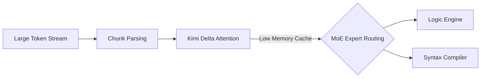

The arrival of Moonshot AI's **Kimi K3** brings an incredibly powerful feature to developer workflows: a native **1 million token context window**. This capacity allows engineers to load entire repositories, extensive database schemas, and multi-thousand-page technical documentations directly into the model's memory.

However, massive context size introduces new challenges. If not managed properly, developers will encounter latency spikes, context dilution (where the model overlooks details near the middle of the context), and increased API token costs. 

Below are the industry-standard best practices for structuring and optimizing codebase ingestion in Kimi K3.

---

## 1. Structure Codebase Ingestion with XML-Style Tags

When feeding multiple files into Kimi K3, avoid pasting raw code blocks sequentially without delimiters. Use structured XML-style container blocks. This makes it easier for Kimi K3's attention layers to locate specific code boundaries:

```xml
<file path="src/services/issue.service.ts">
// Code goes here
</file>

<file path="src/app.ts">
// Code goes here
</file>
```

By explicitly declaring the file path and surrounding the code inside matching tags, the model's retrieval mechanism (needle-in-a-haystack search) can resolve cross-file dependencies and imports near-instantly.

---

## 2. Leverage Kimi Delta Attention (KDA) Routing

Kimi K3 implements a hybrid attention structure called **Kimi Delta Attention (KDA)** to manage the memory footprint of its Mixture of Experts routing.



To optimize KDA routing:
* **Place Instruction Last**: Always place the execution prompt (e.g., "Analyze the code above and fix the issue in `issue.service.ts`") at the **very bottom** of your prompt, after the context files. Models recall instructions better when they are closest to the output generation step.
* **Define System Anchors**: Anchor key rules inside a dedicated system prompt rather than placing them inline in the middle of long source files.

---

## 3. Limit Context Dilution & Token Waste

Just because Kimi K3 *can* process 1 million tokens does not mean every query should saturate the window. 
1. **Prune Dependencies**: Exclude folders like `node_modules`, `dist`, `.astro`, or lock files (`package-lock.json`) from the context.
2. **Context Compression**: Prioritize typescript definition files (`.d.ts`) or structural exports when the model only needs to understand module signatures rather than actual line-by-line implementations.
3. **Reset State**: Clear the conversation session history between unrelated tasks. Maintaining a massive context across multiple chat turns compounds input token costs and increases latency.

Following these practices ensures your agentic development workflows remain high-speed, cost-effective, and accurate.

---

## Image Asset Specifications

* **Hero Image**:
  - **Prompt**: "Editorial minimal graphic showing streams of data nodes aligning into a large central cylinder core, pastel colors, white background."
  - **Filename**: "kimi-k3-best-practices-hero.png"
  - **Alt text**: "Data stream context optimization visualization"
  - **Caption**: "Optimizing code structures for Kimi K3's 1-million-token context window."
  - **Placement**: Top of page
  - **Purpose**: Title hero illustration
  - **Aspect ratio**: 16:9
* **Supporting Visual 1**:
  - **Prompt**: "Abstract clean schema showing XML brackets around code icons, pastel colors, vector graphic design."
  - **Filename**: "code-ingestion-xml-brackets.png"
  - **Alt text**: "XML tags delimiting code inputs diagram"
  - **Caption**: "Using clear delimiters is crucial to prevent context dilution in large files."
  - **Placement**: Under 'Structure Codebase Ingestion' section
  - **Purpose**: Highlight ingestion syntax style
  - **Aspect ratio**: 4:3
* **Supporting Visual 2**:
  - **Prompt**: "Minimalist line graph showing prompt retrieval accuracy over large context sizes, clean graphic, light purple line."
  - **Filename**: "context-accuracy-graph.png"
  - **Alt text**: "Retrieval accuracy over context window graph"
  - **Caption**: "Structured prompts maintain near 100% retrieval accuracy even at the outer limits of the context window."
  - **Placement**: Under 'Leverage Kimi Delta Attention' section
  - **Purpose**: Illustrate retrieval metrics
  - **Aspect ratio**: 4:3
