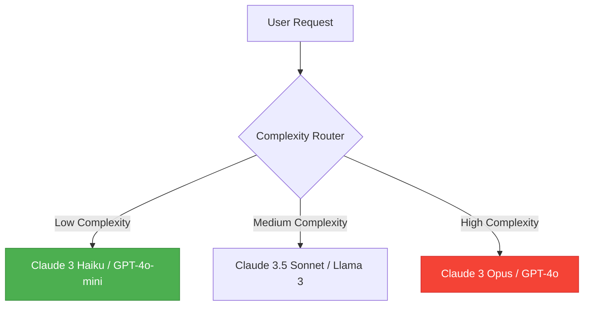

# LLM API Cost Optimization Best Practices

Building applications powered by Large Language Models (LLMs) is easier than ever, but scaling them cost-effectively remains a massive challenge. When a single heavy API call can cost upwards of $0.05, a sudden influx of users can turn a side project into a financial disaster.

To build sustainable AI products, you must treat **Token Management** with the same rigor you apply to memory management in traditional software engineering. In this guide, we break down the definitive best practices for optimizing your LLM API costs.

## 1. Implement Prompt Caching

If you are using Anthropic's Claude 3.5 Sonnet/Opus or the latest OpenAI endpoints, **Prompt Caching** is no longer optional—it is mandatory.

Providers now allow you to cache the prefix of your prompt (usually the system instructions and large reference documents). When you hit the cache, you receive discounts ranging from **50% to 90%** on input tokens.

**Actionable Steps:**
- Move all static instructions, JSON schemas, and large RAG context blocks to the very top of your prompt.
- Add cache breakpoints (`cache_control: {"type": "ephemeral"}`) at the end of these static blocks.
- Never include dynamically changing variables (like user IDs or current timestamps) above your cache breakpoints.

## 2. Dynamic Model Routing (The "Waterfall" Method)

Not every user query requires the reasoning capabilities of a massive frontier model. In many applications, up to 70% of requests are simple formatting, extraction, or basic conversational turns.

### Implementing a Router
Build a lightweight classifier (or use a fast, cheap model) to determine the complexity of an incoming prompt.

**Cost Comparison:**
Using Claude 3 Haiku is roughly **12x cheaper** than Sonnet, and **60x cheaper** than Opus. By routing simple tasks to Haiku, you drastically lower your average cost-per-call.

## 3. Strict Context Window Management (RAG Optimization)

Retrieval-Augmented Generation (RAG) is notorious for inflating input costs. Developers often blindly retrieve the top 10 chunks from a vector database and append them to the prompt, wasting thousands of tokens on irrelevant context.

### Semantic Chunking and Re-ranking
Instead of returning massive chunks, use smaller, more precise semantic chunks. After initial retrieval, run the results through a **Re-ranker** (like Cohere Re-rank or BGE-Reranker). A re-ranker evaluates the relevance of each chunk and allows you to confidently pass only the top 2 or 3 highly-relevant chunks to your expensive LLM.

## 4. Chat History Summarization

In long-running chat sessions, the token count grows linearly with every turn. By turn 20, you might be sending 15,000 tokens of history just to ask a 10-token question.

**The Solution:**
Implement a rolling summarization agent. When the chat history exceeds a certain token threshold (e.g., 4,000 tokens), trigger a cheap, fast model to summarize the history into a dense 300-token paragraph. Replace the old messages with this summary.

## 5. Use Structured Outputs Properly

When asking an LLM to output JSON, developers historically added lengthy explanations of the JSON format into the system prompt ("You must output valid JSON. Use this key, do not include markdown..."). 

Today, you should use native **Structured Outputs** (OpenAI's `response_format` or Anthropic's Tool Use). These enforce the schema at the API level, meaning you can strip out hundreds of tokens of "begging" from your system prompt.

*(Need to estimate how much your prompts are costing? Use our [Token Calculator](https://nadhebe.com/tools/token-calculator/) to forecast your daily API spend).*

## Conclusion

Optimizing LLM costs is a multi-layered engineering problem. By combining Prompt Caching, Intelligent Model Routing, precise RAG retrieval, and history summarization, you can reduce your API bill by over 80%—allowing you to scale your AI applications profitably.
