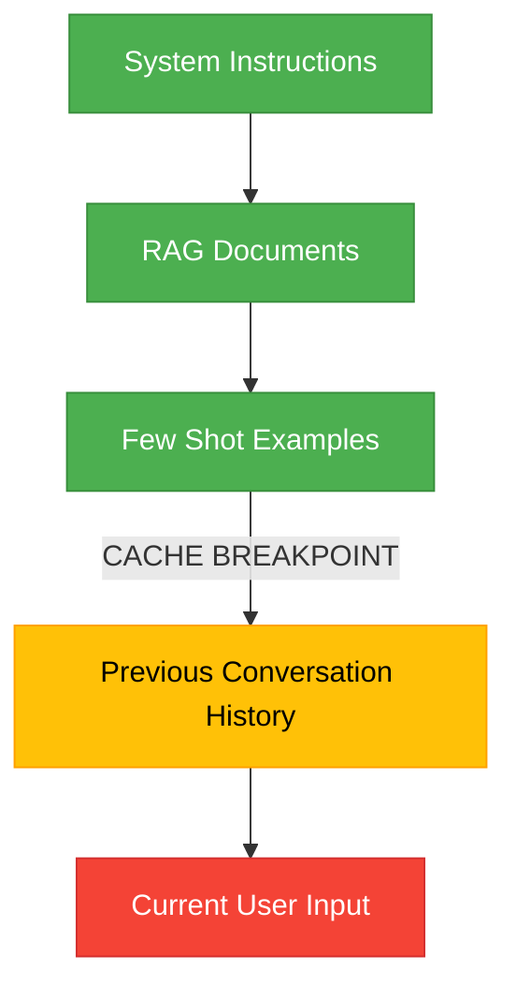

# Prompt Caching Best Practices for Claude 3.5 Sonnet & Opus

As Large Language Models (LLMs) continue to support massive context windows (up to 200,000 tokens for Claude models), developers face two major bottlenecks: **high latency** (Time-To-First-Token) and **exorbitant API costs**. 

Sending a 100k-token codebase to Claude for every single chat turn is computationally expensive and slow. Enter **Prompt Caching**. 

Anthropic's Prompt Caching feature allows you to cache large blocks of context—like system instructions, reference documents, or massive codebases—so they only need to be processed once. In this guide, we will explore the best practices for implementing prompt caching with Claude 3.5 Sonnet and Claude 3 Opus.

## Understanding the Economics of Caching

Before diving into the technical implementation, you must understand the financial incentive. Anthropic structures their caching pricing in three tiers:

| Token Type | Pricing (per 1M tokens) |
| :--- | :--- |
| **Base Input** (Uncached) | Standard Rate (e.g., $3.00 for Sonnet) |
| **Cache Write** (First time) | +25% Premium (e.g., $3.75 for Sonnet) |
| **Cache Read** (Subsequent) | **-90% Discount** (e.g., $0.30 for Sonnet) |

> [!TIP]
> **The Break-Even Point:** Because writing to the cache costs 25% more, you only need to reuse a cached prompt **once** to break even. Any subsequent reuse results in massive cost savings.

## How Prompt Caching Works

Prompt caching works on a **prefix basis**. The API looks at your request from the very beginning (the system prompt) down to the end. If the exact sequence of tokens matches a sequence that has recently been cached, it retrieves the state from memory instead of re-computing it.

### The 5-Minute Rule
Anthropic's cache has a Time-To-Live (TTL) of **5 minutes**. Every time a cached prefix is read, the 5-minute timer resets. For high-traffic applications, a popular cache can theoretically stay alive indefinitely.

## Best Practice 1: Structure Your Prompts Logically

Because caching works strictly via prefix matching, the order of your prompt matters immensely. You must put static, unchanging content at the very top, and dynamic, user-specific content at the very bottom.

### The Optimal Prompt Structure

1. **System Prompt & Instructions** (Static - Cacheable)
2. **Knowledge Base / Documents** (Static - Cacheable)
3. **Few-Shot Examples** (Static - Cacheable)
4. **Chat History** (Semi-Dynamic - Partially Cacheable)
5. **Latest User Query** (Dynamic - Never Cached)



In the diagram above, the green blocks represent static content that should be flagged for caching. 

## Best Practice 2: Strategic Placement of Cache Breakpoints

To utilize caching in the Anthropic API, you must add the `cache_control: {"type": "ephemeral"}` parameter to specific blocks of text in your API request. You can define up to **4 cache breakpoints** per request.

### Example Implementation (Python)

```python
import anthropic

client = anthropic.Anthropic()

response = client.messages.create(
    model="claude-3-5-sonnet-20240620",
    max_tokens=1024,
    system=[
        {
            "type": "text",
            "text": "You are an expert financial analyst. " * 5000, 
            "cache_control": {"type": "ephemeral"} # Breakpoint 1
        }
    ],
    messages=[
        {
            "role": "user",
            "content": "Analyze the latest earnings report."
        }
    ]
)
```

By placing the `cache_control` marker at the end of the large system prompt, you tell Claude to index everything up to that point.

## Best Practice 3: Caching Chat History

For long-running conversations, you can cache the chat history itself. However, since the history changes with every turn, you must handle the breakpoints carefully.

**The Multi-Turn Strategy:**
Instead of caching the entire history, place your cache breakpoint on the *second-to-last* message. 

1. Turn 1: User asks Q1 -> Assistant answers A1. (No cache hit possible yet).
2. Turn 2: User asks Q2. You send `[Q1, A1 (Cache breakpoint here), Q2]`. 
3. Turn 3: User asks Q3. You send `[Q1, A1, Q2, A2 (Cache breakpoint here), Q3]`.

This rolling cache strategy ensures that the bulk of the historical context is always loaded from memory, reducing TTFT to a fraction of a second, even for 50k+ token conversations.

## Best Practice 4: Avoid Cache Invalidation Traps

The most common mistake developers make is accidentally invalidating their own cache. Remember: the prefix must be a **byte-for-byte exact match**.

> [!WARNING]
> A single altered character—even an invisible trailing space or a dynamically inserted timestamp at the top of your prompt—will instantly invalidate the entire cache, forcing a costly cache write.

- **Do not include timestamps** or unique request IDs in the system prompt.
- **Do not randomly shuffle** your RAG documents or few-shot examples.
- **Ensure deterministic JSON serialization** if you are passing structured data into the static portion of the prompt.

## Conclusion

Prompt caching is not just a nice-to-have feature; it is a mandatory architectural pattern for any production-grade LLM application dealing with large context windows. By carefully structuring your prompts, utilizing rolling breakpoints for chat history, and rigorously avoiding accidental cache invalidations, you can slash your Claude API bills by up to 90% while delivering lightning-fast experiences to your users.
