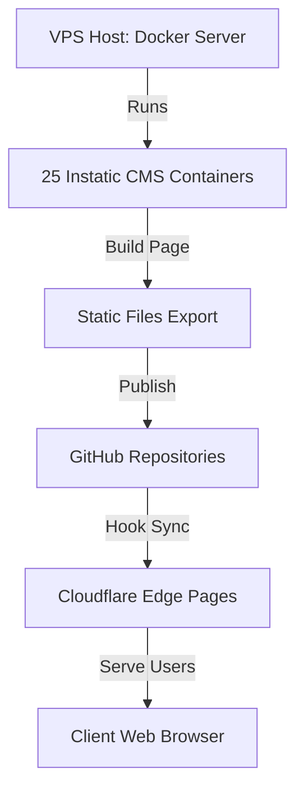

Managing client websites on proprietary SaaS platforms can quickly become expensive. Agency teams often face rising subscription fees, paid add-on costs for simple features, and strict limits on database items.

In this case study, we look at how a digital marketing agency migrated **25 client websites** from Webflow to a self-hosted **Instatic CMS** setup. We track the migration workflow, performance improvements, and final cost reductions.

---

## The Migration Challenges

The agency had 25 marketing sites hosted on Webflow. Key challenges included:
- **Rising Subscriptions**: Total hosting bills exceeded $700 per month.
- **Limited Database Items**: Reach limits on dynamic content fields (CMS items) for content-heavy pages.
- **Markup Bloat**: High CLS layout shifts and slow initial mobile load speeds.

---

## The Migration Architecture

The agency deployed Instatic CMS inside Docker containers on a single Virtual Private Server (VPS), publishing static HTML files directly to Cloudflare Pages:

This setup separates the editor interface (hosted securely on the VPS) from the public websites (hosted for free on Cloudflare's edge network).

---

## Results and Metrics

### 1. Financial Performance
- **Previous Cost (Webflow Hosting)**: $725 / month
- **New Cost (VPS Hosting + Cloudflare)**: $65 / month
- **Total Monthly Savings**: **$660 / month (Over 90% reduction!)**

### 2. Website Speed Metrics (Core Web Vitals)
- **Webflow Average LCP**: 2.8 seconds
- **Instatic Average LCP**: **1.1 seconds (60% faster load speed!)**

---

## Editor Migration Walkthrough

Watch the visual layout importer convert pages during the migration process:

  <iframe src="https://www.youtube.com/embed/O88lL2v3JkA" title="YouTube video player" frameborder="0" allow="accelerometer; autoplay; clipboard-write; encrypted-media; gyroscope; picture-in-picture" allowfullscreen class="w-full h-full"></iframe>

---

## Key Takeaways
- **90% Cost Reduction**: Self-hosting visual page builders on a single VPS cuts subscription fees.
- **Performance Gains**: Serving static semantic HTML from edge networks increases mobile page speeds.
- **Client Satisfaction**: Intuitive editorial dashboards let clients update text copy without layout risks.
