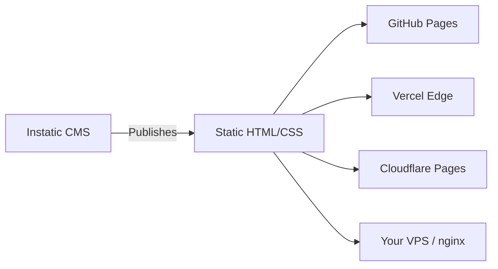

Visual page builders have revolutionized how agencies build websites. However, legacy tools often lock your team into proprietary infrastructure and billing cycles. 

In this comparison, we contrast the open-source challenger **Instatic** against **Webflow** and **Framer** to help you choose the right visual compiler for your engineering workflow.

---

## Benchmark Comparison Matrix

| Criteria | Instatic | Webflow | Framer |
| :--- | :--- | :--- | :--- |
| **Hosting Model** | **Self-hosted (Any VPS/CDN)** | Proprietary Hosting | Proprietary Hosting |
| **Pricing** | **Free (MIT License)** | $14–$49+/mo per site | $15–$40+/mo per site |
| **Output Format** | **Semantic Static HTML/CSS** | Dynamic Server / HTML export | React Single Page App |
| **Extensibility** | **TypeScript SDK Plugins** | Integration APIs | Framer Components (React) |
| **Database** | **SQLite / PostgreSQL** | Webflow CMS | Framer CMS |

---

## Code Quality and Cleanliness

One of the largest issues with proprietary visual builders is output bloat.

### Webflow
Webflow exports massive styling configurations and script components. While the HTML is relatively semantic, the accompanying stylesheet often accumulates unused CSS rules over long design iterations.

### Framer
Framer compiles websites as React Single Page Applications (SPAs). While this enables rich animations, it increases the initial JavaScript payload, causing layout shifts (CLS) and slower load times on low-power mobile devices.

### Instatic
Instatic outputs **clean static HTML and CSS**. It uses a class-based utility generator where styles map to a centralized token set, eliminating unused rules and avoiding heavy runtime libraries.

---

## Deployment Flexibility

Webflow and Framer require you to host on their systems to preserve CMS features (like blogging and forms). If you export the code, you lose dynamic CMS endpoints.

Instatic separates the editor server from the static output site. You run the editor on a VPS (costing ~$5/month for unlimited sites), and publish the resulting HTML directly to free CDNs like Cloudflare Pages or Netlify.

---

## When to Choose Which

### Choose Instatic if:
- You want zero recurring subscription fees and self-hosting freedom.
- Clean semantic code output is critical for your SEO performance.
- You need built-in AI layout assistance without paid add-ons.

### Choose Webflow if:
- You require enterprise ecommerce engines natively integrated.
- You want a visual canvas backed by a large template ecosystem.

### Choose Framer if:
- Your product marketing relies on complex, interactive transitions.
- Your design workflow starts and ends in Figma.

Watch the editor workflow in action to compare interfaces:

  <iframe src="https://www.youtube.com/embed/O88lL2v3JkA" title="YouTube video player" frameborder="0" allow="accelerometer; autoplay; clipboard-write; encrypted-media; gyroscope; picture-in-picture" allowfullscreen class="w-full h-full"></iframe>

---

## Key Takeaways
- **True Portability**: Instatic does not restrict you to proprietary CDNs or hosting providers.
- **Performance Excellence**: Semantic static output loads faster than React-hydrated Single Page Apps.
- **SaaS-grade Permissions**: Built-in team permission audits allow agency control over client access.
---
