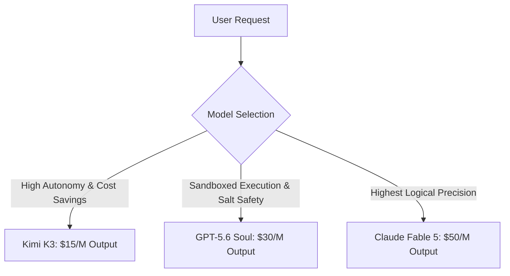

The release of Moonshot AI's **Kimi K3** marks a new chapter in the open-weight AI model landscape. With a massive **2.8 trillion parameters** structured as a Mixture of Experts (MoE), Kimi K3 is designed to compete directly with proprietary flagships like OpenAI’s **GPT-5.6 Soul** and Anthropic’s **Claude Fable 5**.

This article presents a technical evaluation comparing these three frontier models across four crucial dimensions: Architecture & Scale, Economics & API Costs, Context & Vision Capabilities, and Agentic Reasoning Performance.

---

## Technical Comparison Matrix

| Specification / Model | Kimi K3 | GPT-5.6 Soul | Claude Fable 5 |
| :--- | :--- | :--- | :--- |
| **Model Type** | **Open-Weight / API** | Closed API | Closed API |
| **Total Parameters** | **2.8 Trillion (MoE)** | Proprietary (MoE) | Proprietary |
| **Context Window** | **1,000,000 tokens** | 1,000,000 tokens | 200,000 tokens |
| **Native Vision** | **Yes** | Yes | Yes |
| **Input Cost / Million** | **$3.00** | $6.00 | $10.00 |
| **Output Cost / Million**| **$15.00** | $30.00 | $50.00 |
| **Primary Advantage** | **Cost-to-performance ratio**| Native sandbox safety (Salt)| Deep contextual synthesis |

---

## 1. Architecture and Scale

Kimi K3 is the largest open-weight model ever released, featuring **2.8 trillion total parameters**. In comparison, GPT-5.6 Soul and Claude Fable 5 keep their exact parameter counts closed, though industry estimates place them in similar high-density MoE brackets. 

Kimi K3 uses **Kimi Delta Attention (KDA)** to manage its 1-million-token context window efficiently. This reduces KV-cache memory pressure, making it much more practical to deploy at scale compared to traditional dense attention mechanisms.

---

## 2. Economics and API Costs

From an economic perspective, Kimi K3 is highly disruptive:
* **Output Pricing**: At **$15.00 per million output tokens**, Kimi K3 runs at exactly half the cost of GPT-5.6 Soul ($30/M) and is roughly 70% cheaper than Claude Fable 5 ($50/M).
* **Self-Hosting Options**: Once Moonshot AI releases the full model weights, enterprise organizations can run Kimi K3 on private clouds, bypassing token-based pricing entirely for highly sensitive datasets.

For high-throughput developer tasks, such as running continuous agentic coding loops or batch processing millions of code symbols, Kimi K3 provides a massive economic advantage.

---

## 3. Context Length and Vision

* **Context Window**: Kimi K3 matches GPT-5.6 Soul with a **1 million token context window**, which is five times larger than Claude Fable 5's 200k limit. This makes both Kimi K3 and GPT-5.6 Soul far better suited for ingesting entire repositories or large PDF directories.
* **Vision Performance**: All three models feature native vision capabilities. While Claude Fable 5 still maintains a slight edge in complex geometric layout analysis, Kimi K3 is highly proficient at reading screenshots and UI layouts to output matching code coordinates.

---

## 4. Agentic Reasoning and Synthesis

On internal reasoning and coding benchmarks, Moonshot AI reports that Kimi K3 ranks just behind Claude Fable 5 and GPT-5.6 Soul. 
* **GPT-5.6 Soul** benefits from native parallel sandboxing and its **"Salt"** safety runtime, which allows it to run and self-correct shell commands safely.
* **Claude Fable 5** leads in writing clean logic from abstract design concepts.
* **Kimi K3** delivers comparable results when guided by structured prompting frameworks (such as the 4-Pillar Prompt Spec), making it a highly competitive engine for agentic workflows when cost and code ownership are taken into account.

---

## Image Asset Specifications

* **Hero Image**:
  - **Prompt**: "Three polished minimalist glass prisms of varying shapes standing on a white table, refracting blue, violet, and green studio lighting, clean background."
  - **Filename**: "llm-comparison-hero.png"
  - **Alt text**: "Kimi K3 vs Claude Fable 5 vs GPT-5.6 Soul comparison prisms"
  - **Caption**: "Evaluating Kimi K3 against proprietary market leaders on scale, cost, and capability."
  - **Placement**: Top of page
  - **Purpose**: Title header asset
  - **Aspect ratio**: 16:9
* **Supporting Visual 1**:
  - **Prompt**: "Modern clean bar chart comparison visualization, blue, green, and purple bar columns, white background, minimalist presentation template."
  - **Filename**: "benchmark-comparison-chart.png"
  - **Alt text**: "Token cost and context capacity benchmark comparisons chart"
  - **Caption**: "Cost and context capacity comparison across frontier models."
  - **Placement**: Under 'Technical Comparison Matrix' section
  - **Purpose**: Compare API economics visually
  - **Aspect ratio**: 4:3
* **Supporting Visual 2**:
  - **Prompt**: "Clean flowchart diagram, showing an agentic logic routing decision tree, pastel shapes, clean vector graphics."
  - **Filename**: "agentic-loop-design.png"
  - **Alt text**: "Agentic loop flowchart routing diagram"
  - **Caption**: "Agentic loops benefit significantly from Kimi K3's combination of low token costs and large context window."
  - **Placement**: Under 'Agentic Reasoning and Synthesis' section
  - **Purpose**: Detail workflow optimization choice
  - **Aspect ratio**: 4:3
