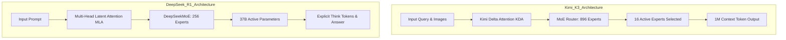
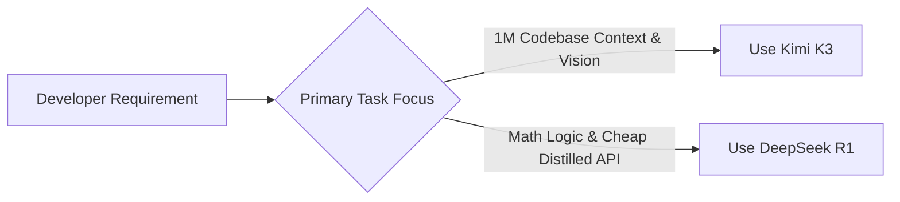

Choosing between **Kimi K3** and **DeepSeek R1** depends on whether your workload requires **massive multi-modal 1M context engineering** or **cost-optimized chain-of-thought math and logic reasoning**. Moonshot AI's **Kimi K3** (2.8 trillion total parameters) uses a sparse 896-expert Mixture of Experts (MoE) architecture with native vision capabilities and Kimi Delta Attention (KDA) to manage 1,000,000 token inputs. **DeepSeek R1** (671 billion total parameters, 37 billion active) relies on Multi-Head Latent Attention (MLA) and reinforcement learning (RL) to produce explicit `<think>` reasoning chains for complex logic, offering lower token costs and lightweight distilled model variants.

This guide compares both flagship open-weight models across verifiable specs, attention mechanisms, context limits, and self-hosting constraints.

---

## Verifiable Specification Matrix

| Parameter / Feature | Kimi K3 (Moonshot AI) | DeepSeek R1 (DeepSeek) |
| :--- | :--- | :--- |
| **Release Date** | July 2026 | January 2025 |
| **Total Parameters** | 2.8 Trillion (Sparse MoE) | 671 Billion (Sparse MoE) |
| **Active Parameters / Token** | 16 Active Experts (out of 896) | 37 Billion Active (out of 256 experts) |
| **Attention Architecture** | Kimi Delta Attention (KDA Linear Hybrid) | Multi-Head Latent Attention (MLA) |
| **Native Context Window** | **1,000,000 Tokens (1M)** | **128,000 Tokens (128k)** |
| **Native Vision Support** | Yes (Integrated multimodal vision input) | No (Text-only base; vision via separate Qwen-VL) |
| **Reasoning Mechanism** | Native multi-step agentic execution & planning | Explicit Chain-of-Thought (`<think>` blocks) |
| **Distilled Model Variants** | None (Full 2.8T MoE weight package) | 6 Distilled models (Llama 8B/70B, Qwen 1.5B–32B) |
| **Open-Weight License** | Open-weight weights & hosted API access | MIT License (Fully open weights & code) |
| **Official Hosted API Price** | $3.00 / 1M Input · $15.00 / 1M Output | $0.55 / 1M Input · $2.19 / 1M Output |

---

## 1. Architectural & Attention Mechanism Trade-offs

### Kimi K3: Kimi Delta Attention (KDA) for 1M Context Scaling
Processing 1 million tokens in standard Transformer self-attention requires quadratic $O(N^2)$ memory and computation. **Kimi K3** addresses this with **Kimi Delta Attention (KDA)**—a hybrid linear attention layer that compresses intermediate key-value states while maintaining long-range token retrieval accuracy.

* **Linear Memory Scaling**: KDA reduces KV cache memory consumption during long-context inference, enabling full codebase context loading on single node clusters.
* **Native Multimodality**: Image pixels are tokenized directly within the KDA pipeline, allowing developers to pass full UI design wireframes alongside 500k lines of frontend code. For best practices on structuring long prompts, see [Maximizing Kimi K3: Best Practices for 1M Token Context Windows](/best-practices/kimi-k3-context-window-best-practices).

### DeepSeek R1: Multi-Head Latent Attention (MLA) & CoT Reasoning
**DeepSeek R1** compresses the KV cache using **Multi-Head Latent Attention (MLA)**, which projects Key and Value vectors into a low-rank latent space.

* **VRAM Efficiency**: MLA reduces GPU memory requirements by up to 90% compared to standard MHA during prefill.
* **RL-Trained Chain-of-Thought**: DeepSeek R1 was trained using large-scale Reinforcement Learning without initial supervised fine-tuning (SFT). The model automatically emits structured `<think>` reasoning traces before generating final responses, making logic debugging transparent.

---

## 2. Target Use Cases & Capability Profiles

### Choose Kimi K3 for:
1. **Large Repository Ingestion**: Ingesting entire static sites, frameworks, or database schemas in a single prompt. Read our release overview in [Moonshot AI Releases Kimi K3](/news/kimi-k3-moonshot-ai-release).
2. **Frontend & Visual Web Engineering**: Converting visual screenshots or wireframes into working HTML/CSS/JS components.
3. **Multi-Agent Swarm Orchestration**: Running complex multi-step workflows across wide context windows. Compare model tiers in [Kimi K3 vs Claude Fable 5 vs GPT-5.6](/comparisons/kimi-k3-vs-claude-fable-5-vs-gpt-5-6-soul).

### Choose DeepSeek R1 for:
1. **Cost-Sensitive High-Volume Reasoning**: Serving automated reasoning pipelines where $0.55/1M input tokens provides maximum ROI.
2. **Mathematical & Algorithmic Verification**: Problems requiring strict multi-step logical proofs where inspecting `<think>` output is mandatory.
3. **Local & Edge Deployment**: Deploying lightweight 1.5B, 8B, or 14B distilled R1 models locally on consumer GPUs via engines like vLLM or Ollama. For engine choices, review [vLLM vs Ollama Architectural Comparison](/comparisons/vllm-vs-ollama-architectural-comparison).

---

## References & Primary Sources

* [Moonshot AI Kimi K3 Technical Announcement](https://www.kimi.ai)
* [DeepSeek R1 Official Repository & Paper](https://github.com/deepseek-ai/DeepSeek-R1)

---

## Related Kimi K3 & Open-Weight Resources

* Read the full release announcement in [Moonshot AI Releases Kimi K3: The 2.8T Parameter Open-Weight Pioneer](/news/kimi-k3-moonshot-ai-release).
* Learn context optimization techniques in [Maximizing Kimi K3: Best Practices for 1M Token Context Windows](/best-practices/kimi-k3-context-window-best-practices).
* Compare frontier models in [Kimi K3 vs Claude Fable 5 vs GPT-5.6 Soul](/comparisons/kimi-k3-vs-claude-fable-5-vs-gpt-5-6-soul).
* Evaluate local hosting engines in [vLLM vs Ollama Architectural Comparison](/comparisons/vllm-vs-ollama-architectural-comparison).
