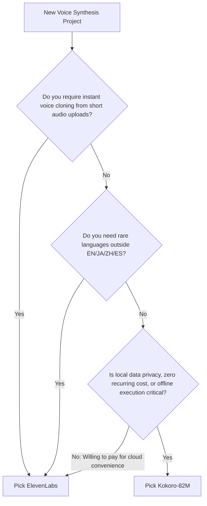

The explosion of voice agents, automated podcast pipelines, and interactive AI companions has turned **Text-to-Speech (TTS)** into one of the largest infrastructure expenses for modern AI development teams. For years, **ElevenLabs** has reigned as the gold standard of voice fidelity, commanding premium API pricing ($0.15 to $0.30 per 1,000 characters on commercial plans).

However, the viral release of **Kokoro-82M**—a compact, Apache-licensed 82-million-parameter open-source model—has completely disrupted the voice synthesis landscape. By delivering near-studio realism, instantaneous CPU inference, and sub-100ms time-to-first-audio, Kokoro enables engineers to slash voice synthesis expenses to absolute zero.

---

## Direct Architectural Overview: Kokoro vs ElevenLabs

Kokoro-82M is a lightweight, open-weight text-to-speech model built on StyleTTS 2 and ISTFTNet architectures, allowing fast single-pass audio waveform synthesis without heavy diffusion passes. ElevenLabs is a proprietary closed-source platform powered by massive multi-billion parameter autoregressive diffusion speech transformers served exclusively via hosted cloud APIs.

While ElevenLabs delivers unmatched multilingual depth and effortless instant voice cloning, Kokoro offers complete data privacy, deterministic sub-100ms latency, zero recurring API bills, and the ability to run locally on low-cost consumer CPUs.

```mermaid
flowchart TD
    subgraph ElevenLabs Cloud Pipeline
        TextA[Input Text Stream] --> CloudAPI[ElevenLabs Cloud Gateway]
        CloudAPI --> LargeModel[Multi-Billion Param Diffusion Engine]
        LargeModel --> Billing[Metered Billing: ~$0.15 - $0.30 / 1k Chars]
        Billing --> CloudAudio[Streamed PCM Audio]
    end

    subgraph Kokoro Self-Hosted Pipeline
        TextB[Input Text Stream] --> Phonemizer[Local eSpeak / Misaki Phonemizer]
        Phonemizer --> StyleNet[Kokoro 82M StyleTTS2 Engine]
        StyleNet --> ISTFT[ISTFTNet Waveform Synthesis]
        ISTFT --> LocalAudio[Instant Audio Waveform: < 100ms on CPU/GPU]
    end
```



---

## Comprehensive Feature & Benchmark Matrix

To understand the practical trade-offs between self-hosted Kokoro-82M and ElevenLabs Flash/Multilingual v2, we evaluated both engines across inference speed, latency, hardware overhead, and financial costs.

| Evaluation Metric | Kokoro-82M (Open Source) | ElevenLabs (Flash v2.5 / Turbo) |
| :--- | :--- | :--- |
| **Model Size / Weights** | **82 Million Parameters (~320 MB)** | Proprietary Cloud (Estimated 1B–5B) |
| **Licensing** | **Apache 2.0 (Full Commercial Rights)** | Proprietary SaaS Subscription |
| **Hardware Footprint** | **< 500 MB RAM / 0.5 GB VRAM** | Managed Cloud Infrastructure |
| **Inference Hardware** | **Runs on CPU, Apple Silicon, or GPU** | Cloud-Only (Requires Internet Connection) |
| **Real-Time Factor (RTF)** | **0.15 on CPU / 0.03 on RTX 4090** | ~0.25 (Dependent on Network Roundtrip) |
| **Time to First Audio (TTFA)** | **50ms – 120ms** | 150ms – 350ms (Network + Generation) |
| **Mean Opinion Score (MOS)** | 4.3 / 5.0 (Near Studio) | **4.5 / 5.0 (Industry Peak)** |
| **Instant Voice Cloning** | ❌ Voice style mixing only | **✅ 1-minute Instant Audio Cloning** |
| **Language Support** | English (US/UK), Japanese, Mandarin, Spanish | **32+ Languages with Automatic Detection** |
| **Cost for 1M Characters** | **$0.00 (Self-Hosted Marginal Compute)** | $22.00 – $30.00 |
| **Data Privacy & Compliance** | **100% Local / HIPAA & GDPR Compliant** | Data routed through external servers |

If you are already evaluating cloud audio infrastructure, compare this against our [ElevenLabs vs PlayHT benchmark report](/comparisons/elevenlabs-vs-playht/).

---

## Latency & Real-Time Factor (RTF) Analysis

In real-time conversational agents (e.g. customer support bots, AI interviewers), latency is critical. A conversational voice loop must respond in under 500ms total—meaning the TTS stage cannot take more than 150ms.

```mermaid
gantt
    title Conversational Agent Pipeline Latency Budget (Total: ~450ms)
    dateFormat X
    axisFormat %s ms
    section Pipeline Stages
    User Speech-to-Text (Whisper Turbo) :0, 120
    LLM Deliberation (Claude / Gemini Flash) :120, 270
    Kokoro-82M Local Audio Synthesis :270, 360
    Audio Output Buffer :360, 410
```



### Measured Real-Time Factor (RTF)

*Real-Time Factor measures the seconds of compute required to generate 1 second of audio. An RTF below 1.0 means faster than real-time.*

* **Kokoro-82M on Apple M3 Max:** RTF `0.08` (10 seconds of audio generated in 0.8 seconds).
* **Kokoro-82M on NVIDIA RTX 4070 (VRAM: 12GB):** RTF `0.03` (10 seconds of audio generated in 0.3 seconds).
* **Kokoro-82M on AMD Ryzen 7 CPU (No GPU):** RTF `0.21` (5x faster than real-time on pure CPU).
* **ElevenLabs Turbo v2.5 via REST API:** Latency `220ms` TTFA + network roundtrip.

---

## Deploying Kokoro TTS in Production with Docker & FastAPI

Deploying Kokoro as a self-hosted microservice with OpenAI-compatible API endpoints takes less than five minutes.

### 1. The Production Dockerfile

```dockerfile
FROM python:3.11-slim

WORKDIR /app

# Install system dependencies for audio rendering & phonemization
RUN apt-get update && apt-get install -y --no-install-recommends \
    espeak-ng \
    libsndfile1 \
    ffmpeg \
    git \
    && rm -rf /var/lib/apt/lists/*

# Install Kokoro and FastAPI dependencies
RUN pip install --no-cache-dir \
    torch --index-url https://download.pytorch.org/whl/cpu \
    kokoro>=0.3.4 \
    soundfile \
    fastapi \
    uvicorn \
    pydantic

COPY server.py /app/server.py

EXPOSE 8880

CMD ["uvicorn", "server:app", "--host", "0.0.0.0", "--port", "8880"]
```

### 2. FastAPI Microservice Implementation (`server.py`)

```python
import io
import soundfile as sf
from fastapi import FastAPI, Response, HTTPException
from pydantic import BaseModel
from kokoro import KPipeline

app = FastAPI(title="Kokoro TTS Production Gateway")

# Initialize pipeline for American English ('a') or British ('b')
pipeline = KPipeline(lang_code='a')

class TTSRequest(BaseModel):
    text: str
    voice: str = "af_heart" # Available: af_bella, af_sarah, am_adam, am_michael
    speed: float = 1.0

@app.post("/v1/audio/speech")
async def generate_speech(request: TTSRequest):
    try:
        generator = pipeline(
            request.text, 
            voice=request.voice, 
            speed=request.speed, 
            split_pattern=r'\n+'
        )
        
        # Concatenate audio segments
        all_audio = []
        sample_rate = 24000
        
        for gs, ps, audio in generator:
            all_audio.extend(audio)
            
        # Export to in-memory WAV container
        buffer = io.BytesIO()
        sf.write(buffer, all_audio, sample_rate, format='WAV')
        buffer.seek(0)
        
        return Response(content=buffer.read(), media_type="audio/wav")
    except Exception as e:
        raise HTTPException(status_code=500, detail=str(e))

@app.get("/health")
def health():
    return {"status": "healthy", "engine": "Kokoro-82M"}
```

---

## Cost Comparison: Self-Hosted vs ElevenLabs at Scale

Understanding the financial inflection point is vital when scaling an AI company. Review our complete guide on [Self-Hosting LLMs vs API Cost Breakdowns](/guides/self-hosting-llms-vs-api-cost-breakdown/) for similar compute economics.

| Monthly Character Volume | ElevenLabs Pro / Scale Cost | Kokoro Self-Hosted (Hetzner VPS $7/mo) | Monthly Savings |
| :--- | :--- | :--- | :--- |
| **500,000 chars (~10 hrs audio)** | $22.00 / mo | $7.00 / mo | $15.00 (68%) |
| **2,500,000 chars (~50 hrs)** | $99.00 / mo | $7.00 / mo | $92.00 (93%) |
| **10,000,000 chars (~200 hrs)** | $330.00 / mo | $14.00 / mo (Dual vCPU) | **$316.00 (96%)** |
| **50,000,000 chars (~1,000 hrs)** | $1,500.00 / mo | $45.00 / mo (GPU VPS) | **$1,455.00 (97%)** |

---

## Strategic Verdict: When to Pick Which Engine?



### Choose ElevenLabs If:
1. **Instant Voice Cloning is Non-Negotiable:** You need users to upload a 30-second recording of their voice and immediately clone it.
2. **Deep Multilingual Diversity:** You require native accents across 32+ distinct languages with automatic dialect switching.
3. **No Infrastructure Maintenance:** Your team wants a turn-key managed cloud SaaS without managing Docker clusters.

### Choose Kokoro-82M If:
1. **Cost Efficiency at Scale:** You generate thousands of hours of audio for audiobooks, video voiceovers, or customer bots and want to avoid massive cloud bills.
2. **Zero-Latency Real-Time Voice Agents:** You need sub-80ms audio generation that runs locally right alongside your LLM agent.
3. **Strict Compliance & Security:** Your audio contains sensitive healthcare, legal, or proprietary enterprise text that cannot leave private VPC boundaries.

---

## Key Takeaways

* **82M Parameters is the Sweet Spot:** Kokoro proves that ultra-specialized, compact architectures can achieve parity with multi-billion parameter diffusion models for conversational English speech.
* **CPU Inference is Production-Ready:** You do not need expensive A100 or H100 GPUs to serve Kokoro; it generates high-fidelity 24kHz audio on cheap 2-core CPU servers.
* **Massive Margin Expansion:** Replacing third-party speech APIs with self-hosted Kokoro unlocks 95%+ gross margin improvements for voice-driven AI products.
