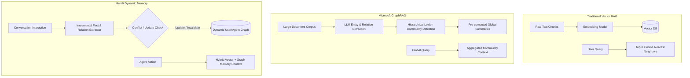
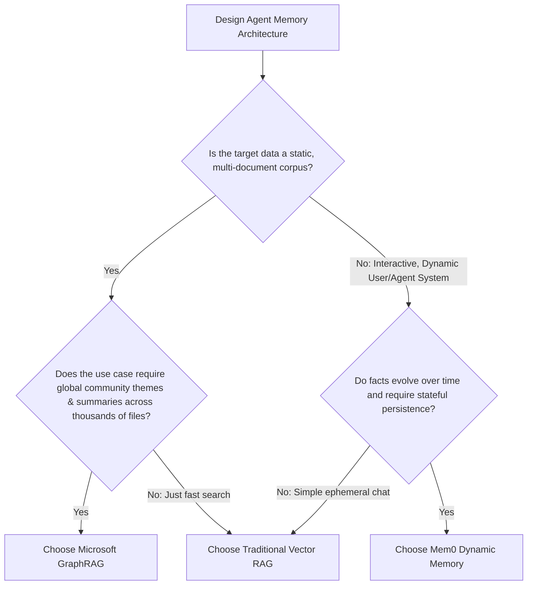

When autonomous AI agents interact with users over weeks and months, static prompt context windows quickly fall short. Early engineering teams attempted to solve this by dumping conversation histories into standard **Vector RAG (Retrieval-Augmented Generation)** databases like Pinecone, Qdrant, or Chroma.

However, naive vector search suffers from fundamental architectural flaws when applied to agent memory: it cannot resolve contradictory facts across time, fails at multi-hop associative reasoning, and treats outdated preferences with equal semantic weight.

To solve this, modern AI architectures have bifurcated into **GraphRAG** (for deep corpus understanding) and **Mem0** (for dynamic, self-updating agent memory graphs). Understanding the trade-offs between **Mem0**, **Microsoft GraphRAG**, and **Traditional Vector RAG** is essential for engineering reliable production agents.

---

## Architectural Comparison: Vector RAG vs GraphRAG vs Mem0

Each system approaches memory retrieval through a completely different conceptual paradigm:



### 1. Traditional Vector RAG
* **Mechanism:** Slices documents into fixed token chunks (e.g. 512 tokens with 50-token overlap), computes dense vector embeddings, and performs top-$K$ cosine similarity lookups.
* **Failure Mode:** Zero temporal awareness. If a user states *"I moved from Seattle to Austin"* in turn 50, a query in turn 100 for *"Where do I live?"* retrieves chunks mentioning both Seattle and Austin, confusing the LLM.

### 2. Microsoft GraphRAG
* **Mechanism:** Uses LLMs to parse entire knowledge bases into knowledge graphs (entities, relations, claims), clusters nodes into hierarchical graph communities via the Leiden algorithm, and generates pre-baked community summaries.
* **Best Fit:** Global synthesis over static enterprise document repositories (e.g. analyzing 10,000 regulatory reports or thousands of research papers).

### 3. Mem0 (The Memory Layer for AI)
* **Mechanism:** An intelligent, stateful memory system that continuously extracts atomic facts, profiles, and relational edges. Crucially, it performs automatic **conflict resolution**—updating old facts when new contradictory information arrives.
* **Best Fit:** Stateful AI agents, personalized assistants, customer success bots, and autonomous terminal operators.

For broader agent orchestration architectures, see our guide on [Agentic RAG Workflows with LangGraph](/tutorials/agentic-rag-workflows-langgraph/).

---

## Head-to-Head Comparison Matrix

| Evaluation Dimension | Traditional Vector RAG | Microsoft GraphRAG | Mem0 Dynamic Memory |
| :--- | :--- | :--- | :--- |
| **Primary Design Goal** | Static Document Search | Corpus-Wide Synthesis | Continuous Agent State & Personalization |
| **Data Representation** | Unstructured Flat Chunks | Entity Knowledge Graph + Summaries | Atomic Fact Graph + Vector Embeddings |
| **Temporal Fact Invalidation** | ❌ None (Returns conflicting chunks) | ❌ Batch Re-indexing Needed | **✅ Automatic Contradiction Resolution** |
| **Multi-Hop Reasoning** | Poor (Single-chunk semantic proximity) | **Exceptional (Graph community traversal)** | **High (Entity-relationship graph)** |
| **Indexing Latency / Cost** | Low (Single embedding call) | Very High (Requires heavy LLM extraction) | **Low-to-Medium (Incremental turn parsing)** |
| **Query Latency** | **< 30 ms** | 1,500 ms – 4,000 ms | **60 ms – 150 ms** |
| **Incremental Updates** | Easy (Append chunk) | Prohibitive (Must rebuild graph clusters) | **Native (Per-turn incremental diffs)** |
| **Memory Isolation Tiers** | None (Flat collection) | Global Corpus Level | **User, Session, and Agent-level tiers** |

---

## Code Comparison: Vector RAG vs Mem0 Implementation

### Traditional Vector RAG (Naive Chunk Retrieval)

```python
# Naive approach: appends every chat log to a vector collection
import chromadb
from chromadb.utils import embedding_functions

client = chromadb.Client()
collection = client.create_collection(name="agent_chat_history")

# Turn 1:
collection.add(
    documents=["User lives in San Francisco and prefers dark mode."],
    metadatas=[{"timestamp": "2026-01-10"}],
    ids=["turn_1"]
)

# Turn 2 (3 months later):
collection.add(
    documents=["User moved to Tokyo and now uses light mode."],
    metadatas=[{"timestamp": "2026-04-12"}],
    ids=["turn_2"]
)

# Query:
results = collection.query(query_texts=["What are the user's city and theme preferences?"], n_results=2)
# Flaw: Both conflicting memories are returned to prompt context!
print(results["documents"])
```

### Mem0 Dynamic Memory Implementation

Mem0 intelligently resolves the conflict, updating the existing preference without human intervention:

```python
import os
from mem0 import Memory

config = {
    "vector_store": {
        "provider": "qdrant",
        "config": {
            "host": "localhost",
            "port": 6333,
        }
    },
    "graph_store": {
        "provider": "neo4j",
        "config": {
            "url": "bolt://localhost:7687",
            "username": "neo4j",
            "password": os.environ.get("NEO4J_PASSWORD"),
        }
    }
}

memory = Memory.from_config(config)

# Interaction 1:
memory.add("User lives in San Francisco and prefers dark mode.", user_id="developer_42")

# Interaction 2:
memory.add("User recently relocated to Tokyo and switched to light mode.", user_id="developer_42")

# Query:
user_memories = memory.search("Where does the user live and what is their UI theme?", user_id="developer_42")

for m in user_memories["results"]:
    # Mem0 automatically invalidated San Francisco and dark mode
    print(f"Memory: {m['memory']}")
    # Output:
    # Memory: User lives in Tokyo.
    # Memory: User prefers light mode UI theme.
```

---

## Solving the Temporal Conflict Problem

In autonomous systems, facts are mutable. The following diagram illustrates how Mem0 handles state invalidation compared to naive vector databases:

```mermaid
sequenceDiagram
    autonumber
    participant U as User
    participant Agent as Agent Memory Controller
    participant VDB as Vector RAG
    participant Mem as Mem0 Engine

    U->>Agent: "We deprecated MySQL; all services must use CockroachDB now."
    
    rect rgb(250, 230, 230)
    Note over Agent,VDB: Naive Vector RAG Action
    Agent->>VDB: Embed & Store new document chunk
    Note over VDB: Both "Use MySQL" and "Use CockroachDB" persist in index!
    end

    rect rgb(230, 250, 230)
    Note over Agent,Mem: Mem0 Intelligent Memory Action
    Agent->>Mem: Add fact: Database change
    Mem->>Mem: Detect conflict with existing node (Technology: MySQL)
    Mem->>Mem: Update relation: status="deprecated", active="CockroachDB"
    Note over Mem: Fact graph successfully reconciled!
    end
```

---

## Architectural Decision Framework

Use this structured decision tree to select the optimal memory system for your technical stack:



### Choose Traditional Vector RAG If:
* You are indexing static developer documentation, API reference manuals, or knowledge base articles.
* Query latency must stay strictly below 50ms.
* You do not need stateful tracking across long conversation trajectories. Check our [Vector Databases & Chunking Strategies Guide](/tutorials/embeddings-vector-databases/) for production setup.

### Choose Microsoft GraphRAG If:
* You need comprehensive summarization and trend discovery across massive corporate datasets (e.g. legal discovery, enterprise research archives).
* Query cost and indexing time are secondary to holistic global synthesis.

### Choose Mem0 If:
* You are building conversational AI agents, autonomous coding assistants, or long-term personalized bots.
* You require automatic fact updating, deduplication, and separation between user, session, and agent memories.

---

## Key Takeaways

1. **Vector RAG is Insufficient for Agents:** Vector databases are search indexes, not memory systems. They fail at temporal invalidation and relationship resolution.
2. **GraphRAG Excels at Global Synthesis:** Microsoft GraphRAG sets the standard for hierarchical understanding across static corpora, but is too slow and costly for real-time conversation turns.
3. **Mem0 Bridges the Dynamic Gap:** By unifying vector similarity with graph relationship tracking and conflict resolution, Mem0 delivers a robust, self-healing memory tier for production AI agents.
