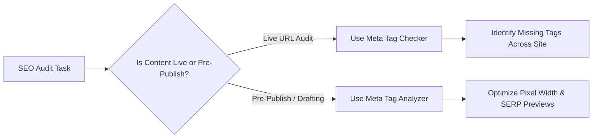

# Meta Tag Analyzer vs Meta Tag Checker: Key Differences & Comparison

When optimizing web pages for search engines and social platforms, developers and SEO specialists frequently use the terms **meta tag analyzer** and **meta tag checker** interchangeably. However, these tools serve distinct roles in technical auditing workflows.

Understanding the difference helps technical teams choose the right tool—whether auditing an entire live domain or testing local staging metadata before deployment using utilities like our [Meta Tag Analyzer](/tools/meta-tag-analyzer/).

---

## Key Differences Summary

| Feature | Meta Tag Checker | Meta Tag Analyzer |
| :--- | :--- | :--- |
| **Primary Focus** | Presence verification (Yes/No) | Depth, character counts & snippet preview |
| **Input Mode** | Live URL crawling | Live URL & manual text input |
| **Pre-Publication Editing** | Limited / No | Full interactive sandbox editing |
| **Social Card Simulation** | Basic text readout | Real-time OpenGraph & Twitter visual cards |
| **Execution Context** | Server-side web crawler | Fast client-side browser execution |

---

## What Is a Meta Tag Checker?

A **meta tag checker** functions primarily as a passive crawler. Given an active HTTP URL, it fetches the HTML document and verifies whether mandatory metadata tags exist in the `<head>` node:
- Checks if `<title>` exists.
- Checks if `<meta name="description">` exists.
- Checks if `<link rel="canonical">` exists.

Checkers are ideal for automated site-wide crawls to discover pages missing fundamental SEO tags.

---

## What Is a Meta Tag Analyzer?

A **meta tag analyzer** (such as Nadhebe's [Meta Tag Analyzer](/tools/meta-tag-analyzer/)) goes beyond simple binary checks. It evaluates qualitative aspects, pixel widths, character thresholds, and simulates visual previews:
- **Pixel Width Measurement**: Calculates whether your title tag will exceed Google's 600px desktop display limit.
- **SERP Snippet Simulation**: Renders exact visual representations of desktop and mobile search snippets.
- **Social Card Rendering**: Simulates OpenGraph image and card presentation for LinkedIn, Twitter/X, and Slack.
- **Code Generation**: Generates clean, ready-to-copy HTML head blocks.

---

## When to Use Each Tool

---

## Frequently Asked Questions

### Can I use a meta tag analyzer for local development?
Yes. Our client-side [Meta Tag Analyzer](/tools/meta-tag-analyzer/) runs entirely in browser JS, allowing you to copy-paste metadata draft strings without needing a public URL.

### Do meta tag checkers detect OpenGraph errors?
Basic checkers only confirm tag existence. A full analyzer validates image URLs, aspect ratios, and card fallback behavior.

---

## References

1. OpenGraph Protocol Specifications: https://ogp.me
2. W3C HTML Metadata Standards: https://www.w3.org/TR/html52/document-metadata.html
