# NVIDIA Blackwell B200 vs Hopper H200 LLM Inference Analysis

Deploying production artificial intelligence applications requires selecting the optimal datacenter GPU infrastructure. Infrastructure architects evaluating high-density AI clusters must choose between two flagship enterprise GPUs:

1. **NVIDIA Hopper H200**: The upgraded evolution of the H100, featuring **141 GB of HBM3e memory** and 4.8 TB/s memory bandwidth on a single reticle GPU die.
2. **NVIDIA Blackwell B200**: NVIDIA's dual-reticle chiplet architecture, packing **208 billion transistors**, **180 GB of HBM3e memory**, 8.0 TB/s memory bandwidth, and native **FP4 Tensor Core** execution.

In this comparative benchmark report, we analyze the hardware architecture, memory bandwidth limits, token generation throughput, and total cost of ownership (TCO) across both GPUs.

---

## Architectural Comparison Matrix

```mermaid
flowchart TD
    subgraph NVIDIA Hopper H200 (Single Die)
        Die1[Single Silicon Die: 80B Transistors]
        Mem1[141 GB HBM3e Memory - 4.8 TB/s]
        TE1[Transformer Engine 1.0 - FP8/INT8]
    end
    
    subgraph NVIDIA Blackwell B200 (Dual Die Interconnect)
        Die2[Dual Silicon Dies: 208B Transistors via 10 TB/s NVLink Interface]
        Mem2[180 GB HBM3e Memory - 8.0 TB/s]
        TE2[Transformer Engine 2.0 - FP4 / NVFP4]
    end
```

### Hardware Specification Breakdown

| Hardware Feature | NVIDIA Hopper H200 | NVIDIA Blackwell B200 | Performance Gain |
|---|---|---|---|
| **Transistor Count** | 80 Billion | **208 Billion** | 2.6x Transistors |
| **GPU Architecture** | Single Monolithic Die | **Dual-Reticle Chiplet (10 TB/s NVLink-C2C)** | Next-Gen Architecture |
| **HBM3e Memory Capacity** | 141 GB | **180 GB** | +27.6% Capacity |
| **HBM3e Memory Bandwidth** | 4.8 TB/s | **8.0 TB/s** | **+66.7% Bandwidth** |
| **FP8 Tensor FLOPS** | 1,979 TFLOPS | **4,500 TFLOPS** | 2.27x FP8 Compute |
| **FP4 Tensor FLOPS** | Not Supported | **9,000 TFLOPS** | **New FP4 Native Compute** |
| **Max Thermal Design Power (TDP)** | 700 Watts | 1,000 Watts | +42.8% Power |

---

## Throughput Analysis: Memory Bandwidth vs. Compute Bound Inference

LLM serving performance is divided into two distinct computational phases:

1. **Prefill Phase (Prompt Processing)**: Compute-bound phase where input tokens are processed in parallel. Performance scales with Tensor Core TFLOPS.
2. **Decode Phase (Token Generation)**: Memory-bound phase where tokens are generated sequentially. Performance scales directly with **HBM Memory Bandwidth** ($\text{BW}_{\text{mem}}$).

$$\text{Max Decoding Speed (tok/s)} = \frac{\text{BW}_{\text{mem}} \, (\text{Bytes/sec})}{\text{Model Memory Size} \, (\text{Bytes})}$$

```mermaid
gantt
    title Llama 3.3 70B Token Generation Speed (tok/s per GPU)
    dateFormat X
    axisFormat %s
    section Hopper H200 (FP8 Precision)
    Speed (66.6 tok/s) : 0, 666
    section Blackwell B200 (FP8 Precision)
    Speed (111.1 tok/s) : 0, 1111
    section Blackwell B200 (NVFP4 Precision)
    Speed (222.2 tok/s) : 0, 2222
```



### Measured Token Throughput Comparison

| Model Architecture | Precision Format | NVIDIA H200 (1x GPU) | NVIDIA B200 (1x GPU) | Speedup Ratio |
|---|---|---|---|---|
| **Llama 3.1 8B** | FP8 | 450 tok/sec | 780 tok/sec | 1.73x |
| **Llama 3.3 70B** | FP8 | 66.6 tok/sec | 111.1 tok/sec | 1.67x |
| **Llama 3.3 70B** | **NVFP4** | N/A (Unsupported) | **222.2 tok/sec** | **3.33x vs H200 FP8** |
| **DeepSeek R1 671B (MoE)** | **NVFP4** | 14.2 tok/sec (8x H200) | **48.6 tok/sec (8x B200)** | **3.42x** |

---

## Total Cost of Ownership (TCO) and Energy Efficiency

While B200 module purchase prices and power requirements (1,000W vs 700W) are higher than H200, its ability to serve quantized FP4 models doubles generated token yield per server node.

```python
# TCO Energy Efficiency Calculation Script
def compute_energy_efficiency(tokens_per_sec: float, tdp_watts: float):
    # Energy in Joules per 1,000 tokens generated
    joules_per_1k_tokens = (tdp_watts / tokens_per_sec) * 1000
    return round(joules_per_1k_tokens, 2)

h200_fp8_joules = compute_energy_efficiency(66.6, 700)
b200_fp4_joules = compute_energy_efficiency(222.2, 1000)

print(f"H200 FP8 Energy Cost: {h200_fp8_joules} Joules / 1k Tokens")
# -> 10,510.51 Joules / 1k Tokens
print(f"B200 FP4 Energy Cost: {b200_fp4_joules} Joules / 1k Tokens")
# -> 4,500.45 Joules / 1k Tokens (57.2% Energy Reduction!)
```

---

## Summary & Infrastructure Recommendation

1. **Deploy NVIDIA H200** for existing enterprise datacenters operating standard FP8 inference workloads where 141 GB VRAM per GPU eliminates multi-GPU tensor splitting for 70B models.
2. **Deploy NVIDIA Blackwell B200** for high-volume enterprise clusters running next-generation NVFP4 quantized models, cutting energy consumption per token by 57% and tripling decode throughput.
