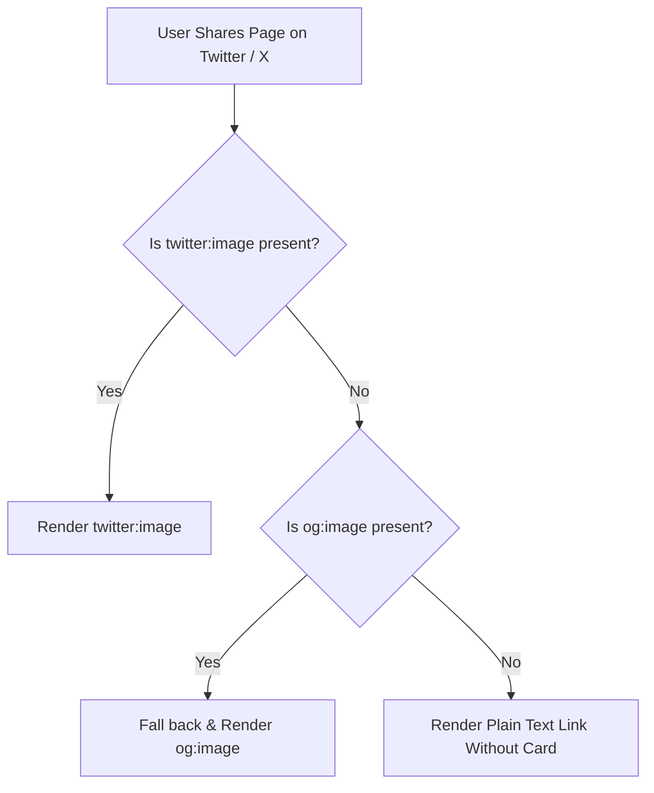

# Open Graph vs Twitter Card Meta Tags: Technical Comparison

Creating compelling social sharing cards requires understanding two distinct metadata standards: the **Open Graph Protocol** (`og:`) and **Twitter Cards** (`twitter:`). 

While both frameworks enable rich media sharing on platforms like LinkedIn, Facebook, Discord, Slack, and X, their syntax, fallbacks, and card types differ. Use our [Meta Tag Analyzer](/tools/meta-tag-analyzer/) to inspect both standards simultaneously.

---

## Technical Comparison Matrix

| Property Category | Open Graph Protocol (`og:`) | Twitter Cards (`twitter:`) |
| :--- | :--- | :--- |
| **Origin / Maintainer** | Facebook / Open Source Consortium | Twitter / X Corporation |
| **Attribute Name** | `property="..."` | `name="..."` |
| **Title Attribute** | `<meta property="og:title">` | `<meta name="twitter:title">` |
| **Description Attribute** | `<meta property="og:description">` | `<meta name="twitter:description">` |
| **Image Attribute** | `<meta property="og:image">` | `<meta name="twitter:image">` |
| **Card Layout Control** | Determined by `og:type` | Explicit via `twitter:card` |
| **Fallback Behavior** | Universal social standard | Falls back to `og:` properties |

---

## Code Example: Combined HTML Head Markup

To maximize social engagement across all networks, combine both specifications in your HTML head:

```html
<!-- OpenGraph Standard (Facebook, LinkedIn, Discord, Slack) -->
<meta property="og:type" content="article" />
<meta property="og:site_name" content="Nadhebe" />
<meta property="og:title" content="Open Graph vs Twitter Card Meta Tags: Technical Comparison" />
<meta property="og:description" content="Compare Open Graph (og:) and Twitter Card (twitter:) metadata specifications." />
<meta property="og:url" content="https://nadhebe.com/comparisons/open-graph-vs-twitter-card-meta-tags/" />
<meta property="og:image" content="https://nadhebe.com/images/open-graph-vs-twitter-card-hero.webp" />

<!-- Twitter Card Extension (X / Twitter) -->
<meta name="twitter:card" content="summary_large_image" />
<meta name="twitter:title" content="Open Graph vs Twitter Card Meta Tags: Technical Comparison" />
<meta name="twitter:description" content="Compare Open Graph (og:) and Twitter Card (twitter:) metadata specifications." />
<meta name="twitter:image" content="https://nadhebe.com/images/open-graph-vs-twitter-card-hero.webp" />
```

---

## Fallback Rules Diagram



---

## How to Test Both Standards Real-Time

Instead of deploying code and waiting for external social scrapers, paste your markup into our client-side [Meta Tag Analyzer](/tools/meta-tag-analyzer/). The analyzer generates live visual previews of both Google SERP and OpenGraph / Twitter social cards instantly.

---

## Frequently Asked Questions

### Why does Twitter use `name="..."` while OpenGraph uses `property="..."`?
OpenGraph is built on RDFa metadata standards which use the `property` attribute, whereas Twitter Cards follow standard HTML `<meta name="..." content="...">` conventions.

### Will using both standards inflate my HTML bundle size?
No. Including both `og:` and `twitter:` tags adds less than 500 bytes of plain text to your HTML head, while guaranteeing high CTR previews across all social feeds.

---

## References

1. Open Graph Protocol Standard: https://ogp.me
2. X Cards Developer Reference: https://developer.twitter.com/en/docs/twitter-for-websites/cards/overview/markup
