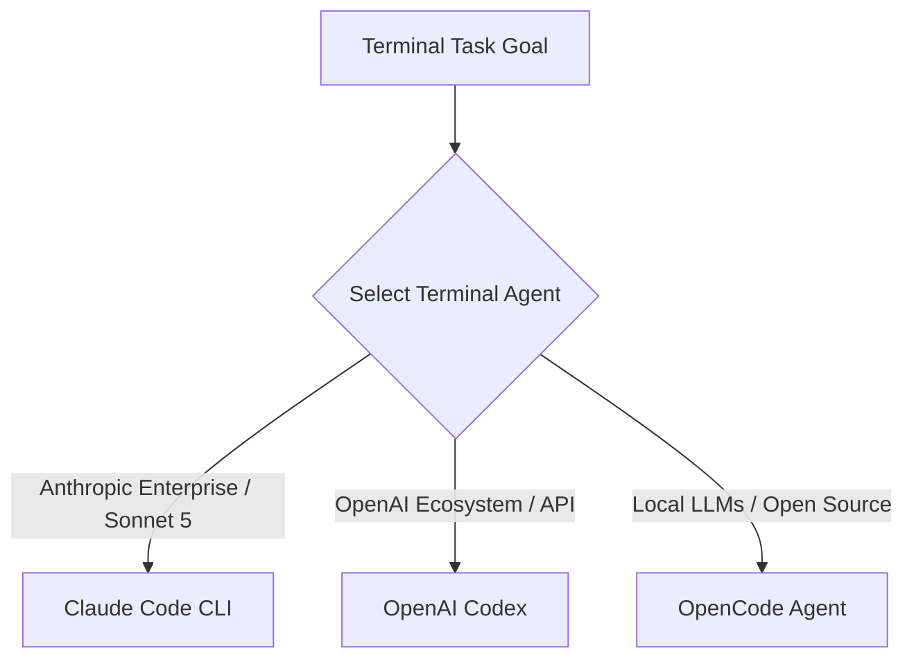

The landscape of developer tooling is transitioning rapidly from inline code completion plugins to autonomous **terminal AI agents**. Rather than just suggesting auto-complete snippets, modern terminal agents inspect local repositories, execute bash commands, run automated test suites, evaluate error tracebacks, and manage git worktrees.

Three primary contenders dominate this domain: **Anthropic's Claude Code CLI**, **OpenAI Codex**, and the open-source **OpenCode** framework.

This guide provides an architectural, benchmark, and cost comparison across all three platforms.

---

## 📊 Executive Summary & Head-to-Head Matrix



### Feature & Capability Comparison

| Metric / Dimension | Anthropic Claude Code CLI | OpenAI Codex | OpenCode (Open Source) |
| :--- | :--- | :--- | :--- |
| **Primary Execution Engine** | Claude 3.7 Sonnet / Opus 4.8 | GPT-4o / Codex API | Any Model (Ollama / Local / API) |
| **Native Context Window** | **1,000,000 Tokens (Sonnet 5)** | 128,000 Tokens | Variable (Model Dependent) |
| **SWE-bench Verified Score** | **70.3%** | 49.2% | Variable |
| **TerminalBench 2.1 Score** | **88.8%** | 65.4% | Variable |
| **Execution Loop Architecture** | Stateful Observe-Plan-Act-Verify | Request-Response Prompt Loop | Configurable Agent Loop |
| **Permission Controls** | 3-Tier Security + Shift+Tab | Custom System Prompts | Middleware Rules |
| **Local Model Support** | API Only (Anthropic Console) | API Only (OpenAI) | **Yes (Ollama, vLLM, SGLang)** |
| **License Type** | Proprietary CLI Client | Proprietary API Platform | **MIT Open Source License** |

---

## 🧠 1. Architectural Deep Dive

### Anthropic Claude Code CLI
Claude Code operates directly on your POSIX terminal shell. It builds a localized, lightweight AST index of your project files (excluding `.gitignore` patterns), executing atomic tool calls (`FileRead`, `FileEdit`, `BashRun`, `GrepSearch`) inside a stateful Observe-Plan-Act-Verify (OPAV) execution loop.

### OpenAI Codex
OpenAI Codex operates primarily as an API-driven code synthesis engine. While highly effective at isolated function generation and single-file edits, it lacks a native, interactive terminal TUI runtime wrapper out of the box, requiring secondary CLI tools or IDE plugins to manage context.

### OpenCode (Open-Source Terminal Agent)
OpenCode is an open-source terminal framework designed for maximum customization. It allows developers to plug in local LLMs running via **Ollama**, **vLLM**, or **SGLang** (e.g. DeepSeek R1, Llama 3.3 70B), freeing engineering teams from proprietary API vendor lock-in.

---

## ⚡ 2. Context Windows & Context Compression

* **Claude Code CLI:** Features a native **1M-token context window** powered by Sonnet 5 and Opus 4.8. It leverages Ephemeral Prompt Caching to reduce token costs by up to 90% and includes the `/compact` command to summarize long multi-turn sessions automatically.
* **OpenAI Codex:** Operates within standard 128k context limits, requiring frequent prompt truncation when analyzing multi-file project repositories.
* **OpenCode:** Context window size depends on the underlying model provider (e.g., DeepSeek R1 64k vs Llama 3.3 128k).

---

## 💰 3. Pricing & Token Economics

```text
Cost Breakdown per 1,000,000 Tokens:
-------------------------------------------------------------------
Claude 3.7 Sonnet (Standard Input):   $3.00 USD
Claude 3.7 Sonnet (Cached Input):     $0.30 USD (90% Savings)
GPT-4o (Standard Input):              $2.50 USD
Local Models via OpenCode (Ollama):   $0.00 USD (Self-Hosted Hardware)
-------------------------------------------------------------------
```

---

## 🏆 Final Verdict & Decision Matrix

* **Choose Claude Code CLI if:** You need the highest SWE-bench accuracy (70.3%), deep multi-file repo refactoring, strict permission security, and native 1M context caching.
* **Choose OpenAI Codex if:** Your stack is deeply embedded in the OpenAI API ecosystem or Azure OpenAI Service endpoints.
* **Choose OpenCode if:** You require 100% open-source software, complete data privacy, and the ability to run local models offline via Ollama.

---

## Related Guides & Workflows

* For complete CLI shortcuts, read [Claude Code Cheat Sheet](/tutorials/claude-code-cheat-sheet-commands-shortcuts).
* For desktop agent comparisons, see [Claude Cowork Desktop Agent Guide](/guides/claude-cowork-desktop-agent-guide).
* For agent loop mechanics, explore [Inside Claude Code Agent Loop Architecture](/guides/claude-code-agent-loop-architecture).
