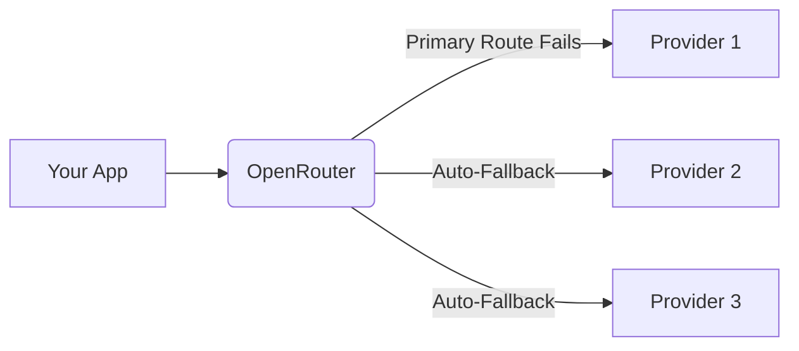

# OpenRouter vs Direct Provider APIs

When building an AI application, one of the very first architectural decisions you face is how to access the Large Language Models. Do you integrate directly with the official APIs (OpenAI, Anthropic, Google)? Or do you use an aggregator / routing layer like **OpenRouter**?

Both approaches have distinct technical trade-offs regarding reliability, vendor lock-in, feature access, and latency. In this guide, we break down the pros and cons of OpenRouter versus Direct Provider APIs to help you make the right choice for your infrastructure.

## What is OpenRouter?

OpenRouter is an LLM routing service that provides a unified, OpenAI-compatible API across dozens of different models and providers. With a single API key, you can access GPT-4o, Claude 3.5 Sonnet, Google Gemini, and hundreds of open-weight models (like Llama 3) hosted on various cloud infrastructures (Together AI, Fireworks, DeepInfra).

## 1. Integration Complexity & Vendor Lock-in

**Direct APIs (The Hard Way):**
Integrating directly means you must write separate client implementations for OpenAI, Anthropic, and Google. Each uses a fundamentally different SDK, payload structure, and error-handling paradigm. If you build your entire app around the Anthropic SDK, migrating to OpenAI if a better model drops requires a massive code rewrite.

**OpenRouter (The Easy Way):**
OpenRouter uses the standard OpenAI chat completions endpoint structure. This means you can use the official `openai` Python or Node SDKs to talk to Anthropic, Google, and Meta models.

```javascript
// Using OpenRouter to call Claude via the OpenAI SDK
const response = await openai.chat.completions.create({
  model: "anthropic/claude-3.5-sonnet", // Just change the model string!
  messages: [{ role: "user", content: "Hello!" }]
});
```
This practically eliminates vendor lock-in, allowing you to swap models in production by changing a single string variable.

## 2. Pricing and Billing Management

**Direct APIs:**
You must manage separate billing dashboards, credit card setups, and prepay balances for OpenAI, Anthropic, Google, and any open-source hosts you use. Tracking costs across 4 different platforms is a logistical nightmare for accounting.

**OpenRouter:**
You manage one central balance. OpenRouter charges the **exact same price** as the direct proprietary providers (OpenAI/Anthropic). For open-weight models (like Llama 3), OpenRouter acts as an open market, automatically routing your request to the cheapest or fastest provider currently hosting that model.

## 3. Reliability and Fallbacks



**Direct APIs:**
If OpenAI goes down, your app goes down—unless you have manually coded a complex fallback system in your backend to catch a 502 error and construct a completely different payload for Anthropic.

**OpenRouter:**
OpenRouter has built-in fallback routing. You can pass an array of models in your request. If your primary model's API is returning 500 errors or is rate-limited, OpenRouter will automatically seamlessly re-route the request to your backup model, keeping your app online.

## 4. Latency and Feature Support

This is where Direct APIs have an edge.

**Direct APIs:**
You get the absolute lowest possible latency (no middleman), and you have day-one access to beta features, experimental headers, and full native support for things like OpenAI's Realtime Audio API or Anthropic's Computer Use.

**OpenRouter:**
OpenRouter introduces a very slight network hop (usually negligible for streaming chat, but measurable for high-frequency trading or ultra-low-latency voice apps). Furthermore, while OpenRouter does an incredible job supporting things like Prompt Caching and Tool Use, brand-new cutting-edge API features often take a few days or weeks to be fully supported and mapped through their unified layer.

## The Verdict

For **90% of developers and startups**, **OpenRouter is the vastly superior choice**. The unified billing, zero vendor lock-in, automatic fallbacks, and single-SDK integration save weeks of engineering time.

However, you should choose **Direct APIs** if:
1. You have negotiated enterprise volume discounts directly with a provider (like Azure OpenAI).
2. You are building an ultra-low-latency voice application where every millisecond matters.
3. You need day-one access to experimental beta features (like native Computer Use or Realtime Audio websockets).
