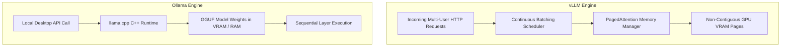
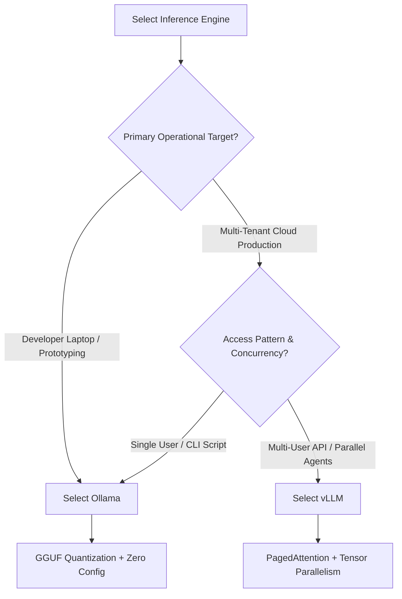

Selecting an open-source inference engine dictates API concurrency, GPU memory overhead, and infrastructure cost efficiency. As open-weight models like [Moonshot AI's Kimi K3](/news/kimi-k3-moonshot-ai-release) and Llama 3 expand in capability, engineering teams frequently compare **vLLM** and **Ollama**.

Both tools serve open-weight LLMs, but they target fundamentally different architectural layers and operational requirements.

---

## Architectural Comparison Matrix

*Sources: Official vLLM documentation (`docs.vllm.ai`) and Ollama GitHub repository (`github.com/ollama/ollama`).*

| Architectural Feature | vLLM | Ollama |
| :--- | :--- | :--- |
| **Primary Execution Engine** | Native PyTorch + Custom CUDA (PagedAttention) | `llama.cpp` C/C++ Engine |
| **Target Deployment** | Cloud Multi-Tenant APIs & High-Throughput Services | Workstation CLI, Local Desktop Apps, & Prototyping |
| **KV Cache Allocation** | Virtual Paged Blocks (Non-contiguous VRAM) | Continuous Static Memory Allocation |
| **Model Formats Supported** | Safetensors, AWQ, GPTQ, FP8, Unquantized FP16 | GGUF (Q4_K_M, Q8_0, Q5_K_S) |
| **Scheduling Algorithm** | Iteration-Level Continuous Batching | Request Queueing / Slot Management |
| **Multi-GPU Parallelism** | Native Ray Tensor & Pipeline Parallelism | Layer-based Multi-GPU Offloading (`llama.cpp`) |
| **API Compliance** | Native OpenAI-Compatible HTTP Server | Custom REST API + OpenAI Emulation Wrapper |

---

## Memory Allocation Mechanics: PagedAttention vs GGUF



### 1. vLLM & PagedAttention
Traditional PyTorch LLM serving pre-allocates continuous GPU memory for the Key-Value (KV) cache based on maximum sequence lengths. According to research published by the vLLM team (Sheng et al., SOSP 2023), this static allocation leads to significant memory fragmentation and waste.

vLLM addresses this using **PagedAttention**, an algorithm inspired by virtual memory paging in operating systems. KV cache data is stored in non-contiguous physical memory blocks. Pages are allocated dynamically during token generation, enabling higher batch concurrency on identical hardware.

### 2. Ollama & `llama.cpp`
Ollama packages `llama.cpp`, a lightweight C/C++ runtime designed for low-overhead local execution. It specializes in **GGUF quantization**, allowing large models to run efficiently across consumer GPUs, Apple Silicon Unified Memory (macOS), or system RAM (CPU fallback).

Ollama prioritizes low latency for single-stream interactive usage and simple developer setup over multi-tenant continuous batching.

For strategies on managing token usage in automated agent loops, see our guide on [LLM Autonomous Loops: Token and Cost Management](/best-practices/llm-autonomous-loop-cost-management).

---

## Configuration & Deployment Examples

### vLLM Server Launch (Python CLI)
*Source: Official vLLM Entrypoints Documentation (`docs.vllm.ai`)*

```bash
python3 -m vllm.entrypoints.openai.api_server \
    --model Qwen/Qwen2.5-72B-Instruct-AWQ \
    --tensor-parallel-size 4 \
    --gpu-memory-utilization 0.90 \
    --max-model-len 16384 \
    --port 8000
```

### Ollama Launch (Modelfile)
*Source: Official Ollama Documentation (`github.com/ollama/ollama`)*

```dockerfile
FROM llama3.3:70b
PARAMETER temperature 0.7
PARAMETER num_ctx 16384
SYSTEM "You are a technical architect specialized in backend systems."
```

Run via CLI:
```bash
ollama run llama3.3:70b
```

For cloud infrastructure setup, review our tutorial on [Deploying Docker Workloads on a VPS](/tutorials/deploying-instatic-docker-vps).

---

## Architectural Decision Framework



* **Select Ollama if:** You require zero-config local execution, macOS Apple Silicon optimization, or lightweight GGUF quantization for single-user workflows.
* **Select vLLM if:** You are building cloud APIs handling concurrent requests, utilizing multi-GPU tensor parallelism, or optimizing VRAM utilization via PagedAttention.

For high-concurrency production deployments requiring advanced prefix caching or Rust web routers, explore our comparison of [vLLM vs SGLang vs TGI Inference Engines](/comparisons/vllm-vs-sglang-vs-tgi-inference-engine-comparison).
For multi-agent state architectures, see [The SQLite State-Sharing Pattern for Multi-Agent Architectures](/frameworks/sqlite-state-sharing-multi-agent-architecture).
