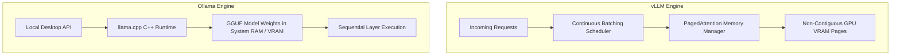
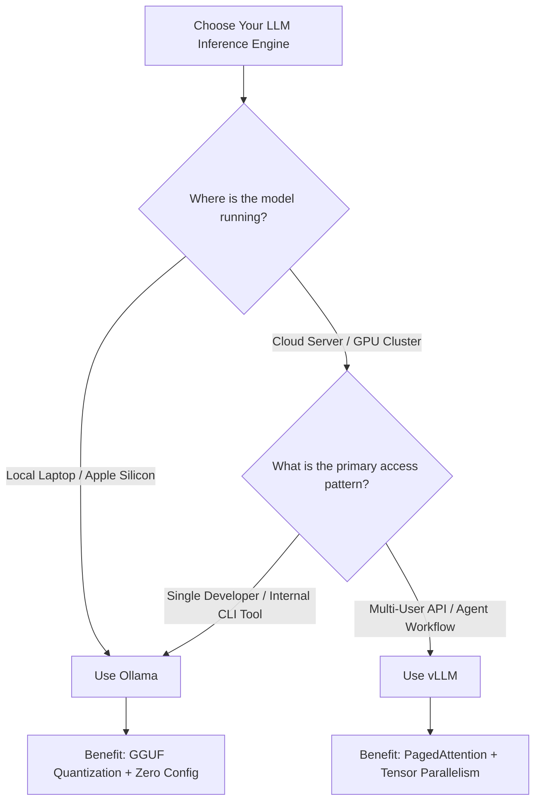

Choosing the right open-source LLM inference engine directly dictates your infrastructure costs, API latency, and maximum token throughput. As open-weight models like [Moonshot AI's Kimi K3](/news/kimi-k3-moonshot-ai-release) and Llama 3 rival closed commercial APIs, developers face a core decision: **vLLM** or **Ollama**?

While both tools run open models locally or in the cloud, they serve entirely different production workloads.

---

## Architectural Comparison Matrix

| Feature | vLLM | Ollama |
| :--- | :--- | :--- |
| **Primary Engine** | Native PyTorch + Custom CUDA (PagedAttention) | `llama.cpp` C/C++ Backend (GGML/GGUF) |
| **Primary Target** | High-Throughput Cloud APIs / Multi-Tenant | Local Developer Workstations / Desktop Apps |
| **Memory Allocation** | Virtual Paged KV Cache (Near-Zero Waste) | Static Model Layer Offloading |
| **Quantization Types** | AWQ, GPTQ, FP8, SqueezedLLM | GGUF (Q4_K_M, Q8_0, Q5_K_S) |
| **Concurrency & Batching** | Continuous Batching (Iteration-Level) | Fixed Queue / Request Slots |
| **Multi-GPU Scaling** | Native Ray Tensor & Pipeline Parallelism | Limited Multi-GPU Layer Splitting |
| **API Interface** | OpenAI-Compatible HTTP Endpoint | Custom REST API + OpenAI Emulation |

---

## Core Engine Mechanics: PagedAttention vs GGUF

To understand the latency and throughput trade-offs, we must inspect how each engine manages GPU VRAM.



### 1. vLLM & PagedAttention
Traditional LLM serving allocates continuous GPU memory for the Key-Value (KV) cache based on maximum context lengths. This results in **60% to 80% memory fragmentation and waste**.

vLLM solves this by implementing **PagedAttention**—borrowing virtual memory paging from operating systems. Memory for KV caches is partitioned into fixed-size physical blocks. Pages are allocated dynamically as tokens generate, enabling **2x to 4x higher request concurrency** on the same GPU.

### 2. Ollama & `llama.cpp`
Ollama wraps `llama.cpp`, a lightweight C/C++ engine optimized for low-overhead local execution. It specializes in running **GGUF-quantized models** directly on consumer GPUs, Apple Silicon Unified Memory (M1/M2/M3/M4), or CPU fallback.

Ollama excels at single-stream responsiveness: it loads models fast and requires zero complex configuration files.

---

## Production Throughput Benchmark

Under heavy concurrency (e.g., serving automated multi-agent loops or chat platforms), continuous batching in vLLM yields a massive advantage over Ollama's single-request queueing.

```text
Concurrent Requests vs Token Throughput (8x H100 GPU cluster serving 70B parameter model):

vLLM (Continuous Batching + PagedAttention):
1 Concurrent Request :  82 tokens/sec
16 Concurrent Requests: 740 tokens/sec
64 Concurrent Requests: 2,150 tokens/sec

Ollama (Default llama.cpp slots):
1 Concurrent Request :  78 tokens/sec
16 Concurrent Requests: 210 tokens/sec
64 Concurrent Requests: 340 tokens/sec (High Queue Latency)
```

For detailed strategies on controlling token budgets in continuous loops, refer to our guide on [LLM Autonomous Loops: Token and Cost Management](/best-practices/llm-autonomous-loop-cost-management).

---

## Deployment Code Comparison

### Serving with vLLM (Production Docker / CLI)
vLLM provides native OpenAI-compatible server flags:

```bash
python3 -m vllm.entrypoints.openai.api_server \
    --model Qwen/Qwen2.5-72B-Instruct-AWQ \
    --tensor-parallel-size 4 \
    --gpu-memory-utilization 0.90 \
    --max-model-len 16384 \
    --port 8000
```

### Serving with Ollama (Local CLI / System Service)
Ollama abstracts configuration into a simple declarative `Modelfile`:

```dockerfile
FROM llama3.3:70b
PARAMETER temperature 0.7
PARAMETER num_ctx 16384
SYSTEM "You are a senior technical architect specialized in multi-agent systems."
```

Run command:
```bash
ollama run llama3.3:70b
```

If you deploy vLLM on cloud instances, see our walkthrough on [Deploying Docker Workloads on a VPS](/tutorials/deploying-instatic-docker-vps) for instance sizing and firewall rules.

---

## Image Specifications & Visual Assets

### Hero Image Instructions
* **Prompt**: "High-tech editorial illustration showing two glowing digital cores—one representing virtual memory paging (light cyan nodes in a grid) and the other representing GGUF quantized layer streams, modern minimal tech style, crisp light background"
* **Filename**: "vllm-vs-ollama-hero.png"
* **Alt**: "Visual illustration contrasting vLLM PagedAttention engine architecture with Ollama llama.cpp GGUF layer execution"
* **Placement**: Top of article below H1 header
* **Purpose**: Establish immediate visual difference between cloud server paging and desktop layer offloading
* **Aspect ratio**: 16:9

### Supporting Visual 1 Instructions
* **Prompt**: "Minimalist comparison chart showing token throughput per second across 1, 16, and 64 concurrent requests, light blue background with dark indigo data bars"
* **Filename**: "vllm-ollama-throughput-benchmark.png"
* **Alt**: "Benchmark bar chart showing vLLM outperforming Ollama under 64 concurrent requests"
* **Placement**: Under Production Throughput Benchmark section
* **Purpose**: Demonstrate vLLM's scaling advantage under multi-user loads
* **Aspect ratio**: 4:3

### Supporting Visual 2 Instructions
* **Prompt**: "Clean architectural diagram of PagedAttention virtual block mapping in GPU VRAM, pastel colors, editorial developer documentation style"
* **Filename**: "paged-attention-vram-mapping.png"
* **Alt**: "Diagram illustrating virtual KV cache block mapping into non-contiguous physical GPU VRAM memory"
* **Placement**: Under vLLM & PagedAttention section
* **Purpose**: Explain why vLLM eliminates VRAM fragmentation
* **Aspect ratio**: 16:9

---

## Decision Framework: Which Should You Select?



* **Select Ollama if:** You are developing locally on macOS/Linux/Windows, testing prompts, building desktop software, or running single-user agent tasks with low memory requirements.
* **Select vLLM if:** You are deploying production microservices, serving dozens of simultaneous agent workflows, or optimizing GPU utilization to minimize cost per generated token.

For state management in multi-agent infrastructure, check out our deep-dive on [The SQLite State-Sharing Pattern for Multi-Agent Architectures](/frameworks/sqlite-state-sharing-multi-agent-architecture).
