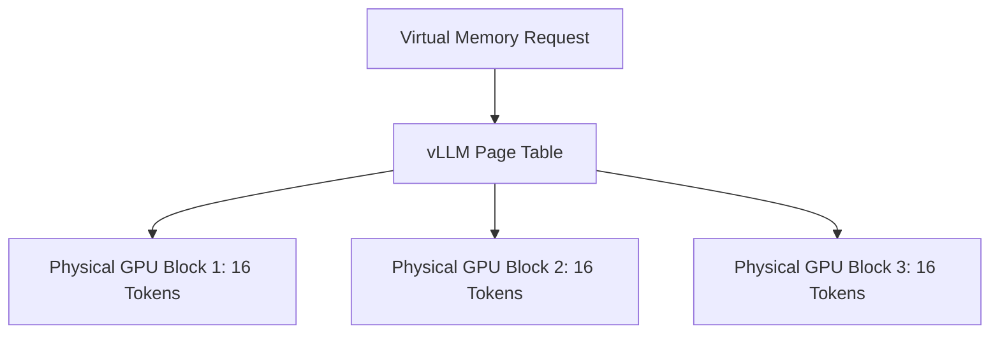
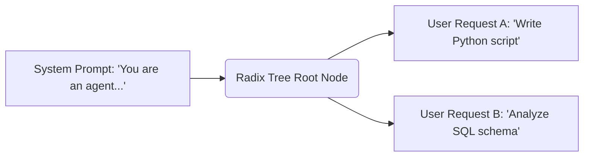
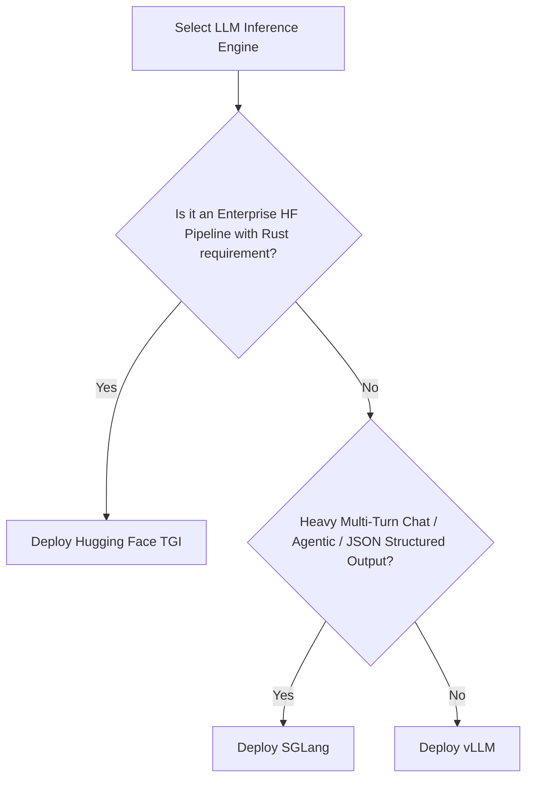

Choosing the right open-source LLM inference engine depends on your workload's memory access patterns and concurrency model. **vLLM** is the industry standard for high-throughput, multi-user request serving using PagedAttention. **SGLang** excels in agentic, multi-turn, and structured output workflows due to its automatic RadixAttention radix-tree prefix caching and fast constrained decoding. **Hugging Face TGI (Text Generation Inference)** provides an enterprise-ready, Rust-powered web server with native Hugging Face Hub integration and built-in telemetry.

This engineering comparison evaluates all three engines across memory management, request scheduling, distributed scaling, and deployment overhead.

---

## At-a-Glance Architectural Decision Matrix

| Dimension | vLLM (UC Berkeley) | SGLang (LMSYS) | Hugging Face TGI |
| :--- | :--- | :--- | :--- |
| **Core Innovation** | PagedAttention (block memory allocation) | RadixAttention (Radix tree prefix reuse) | Rust Web Router + Native HF integration |
| **Primary Use Case** | General high-concurrency production APIs | Multi-turn agent loops & structured JSON | Enterprise HF model serving & telemetry |
| **KV Cache Strategy** | Block-based dynamic virtual memory allocation | Tree-based radix cache for automatic prefix sharing | PagedAttention & FlashAttention integration |
| **Constrained Decoding** | Outlines / xGrammar integration | Compressed Finite State Machine (native) | Guided decoding via Outlines / JSON Schema |
| **Router Architecture** | Python (AsyncIO) + C++/CUDA extensions | Python (AsyncIO) + CUDA C++ kernels | Rust (gRPC + Axum) + Python worker backend |
| **Multi-GPU Scaling** | Tensor Parallelism, Pipeline Parallelism, Ray | Tensor Parallelism, Pipeline Parallelism, DeepSpeed | Tensor Parallelism, Sharded safetensors |
| **Observability** | Prometheus metrics endpoint | Prometheus metrics endpoint | Native OpenTelemetry (OTEL) & Prometheus |

---

## 1. Core Architectural Differences & Memory Management

### vLLM: Dynamic Virtual Memory Allocation via PagedAttention
Traditional LLM serving allocates continuous physical GPU memory for the Key-Value (KV) cache based on maximum potential context length, causing up to 60–80% VRAM fragmentation. **vLLM** resolves this by adapting operating system virtual memory principles to GPU memory via **PagedAttention**.

* **Fixed Block Size**: vLLM divides the KV cache into fixed-size blocks (typically 16 or 32 tokens).
* **Non-Contiguous Allocation**: Blocks are allocated non-contiguously in physical VRAM as generation proceeds, eliminating internal fragmentation.
* **Impact**: Increases maximum batch size per GPU, allowing significantly higher concurrent token throughput. To learn how to tune these parameters when encountering VRAM limits, read our guide on [Fixing vLLM CUDA Out Of Memory Errors](/tutorials/vllm-gpu-out-of-memory-oom-troubleshooting-guide).

---

### SGLang: Automatic Radix-Tree Cache Sharing via RadixAttention
While PagedAttention manages static memory blocks, **SGLang** optimizes memory reuse across separate API requests using **RadixAttention**. SGLang maintains a radix tree data structure in CPU/GPU memory that indexes all active and historical KV cache tokens.

* **Automatic Prefix Matching**: When multiple requests share common system prompts, multi-turn chat history, or few-shot examples, SGLang reuses existing KV cache blocks instantly without re-computation.
* **LRU Eviction**: Unused branches of the radix tree are evicted using a Least Recently Used (LRU) policy when GPU memory limit is reached.
* **Structured Decoding Efficiency**: SGLang integrates compressed finite state machine (FSM) decoding natively, making JSON schema enforcement and tool call parsing significantly faster than standard regex masking.

---

### Hugging Face TGI: Rust Engine with Native Hub Pipeline
**TGI** prioritizes production reliability, security, and enterprise integration. Its frontend server is implemented entirely in **Rust** to eliminate Python GIL overhead during HTTP request parsing and batch queueing.

* **Hybrid Stack**: High-performance Rust HTTP router communicates with Python/CUDA worker processes via gRPC.
* **Hub First**: Native support for Hugging Face Hub model IDs, safetensors, private repositories, and custom model architectures out of the box.
* **Enterprise Telemetry**: Includes native OpenTelemetry tracing, Prometheus metrics, and granular health probes for Kubernetes clusters.

---

## 2. Request Scheduling & Batching Capabilities

### Continuous Batching vs Radix Batching

All three engines support **Continuous Batching** (iteration-level scheduling), where finished sequences are evicted immediately at each generation step and new incoming requests are inserted into the running batch without waiting for the full batch to complete.

* **vLLM**: Uses continuous batching combined with chunked prefill (`--enable-chunked-prefill`) to prevent long input prompts from starving active token generation queues.
* **SGLang**: Combines continuous batching with RadixAttention prefix matching. If incoming prefill prompts match an existing radix branch, prefill latency approaches near-zero.
* **TGI**: Implements dynamic batching in Rust, allowing fine-grained control over max waiting tokens, batch size limits, and sequence truncation.

---

## 3. Distributed & Multi-GPU Serving

| Engine | Tensor Parallelism (TP) | Pipeline Parallelism (PP) | Multi-Node Scaling |
| :--- | :--- | :--- | :--- |
| **vLLM** | Native PyTorch distributed / Megatron-LM | Supported via Ray or native worker pipelines | High (Ray cluster or multi-node CLI) |
| **SGLang** | Native PyTorch distributed | Supported via DeepSpeed / PyTorch | High (Multi-node SGLang launcher) |
| **TGI** | Native Custom CUDA / PyTorch distributed | Limited | Medium (Designed primarily for single-node multi-GPU) |

* For detailed deployment comparisons against lightweight local engines, see our evaluation of [vLLM vs Ollama Architectural Comparison](/comparisons/vllm-vs-ollama-architectural-comparison).

---

## 4. Production Decision Guide: When to Use Each

### Choose vLLM if:
1. You need a general-purpose, high-throughput production API serving diverse user prompts.
2. You require maximum model architecture support (Llama, Qwen, Mistral, Mixtral, DeepSeek) with AWQ, GPTQ, or FP8 quantization.
3. You need seamless Ray cluster integration for distributed multi-GPU environments.

### Choose SGLang if:
1. Your application runs multi-turn autonomous agent loops where system prompts and chat history repeat frequently across requests.
2. You require fast, strict JSON schema output or constrained regex generation.
3. Controlling token consumption in long context loops is critical for financial sustainability. For optimization patterns, see [LLM Autonomous Loops: Token and Cost Management](/best-practices/llm-autonomous-loop-cost-management).

### Choose TGI if:
1. You deploy models directly from private Hugging Face Hub enterprise accounts.
2. Your platform requires a Rust web router with native OpenTelemetry tracing and strict enterprise compliance.
3. You prefer out-of-the-box Docker images configured for AWS SageMaker or Azure ML deployments.

---

## References & Official Sources

* [vLLM GitHub Repository & PagedAttention Paper](https://github.com/vllm-project/vllm)
* [SGLang Project Repository & RadixAttention Specification](https://github.com/sgl-project/sgl-project)
* [Hugging Face Text Generation Inference (TGI) Documentation](https://huggingface.co/docs/text-generation-inference)

---

## Related Guides & Infrastructure Resources

* Explore lightweight local serving options in our guide on [vLLM vs Ollama Architectural Comparison](/comparisons/vllm-vs-ollama-architectural-comparison).
* Resolve CUDA VRAM bottlenecks using [Fixing vLLM CUDA Out Of Memory Errors](/tutorials/vllm-gpu-out-of-memory-oom-troubleshooting-guide).
* Control autonomous agent execution overhead with [LLM Autonomous Loops: Token and Cost Management](/best-practices/llm-autonomous-loop-cost-management).
