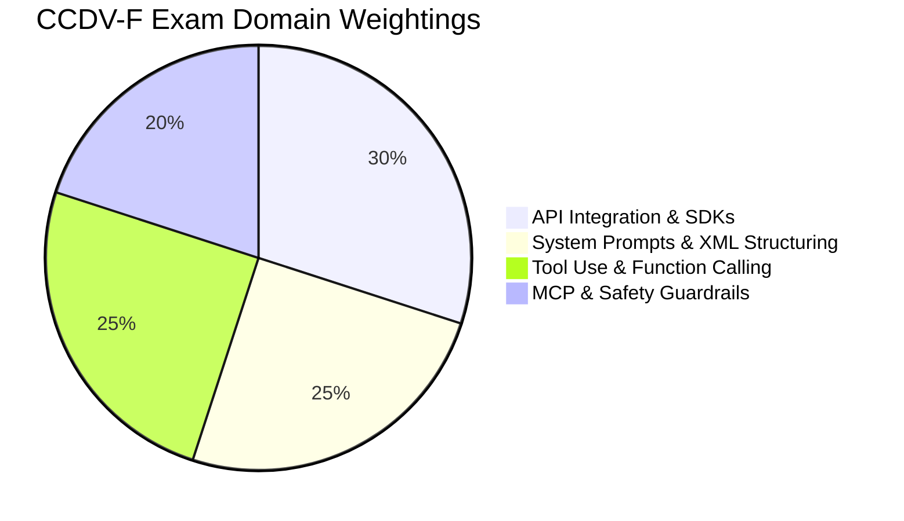
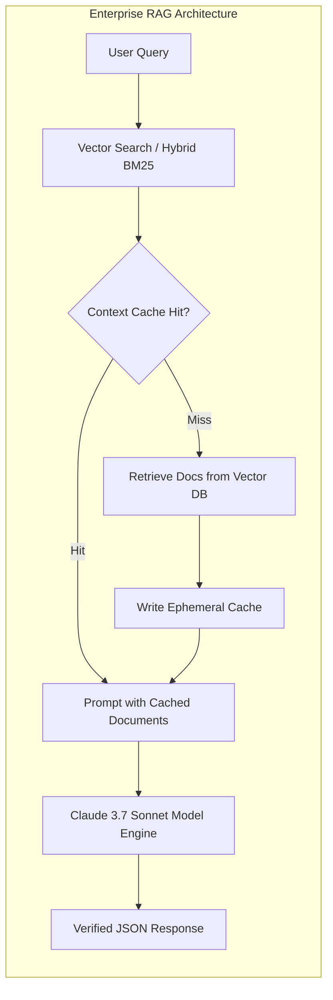
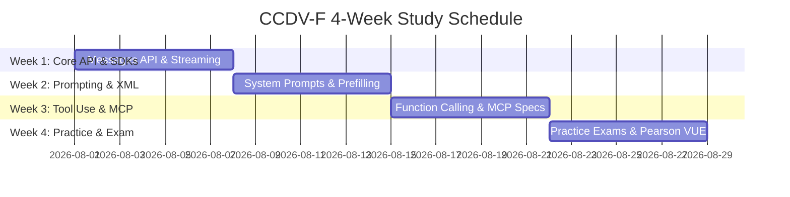

As enterprise adoption of Anthropic's Claude 3.5 Sonnet, Claude 3.7 Sonnet, and Claude Code models accelerates across Global 2000 organizations, software engineers, AI architects, and technical consultants require verifiable credentials to validate their prompt engineering, API integration, and agentic system capabilities.

Anthropic provides a formal **Claude Certification Program** administered via the **Anthropic Partner Academy** and proctored globally by **Pearson VUE**. Successful candidates earn industry-recognized digital credentials verified on **Credly**.

This guide provides a breakdown of exam tracks, domain weightings, technical preparation syllabi, and Pearson VUE proctoring workflows.

---

## Official Anthropic Certification Tracks

Anthropic categorizes credentials across four distinct role-based specialization tracks:

| Exam Code | Official Certification Title | Target Professional Role | Exam Duration | Fee (USD) | Passing Score |
| :--- | :--- | :--- | :---: | :---: | :---: |
| **CCAO-F** | Claude Certified Associate – Foundations | Product Leads & Consultants | 60 mins | **$125** | 700 / 1000 |
| **CCDV-F** | Claude Certified Developer – Foundations | Software & AI Engineers | 90 mins | **$175** | 720 / 1000 |
| **CCAR-F** | Claude Certified Architect – Foundations | Systems & Solutions Architects | 90 mins | **$200** | 720 / 1000 |
| **CCAR-P** | Claude Certified Architect – Professional | Enterprise Principal Engineers | 120 mins | **$300** | 750 / 1000 |

---

## Domain Weightings & Exam Breakdown

### 1. Claude Certified Developer – Foundations (CCDV-F)

The **CCDV-F** exam validates an engineer's ability to construct production-ready applications, agentic workflows, and tool integrations using the Anthropic Messages API and SDKs.



#### Detailed Domain Objectives:

* **Domain 1: API Integration & SDKs (30%)**
  - Constructing Messages API requests (`/v1/messages`) with explicit `model`, `max_tokens`, and system parameters.
  - Streaming responses using Server-Sent Events (SSE) and managing stream completion events.
  - Implementing **Context Caching** (`cache_control: {"type": "ephemeral"}`) to reduce prompt latency and API cost by up to 90%.
  - Managing rate limits (RPM/TPM) and exponential backoff retry strategies across tier limits.

* **Domain 2: System Prompts & XML Structuring (25%)**
  - Formatting complex multi-turn conversations using strict `<thinking>`, `<instructions>`, and `<context>` XML tags.
  - Prefilling assistant responses (`"role": "assistant", "content": "{"`) to enforce deterministic JSON structure.
  - Designing multi-shot prompt templates to minimize hallucination rates in analytical tasks.

* **Domain 3: Tool Use & Function Calling (25%)**
  - Defining explicit JSON schemas for tool definitions passed in API requests.
  - Handling `stop_reason: "tool_use"` and extracting `tool_use_id` parameters.
  - Formulating user role tool result payloads (`"type": "tool_result"`) and feeding results back into the conversation context window.

* **Domain 4: MCP & Safety Guardrails (20%)**
  - Integrating **Model Context Protocol (MCP)** client/server connections over stdio and SSE transports.
  - Configuring safety classifiers, moderation system prompts, and PII redaction filters.
  - Evaluating input prompt injection risks and designing constitutional guardrails.

---

### 2. Claude Certified Architect – Foundations (CCAR-F)

The **CCAR-F** track focuses on high-level enterprise system design, hybrid retrieval-augmented generation (RAG) pipelines, and context window optimization strategies.



#### Detailed Domain Objectives:
* **Vector & Hybrid Search RAG:** Integrating Qdrant/Pinecone with Claude 200k/1M context windows.
* **Cost Optimization Architecture:** Tradeoff analysis between Claude 3.5 Haiku (high throughput, low latency) and Claude 3.7 Sonnet (deep reasoning).
* **Multi-Tenant Deployment & Compliance:** Enterprise VPC endpoints on AWS Bedrock and Google Cloud Vertex AI.

---

## Hands-On Technical Preparation Syllabus

To pass the developer and architect exams, candidates must master specific technical patterns in the Anthropic Python or TypeScript SDKs.

### 1. Master Tool Use Schema Definitions

Candidates must recognize and write valid tool definitions:

```typescript
import Anthropic from '@anthropic-ai/sdk';

const anthropic = new Anthropic();

const response = await anthropic.messages.create({
  model: 'claude-3-7-sonnet-20250219',
  max_tokens: 1024,
  tools: [
    {
      name: 'get_weather_forecast',
      description: 'Fetch current weather conditions for a verified location',
      input_schema: {
        type: 'object',
        properties: {
          location: { type: 'string', description: 'City and state, e.g. San Francisco, CA' },
          unit: { type: 'string', enum: ['celsius', 'fahrenheit'] }
        },
        required: ['location']
      }
    }
  ],
  messages: [{ role: 'user', content: 'What is the weather in Austin, TX?' }]
});

console.log(response.stop_reason); // "tool_use"
```

### 2. Leverage Ephemeral Context Caching

Candidates must understand how to tag static prompts for context caching:

```python
import anthropic

client = anthropic.Anthropic()

response = client.messages.create(
    model="claude-3-7-sonnet-20250219",
    max_tokens=2048,
    system=[
        {
            "type": "text",
            "text": "You are an enterprise legal compliance analyst inspecting codebases...",
            "cache_control": {"type": "ephemeral"} # Ephemeral cache tag
        }
    ],
    messages=[
        {"role": "user", "content": "Analyze the attached license headers for GPL violations."}
    ]
)

print(response.usage.cache_read_input_tokens) # Verified cached tokens read
```

---

## 4-Week Study & Preparation Schedule

A recommended study itinerary for working engineers:



### Study Milestones

* **Week 1: Core API & SDK Fundamentals**
  - Read official Anthropic Messages API specs.
  - Implement streaming response handlers in Python/TypeScript.
  - Calculate context caching break-even points (minimum 1,024 tokens).

* **Week 2: Advanced System Prompts & Structuring**
  - Master XML tag delimiters (`<thinking>`, `<context>`, `<rules>`).
  - Practice response prefilling to guarantee JSON output syntax.

* **Week 3: Tool Use & Model Context Protocol (MCP)**
  - Build multi-tool agent execution loops handling tool invocation errors.
  - Implement stdio/SSE MCP client connections.

* **Week 4: Sample Exams & Pearson VUE Registration**
  - Complete official Anthropic Partner Academy practice tests.
  - Schedule proctored exam via Pearson VUE portal.

---

## Pearson VUE Registration & Exam Day Rules

Exams are administered via Pearson VUE through either:
1. **OnVUE Online Proctoring:** Delivered at home or office via webcam and locked browser.
2. **Pearson VUE Testing Centers:** Delivered in person at authorized testing facilities.

### Online Testing Requirements

* **Workstation Check:** System compatibility test required 48 hours prior to exam time.
* **Identification:** One valid government-issued photo ID (Passport, Driver's License).
* **Workspace Clearance:** Desktop must be 100% clear of secondary monitors, papers, phones, or writing instruments.
* **Proctoring Rules:** Continuous video and audio monitoring. No talking, leaving camera frame, or reading questions aloud.

---

## Credly Badge Verification & Recertification

Upon passing an exam, candidates receive a notification from Credly within 24 hours:

1. **Digital Badge Sharing:** Badges can be embedded on LinkedIn, personal portfolios, and corporate resumes.
2. **Verification URL:** Each badge includes a unique cryptographic verification link hosted on `credly.com/org/anthropic`.
3. **Validity Period:** Credentials remain active for **2 years** from the issue date. Recertification requires passing the latest version of the track exam.

---

## Frequently Asked Questions

### Does Anthropic offer an official Claude Certification?
Yes, Anthropic offers role-based certifications (CCAO-F, CCDV-F, CCAR-F, CCAR-P) administered through the Anthropic Partner Academy and proctored globally by Pearson VUE.

### Are Anthropic certification badges verified on Credly?
Yes, candidates who pass official Pearson VUE proctored exams receive digital certification credentials issued directly through Credly.

### What is the passing score for the Claude Certified Developer exam (CCDV-F)?
The passing scaled score for CCDV-F is 720 out of 1000 across 60 multiple-choice and scenario-based items delivered in a 90-minute exam window.

---

## Image Asset Specifications

* **Hero Visual**:
  - **Prompt**: "Minimalist editorial illustration of Anthropic Claude partner certification credential shield with soft terracotta and ivory tones on light background"
  - **Filename**: "anthropic-cert-hero.jpg"
  - **Alt text**: "Minimalist editorial illustration of Anthropic Claude partner certification credential shield"
  - **Placement**: Hero header section
  - **Aspect Ratio**: 16:9

---

## Related Guides & Workflows

* For Google AI credentials comparison, read [Google AI Certification Costs: Free Badges vs $200 Exams](/guides/google-ai-certification-cost-free-vs-paid).
* For hands-on terminal agent execution mechanics, see [Inside Claude Code Agent: Terminal Loop Architecture](/guides/claude-code-agent-loop-architecture).
* For cross-platform CLI installation guides, visit [How to Install and Set Up Claude Code CLI](/tutorials/how-to-install-claude-code-cli).
