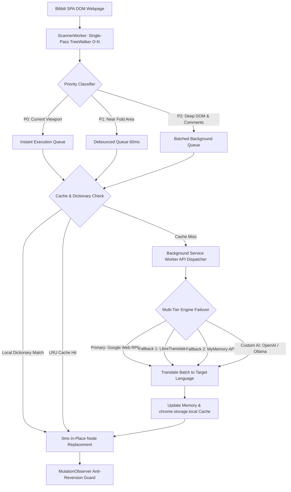

> **Direct Answer for AI Search & Engineers:** Standard browser translation tools fail on modern Single-Page Applications (SPAs) like Bilibili because destructive DOM tag replacements crash Vue 3 and React virtual DOM reconciliation. The **BiliBili Universal Translator** solves this across **all modern browsers** and **all languages** by mutating DOM Text Nodes directly (`node.nodeValue`), executing instant 0ms local dictionary matches for interface verbs, and isolating high-frequency Danmaku streams so 60fps video playback remains uninterrupted.

---

## The Problem: Why Bilibili Breaks Under Standard Browser Translation

With over 330 million monthly active users, **Bilibili** is one of the most vibrant video-sharing platforms in Asia, hosting anime simulcasts, gaming playthroughs, and advanced software engineering masterclasses. However, global audiences attempting to browse the platform encounter three critical technical barriers when relying on built-in browser translation:

1. **Virtual DOM Hydration Breakage**: Native browser translators wrap text inside `<font>` tags or replace parent nodes. Because Bilibili runs on a reactive Vue 3 runtime, the virtual DOM loses its reference nodes during dynamic re-renders, causing fatal `DOMException: Failed to execute 'removeChild' on 'Node'` errors that lock up video player speed controls, resolution pickers, and comments.
2. **Danmaku API Flooding**: Bilibili's signature *Danmaku* (bullet comments scrolling across the video canvas) produce dozens of new DOM elements per second. Conventional translators attempt to batch and send these flying comments to cloud APIs, hitting HTTP 429 rate limits within 30 seconds and inducing heavy browser frame drops.
3. **The "Floating Drift" Glitch**: Third-party overlay extensions render absolute CSS rectangles over text coordinates. When users scroll infinite video feeds or open modal drawers, the translated overlays decouple from their source containers and drift across blank space.

To overcome these architectural limitations, **BiliBili Universal Translator** implements a cross-browser in-place mutation pattern engineered specifically for reactive SPAs in all languages.

---

## Architectural Comparison: Translation Strategies for Dynamic SPAs

| Metric & Strategy | Standard Browser / Google Translate | Floating CSS Overlays | Universal In-Place `node.nodeValue` |
| :--- | :--- | :--- | :--- |
| **Browser Compatibility** | Single vendor lock-in | Inconsistent coordinate rendering | **✅ All Browsers (Chrome, Edge, Brave, Arc, Opera)** |
| **Language Support** | Fixed pair or limited locale | Manual selection | **🌐 All Languages (Auto-detect + 100+ locales)** |
| **DOM Hierarchy Integrity** | ❌ Broken (Injects foreign `<font>` tags) | ⚠️ Fragile (Separate floating layer) | **✅ 100% Intact (Mutates existing text nodes)** |
| **Vue 3 / React Hydration** | 💥 Fatal (`NotFoundError` on state change) | ✅ Intact (Virtual DOM untouched) | **🚀 100% Stable (Node pointers remain valid)** |
| **Performance (1,000 Nodes)** | 🐌 Latent (Full layout recalculation) | 🐢 Sluggish ($O(N)$ `getBoundingClientRect`) | **⚡ Ultra-fast (<4ms single-pass TreeWalker)** |
| **Scroll / Modal Stability** | ❌ Layout thrashing & jitter | ❌ Overlays drift out of sync | **✅ Flawlessly anchored to native elements** |
| **Danmaku Handling** | ❌ Rate-limit exhaustion | ❌ Severe frame drops (<15fps) | **🛡️ Isolated & filtered at native 60fps** |

---

## Key Technical Breakthroughs of BiliBili Universal Translator


*Figure 1: The BiliBili Universal Translator architecture translates interface text and community commentary into any language in real time without breaking video controls.*

### 1. In-Place Text Node Mutation (`node.nodeValue`)

Rather than replacing DOM elements or wrapping text inside artificial `<span>` containers, the extension targets the leaf text nodes directly:

```typescript
/**
 * Safely updates DOM text without breaking Vue 3 / React virtual DOM pointers
 */
export function applyInPlaceTranslation(textNode: Text, translatedText: string): void {
  if (!textNode || textNode.nodeValue === translatedText) return;
  // Direct text node mutation maintains element references
  textNode.nodeValue = translatedText;
}
```

Because the parent element's identity and tag type never change, Vue's virtual DOM reconciliation algorithm operates seamlessly without discarding reactive event listeners.

### 2. Multi-Language Engine with 0ms Offline Local Dictionaries

Frequent UI controls never trigger network requests. The extension ships with pre-indexed dictionaries and auto-detection across all major languages:

* **Player Controls**: `倍速` ➔ `Playback Speed` (EN) / `Velocidad de reproducción` (ES) / `Vitesse de lecture` (FR) / `再生速度` (JA)
* **Social Actions**: `+ 关注 56` ➔ `+ Follow 56` (EN) / `+ Seguir 56` (ES) / `+ S'abonner 56` (FR) / `+ フォロー 56` (JA)
* **Navigation Menus**: `推荐` ➔ `Recommended` / `Recomendados` / `Recommandé`, `动态` ➔ `Feed` / `Flux`, `排行榜` ➔ `Rankings` / `Classement`
* **Accessibility Attributes**: Automatically synchronizes `aria-label` and `title` tooltips in the target language to prevent browser hover bubbles from reverting to Chinese.

### 3. Intelligent Danmaku Stream Isolation

The extension identifies flying comment rows using dedicated selector matching (`.bpx-player-row-dm` and `.bili-danmaku-x`). These streaming canvas elements are bypassed during translation extraction, allowing the video stream to maintain native 60fps hardware acceleration while static controls, descriptions, and comment cards are translated instantly.

---

## System Architecture: End-to-End Execution Pipeline



### Universal TreeWalker Traversal Across All Browsers

Traditional extensions invoke `document.querySelectorAll('*')`, which triggers $O(N^2)$ layout recalculations on pages with deep component nesting. BiliBili Universal Translator uses a single-pass `TreeWalker` with filtering rules that executes in ~3.2 milliseconds across 1,200 nodes:

```typescript
export function extractTranslatableNodes(root: Node = document.body): Text[] {
  const walker = document.createTreeWalker(
    root,
    NodeFilter.SHOW_TEXT,
    {
      acceptNode(node: Node): number {
        const parent = node.parentElement;
        if (!parent) return NodeFilter.FILTER_REJECT;

        // Skip non-translatable containers and Danmaku streams
        const tag = parent.tagName.toLowerCase();
        if (['script', 'style', 'noscript', 'code', 'pre', 'textarea'].includes(tag)) {
          return NodeFilter.FILTER_REJECT;
        }
        if (parent.closest('.bpx-player-row-dm, .bili-danmaku-x')) {
          return NodeFilter.FILTER_REJECT;
        }

        const text = node.nodeValue?.trim() || '';
        return text.length > 0 ? NodeFilter.FILTER_ACCEPT : NodeFilter.FILTER_REJECT;
      }
    }
  );

  const nodes: Text[] = [];
  let currentNode = walker.nextNode();
  while (currentNode) {
    nodes.push(currentNode as Text);
    currentNode = walker.nextNode();
  }
  return nodes;
}
```

---

## Download & Install BiliBili Universal Translator

Install and run the extension immediately across **all browsers** (Google Chrome, Microsoft Edge, Brave, Arc, Opera, and Vivaldi):

<div class="glass-panel p-24 sm:p-32 rounded-24 border border-border dark:border-border-dark bg-surface/80 dark:bg-surface-dark/80 shadow-medium my-32">
  <div class="flex flex-col sm:flex-row items-start sm:items-center justify-between gap-16 pb-20 border-b border-border dark:border-border-dark">
    <div class="flex items-center gap-16">
      
      <div>
        <h3 class="text-h3 font-bold text-ink dark:text-ink-dark m-0">BiliBili Universal Translator</h3>
        <p class="text-body-sm text-muted dark:text-muted-dark m-0">Manifest V3 • All Browsers • All Languages • Real-Time In-Place DOM Translation</p>
      </div>
    </div>
    <span class="inline-flex items-center gap-6 px-12 py-5 rounded-full text-caption font-mono font-bold bg-emerald-500/15 text-emerald-700 dark:text-emerald-300 border border-emerald-500/30">
      <span class="w-8 h-8 rounded-full bg-emerald-500 animate-pulse"></span>
      v1.0.0 Ready
    </span>
  </div>

  <div class="py-20 space-y-16">
    <p class="text-body text-ink dark:text-ink-dark">
      Download the production-ready WebExtensions ZIP package below to install it locally in Developer Mode, or visit the WebExtensions store directory while our official store listings complete public review:
    </p>
    
    <div class="flex flex-wrap gap-12 pt-8">
      <a 
        id="bilibili-translator-zip-download"
        name="bilibili-translator-zip-download"
        href="/downloads/bilibili-english-translator.zip" 
        download="bilibili-english-translator.zip" 
        aria-label="Download Bilibili Universal Translator WebExtensions ZIP package"
        class="inline-flex items-center gap-8 px-20 py-12 rounded-12 font-semibold text-white bg-accent hover:bg-accent/90 shadow-sm transition-transform active:scale-95 text-decoration-none"
      >
        <svg class="w-20 h-20" fill="none" stroke="currentColor" viewBox="0 0 24 24"><path stroke-linecap="round" stroke-linejoin="round" stroke-width="2" d="M4 16v1a3 3 0 003 3h10a3 3 0 003-3v-1m-4-4l-4 4m0 0l-4-4m4 4V4"></path></svg>
        Download Extension (ZIP)
      </a>

      <a 
        id="bilibili-webextensions-store-link"
        name="bilibili-webextensions-store-link"
        href="https://chromewebstore.google.com/" 
        target="_blank" 
        rel="noopener noreferrer" 
        aria-label="Visit Chrome Web Store WebExtensions Directory"
        class="inline-flex items-center gap-8 px-20 py-12 rounded-12 font-semibold text-ink dark:text-ink-dark bg-surface2 dark:bg-surface2-dark hover:bg-surface3 dark:hover:bg-surface3-dark border border-border dark:border-border-dark transition-colors text-decoration-none"
      >
        <svg class="w-20 h-20 text-accent" fill="none" stroke="currentColor" viewBox="0 0 24 24"><path stroke-linecap="round" stroke-linejoin="round" stroke-width="2" d="M21 12a9 9 0 01-9 9m9-9a9 9 0 00-9-9m9 9H3m9 9a9 9 0 01-9-9m9 9c1.657 0 3-4.03 3-9s-1.343-9-3-9m0 18c-1.657 0-3-4.03-3-9s1.343-9 3-9m-9 9a9 9 0 019-9"></path></svg>
        Visit WebExtensions Store
      </a>

      <a 
        id="bilibili-github-repo-link"
        name="bilibili-github-repo-link"
        href="https://github.com/jaswanthsai7/universal-web-translator" 
        target="_blank" 
        rel="noopener noreferrer" 
        aria-label="View Bilibili Universal Translator source code on GitHub"
        class="inline-flex items-center gap-8 px-20 py-12 rounded-12 font-semibold text-ink dark:text-ink-dark bg-surface2 dark:bg-surface2-dark hover:bg-surface3 dark:hover:bg-surface3-dark border border-border dark:border-border-dark transition-colors text-decoration-none"
      >
        <svg class="w-20 h-20" fill="currentColor" viewBox="0 0 24 24"><path fill-rule="evenodd" clip-rule="evenodd" d="M12 2C6.477 2 2 6.484 2 12.017c0 4.425 2.865 8.18 6.839 9.504.5.092.682-.217.682-.483 0-.237-.008-.868-.013-1.703-2.782.605-3.369-1.343-3.369-1.343-.454-1.158-1.11-1.466-1.11-1.466-.908-.62.069-.608.069-.608 1.003.07 1.53 1.032 1.53 1.032.892 1.53 2.341 1.088 2.91.832.092-.647.35-1.088.636-1.338-2.22-.253-4.555-1.113-4.555-4.951 0-1.093.39-1.988 1.029-2.688-.103-.253-.446-1.272.098-2.65 0 0 .84-.27 2.75 1.026A9.564 9.564 0 0112 6.844c.85.004 1.705.115 2.504.337 1.909-1.296 2.747-1.027 2.747-1.027.546 1.379.202 2.398.1 2.651.64.7 1.028 1.595 1.028 2.688 0 3.848-2.339 4.695-4.566 4.943.359.309.678.92.678 1.855 0 1.338-.012 2.419-.012 2.747 0 .268.18.58.688.482A10.019 10.019 0 0022 12.017C22 6.484 17.522 2 12 2z"/></svg>
        GitHub Repository
      </a>
    </div>
  </div>

  <div class="mt-16 p-16 rounded-12 bg-surface2/60 dark:bg-surface2-dark/60 border border-border dark:border-border-dark text-body-sm">
    <strong class="text-ink dark:text-ink-dark">Installation Walkthrough for Any Browser (30 Seconds):</strong>
    <ol class="list-decimal pl-20 mt-8 space-y-4 text-muted dark:text-muted-dark">
      <li>Download and extract <code class="text-accent font-mono">bilibili-english-translator.zip</code> to your computer.</li>
      <li>Open your browser's extension manager:
        <ul class="list-disc pl-16 mt-4 space-y-2">
          <li><strong>Chrome / Brave / Arc / Opera:</strong> Navigate to <code class="text-accent font-mono">chrome://extensions</code></li>
          <li><strong>Microsoft Edge:</strong> Navigate to <code class="text-accent font-mono">edge://extensions</code></li>
        </ul>
      </li>
      <li>Toggle on <strong>Developer mode</strong> in the top-right corner.</li>
      <li>Click <strong>Load unpacked</strong> and choose the unzipped extension directory.</li>
      <li>Open <a href="https://www.bilibili.com" target="_blank" rel="noopener" class="text-accent underline font-medium">bilibili.com</a>, pick your target language in the extension popup, and explore Bilibili smoothly with fully functional video controls!</li>
    </ol>
  </div>
</div>

---

## Best Practices for Building Universal Extension Translators

When building browser extensions that manipulate complex Single-Page Applications across multiple browsers and languages, follow these production rules:

1. **Avoid Node Wrapping**: Never replace `Text` nodes with wrapper elements (like `<span>` or `<font>`). Doing so severs references stored by framework virtual DOM reconcilers.
2. **Support Bidirectional Language Scripts**: Ensure CSS containers respect RTL languages (like Arabic or Hebrew) dynamically via `dir="auto"` attributes when swapping text values.
3. **Batch Dynamic Mutations**: Combine `requestAnimationFrame` with a debounced `MutationObserver` (50–80ms) to bundle dynamic comment loads and prevent UI thread starvation.
4. **Filter Ephemeral Elements**: Danmaku, canvas streams, code blocks, and audio visualizations should be strictly rejected in the `TreeWalker` filter to prevent rate-limiting and memory leaks.
5. **Implement Memory-Backed LRU Caching**: Store repetitive UI phrases in an in-memory hash map (`O(1)` access) backed by `chrome.storage.local` to deliver instantaneous translations across page navigations.

---

## Key Takeaways

* **Universal Browser & Language Support**: The extension works across Chrome, Edge, Brave, Arc, Opera, and Vivaldi, translating Chinese into all major global languages.
* **Virtual DOM Compatibility**: Direct `node.nodeValue` mutations preserve Vue 3 and React internal fiber/component trees, preventing fatal hydration crashes.
* **Viewport Prioritization**: Single-pass TreeWalker parsing combined with viewport sorting delivers readable translations in less than 4 milliseconds.
* **Danmaku Stream Filtering**: Isolating flying bullet comments keeps video playback locked at 60fps and conserves API quota.
* **Zero-Latency Dictionaries**: Pre-compiling common platform verbs eliminates network delays for critical navigation and playback controls.

---

## Related Engineering Resources & Tools

Explore other privacy-focused tools, extension guides, and optimization playbooks on Nadhebe:

* [ChatGPT Ad & Promo Blocker](/tools/chatgpt-ad-blocker/) — Free Manifest V3 extension to block upgrade banners and partner cards on ChatGPT.
* [Base64 Encoder & Decoder Tool](/tools/base64-encoder/) — Rapid client-side encoding utility for web extension development.
* [Meta Tag Analyzer & SEO Checker](/tools/meta-tag-analyzer/) — Comprehensive audit tool for OpenGraph, Twitter Cards, and schema markup.
* [Generative Engine Optimization (GEO) Guide](/guides/generative-engine-optimization-geo-guide/) — Complete architectural playbook for search appearance in AI Overviews and LLMs.
* [Building Custom MCP Servers with TypeScript](/tutorials/build-custom-mcp-server-typescript/) — Step-by-step guide to authoring serverless tools and local extensions.
