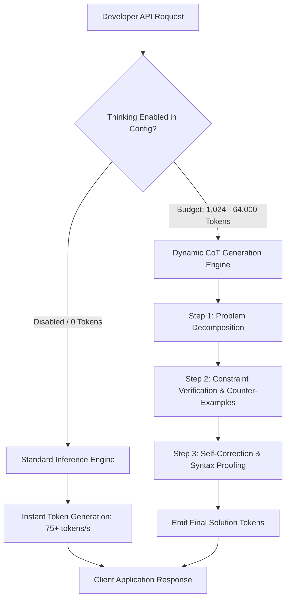
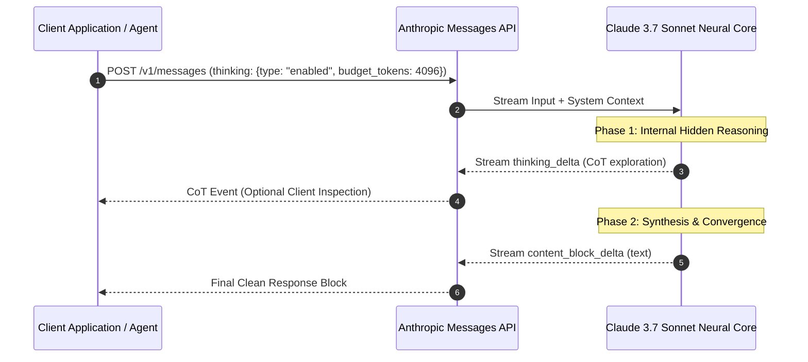
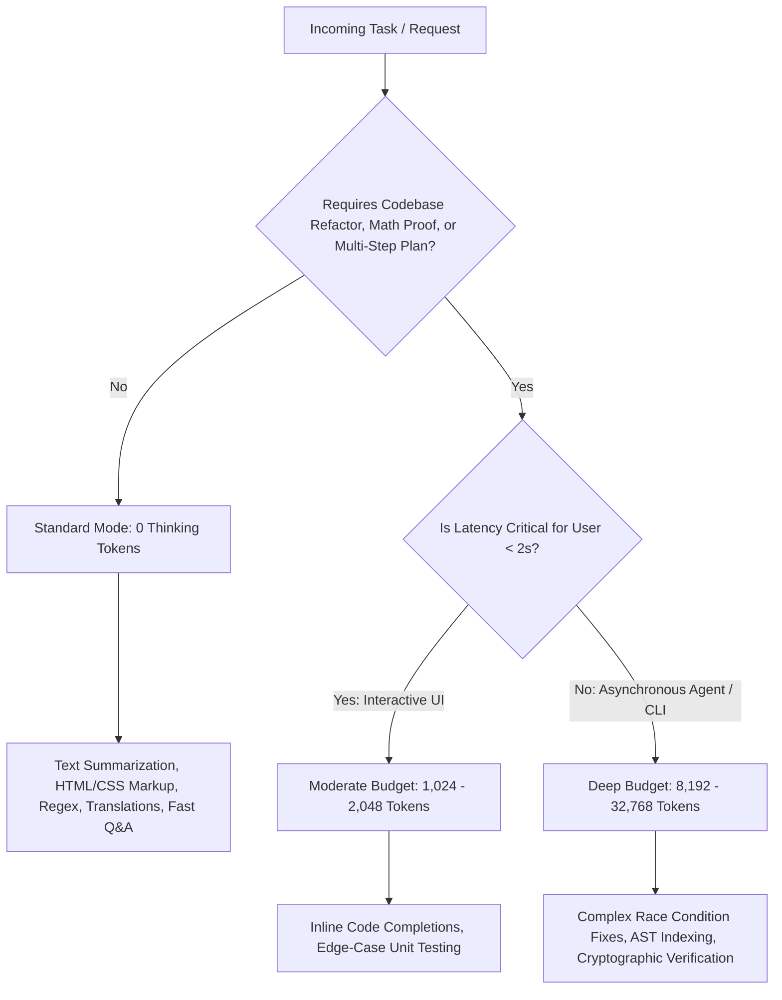

Anthropic's **Claude 3.7 Sonnet** introduces the industry's first true **hybrid reasoning architecture**. Prior to this release, AI engineering teams were forced to bifurcate their tech stacks: routing routine classification, chat, and editing tasks to fast models (like Claude 3.5 Sonnet or GPT-4o), while shunting complex coding, planning, and formal logic to latency-heavy reasoning models (such as OpenAI o1/o3-mini or DeepSeek-R1). 

Claude 3.7 Sonnet consolidates both operational modalities into a single neural network. By controlling a dynamic thinking token budget via the Messages API, developers can scale compute seamlessly from millisecond response times to deep, multi-minute algorithmic deliberation.

---

## What is Claude 3.7 Sonnet Hybrid Reasoning?

Claude 3.7 Sonnet hybrid reasoning is a unified model design where a single set of model weights dynamically switches between instant generation and extended chain-of-thought computation. Developers specify a thinking budget (`max_thinking_tokens`), enabling the model to self-correct, deliberate, and verify edge cases before emitting user-visible tokens.

In standard mode (`thinking: { type: "disabled" }`), Claude 3.7 Sonnet generates tokens immediately with state-of-the-art coding, instruction following, and multilingual capabilities. When thinking is activated, the model generates encrypted and verifiable internal reasoning steps wrapped inside `<thinking>` tokens.



---

## Technical Architecture: Single-Pass Hybrid Execution

Traditional reasoning models rely on heavy system wrappers or distinct distilled student-teacher architectures that require substantial context switching. Claude 3.7 Sonnet integrates thinking natively into transformer attention heads.



### Key Architectural Advantages

1. **Deterministic Latency Management:** You can set `budget_tokens: 1024` for quick sanity-checking or `budget_tokens: 16384` for whole-codebase refactorings.
2. **Interleaved Agentic Tool Calling:** Unlike black-box reasoning systems, Claude 3.7 Sonnet reasons *between* tool executions. When coupled with terminal tools like [Claude Code CLI](/tutorials/how-to-install-claude-code-cli/), it inspects terminal compiler output, deliberates on root causes, and fixes regressions autonomously.
3. **Preserved Tone and Formatting:** The model does not suffer from "reasoning roboticism." Its output retains Anthropic's nuanced, human-centric tone, formatting, and precision.

---

## Configuring Thinking Budgets in the Messages API

To use extended thinking in production, specify the `thinking` object alongside your standard `max_tokens` parameter. Note that `max_tokens` must always exceed `budget_tokens`.

### Node.js / TypeScript Implementation

```typescript
import Anthropic from '@anthropic-ai/sdk';

const client = new Anthropic({
  apiKey: process.env.ANTHROPIC_API_KEY,
});

async function runHybridQuery(userPrompt: string, enableExtendedThinking = true) {
  const thinkingBudget = enableExtendedThinking ? 4096 : 0;
  const maxTokens = enableExtendedThinking ? 8192 : 4096;

  const response = await client.messages.create({
    model: 'claude-3-7-sonnet-20250219',
    max_tokens: maxTokens,
    ...(enableExtendedThinking
      ? {
          thinking: {
            type: 'enabled',
            budget_tokens: thinkingBudget,
          },
        }
      : {}),
    messages: [
      {
        role: 'user',
        content: userPrompt,
      },
    ],
  });

  // Extract thinking blocks and regular text blocks
  for (const block of response.content) {
    if (block.type === 'thinking') {
      console.log('--- INTERNAL REASONING ---');
      console.log(block.thinking);
    } else if (block.type === 'text') {
      console.log('--- FINAL RESPONSE ---');
      console.log(block.text);
    }
  }

  return response;
}
```

### Python Implementation with Streaming

```python
import os
from anthropic import Anthropic

client = Anthropic(api_key=os.environ.get("ANTHROPIC_API_KEY"))

def stream_hybrid_reasoning(prompt: str, budget: int = 2048):
    with client.messages.stream(
        model="claude-3-7-sonnet-20250219",
        max_tokens=6000,
        thinking={
            "type": "enabled",
            "budget_tokens": budget,
        },
        messages=[{"role": "user", "content": prompt}]
    ) as stream:
        for event in stream:
            if event.type == "content_block_delta":
                if event.delta.type == "thinking_delta":
                    print(f"\033[90m{event.delta.thinking}\033[0m", end="", flush=True)
                elif event.delta.type == "text_delta":
                    print(f"\033[92m{event.delta.text}\033[0m", end="", flush=True)

# Example usage for algorithmic validation
stream_hybrid_reasoning("Prove that the maximum subarray sum in circular arrays can be solved in O(N) time.")
```

---

## Benchmark Matrix: Claude 3.7 Sonnet vs OpenAI o3-mini vs DeepSeek-R1

To evaluate where Claude 3.7 Sonnet excels, we compiled performance across competitive coding (SWE-bench Verified, HumanEval), mathematical reasoning (MATH 500), and front-end UI assembly benchmarks.

| Metric / Evaluation | Claude 3.7 Sonnet (Standard) | Claude 3.7 Sonnet (Thinking 16k) | OpenAI o3-mini (High) | DeepSeek-R1 (671B) |
| :--- | :--- | :--- | :--- | :--- |
| **SWE-bench Verified (%)** | 49.2% | **70.3%** | 48.9% | 49.2% |
| **AIME 2024 Math (Accuracy)** | 62.4% | **84.8%** | 83.6% | 79.8% |
| **Time-to-First-Token (TTFT)** | **< 650 ms** | 4,200 ms | 6,800 ms | 5,400 ms |
| **Controllable Latency** | **Yes (0 to 64k)** | **Yes (0 to 64k)** | No (Low/Med/High only) | No (Static Unconstrained) |
| **Tool Calling Interleaving** | **Native** | **Native** | Limited / Sequential | External Orchestrator |
| **Input Pricing (/1M tokens)** | $3.00 | $3.00 | $1.10 | $0.55 |
| **Output / Thinking Pricing** | $15.00 | $15.00 | $4.40 | $2.19 |

For a broader evaluation of reasoning dynamics, see our comparison of [DeepSeek-V4 vs o3-mini vs Claude](/comparisons/deepseek-v4-vs-o3-mini-vs-claude/).

---

## Strategic Decision Framework: Thinking vs Fast Mode

Activating extended thinking on every user turn is an anti-pattern that inflates API expenses and degrades user experience with unnecessary buffering delays. Use this decision matrix to route queries intelligently:



### 1. When to Use Standard Fast Mode (0 Tokens)
* **Single-File Bug Fixes:** Syntactic adjustments, typo corrections, and simple API signature updates.
* **Content Generation:** Technical documentation, release notes, and email synthesis.
* **High-Throughput Webhooks:** Real-time chat streaming and webhook notification parsers where latency must stay sub-second.

### 2. When to Use Extended Thinking (2k–16k Tokens)
* **Full-Stack Architectural Design:** System interface contracts, database migration plans, and distributed consensus logic.
* **Refactoring Complex Async Code:** Resolving tricky deadlocks, Promise leaks, and event-loop blocking routines in Node.js or Go.
* **Autonomous Agent Loops:** As detailed in our deep dive on the [Claude Code Agent Loop Architecture](/guides/claude-code-agent-loop-architecture/), providing Claude with thinking tokens enables it to plan multi-file edits before touching disk.

---

## Common Prompting Pitfalls & How to Avoid Them

### 1. Over-Prompting Chain-of-Thought in System Prompts
* **The Mistake:** Writing *"Think step-by-step, evaluate all possibilities, and provide your reasoning before answering."*
* **The Fix:** Claude 3.7 Sonnet already does this intrinsically in its hidden `<thinking>` blocks. Adding manual CoT instructions causes the model to duplicate its thinking in the final text response, doubling token consumption.

### 2. Setting Insufficient Output Headroom
* **The Mistake:** Configuring `max_tokens: 4000` with `budget_tokens: 4000`.
* **The Fix:** If the model exhausts its budget entirely on thinking tokens, it will truncate before outputting the final answer. Always set `max_tokens` at least **2,000 to 4,000 tokens higher** than `budget_tokens`.

```json
{
  "max_tokens": 8192,
  "thinking": {
    "type": "enabled",
    "budget_tokens": 4096
  }
}
```

---

## Key Takeaways

1. **Dual Operating Modes in One Model:** Claude 3.7 Sonnet eliminates the architectural friction of choosing between separate "chat" and "reasoning" models.
2. **Granular Compute Control:** By scaling `budget_tokens` from 0 to 64,000, development teams can strictly enforce latency SLAs and margin targets.
3. **World-Class Agentic Coding:** With extended thinking enabled, Claude 3.7 Sonnet hits over 70% on SWE-bench Verified, outperforming competing proprietary and open-source models on autonomous multi-file workflows.
4. **Inspectable Deliberation:** The ability to stream internal thinking deltas provides unprecedented observability into model intent, edge-case analysis, and safety alignments.
