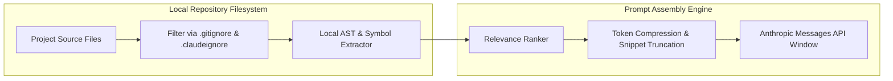
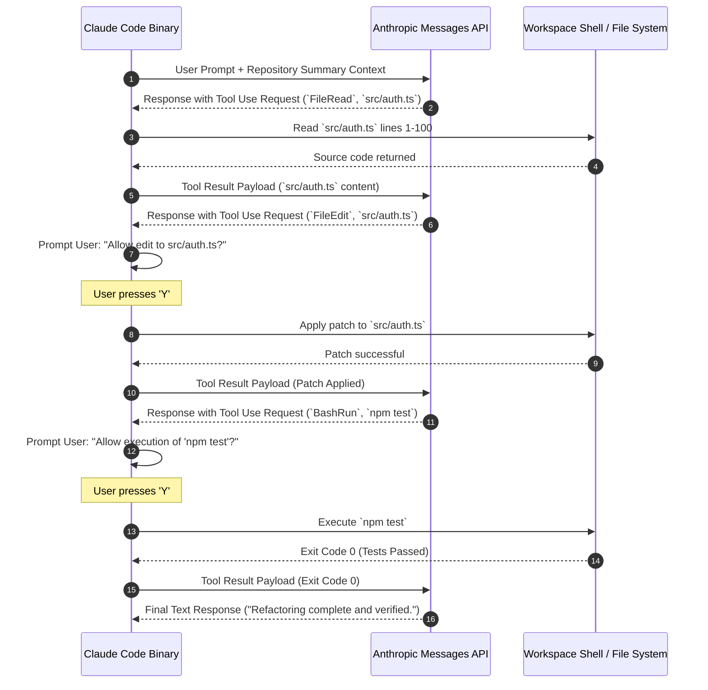

Anthropic's **Claude Code** represents a fundamental architectural shift from chat-based AI assistants to stateful, autonomous terminal agents. Traditional IDE code completion tools operate passively by suggesting inline code snippets based on surrounding text. In contrast, Claude Code acts as an active shell operator—capable of parsing multi-file workspace structures, executing terminal commands, evaluating test failure outputs, and committing git refactorings.

Understanding the internal execution loop, context indexing engine, tool calling schemas, and permission boundaries of Claude Code is essential for technical leads and engineering teams deploying agentic tooling in software production pipelines.

---

## The Observe-Plan-Act-Verify Execution Loop

At the core of Claude Code is a stateful **Observe-Plan-Act-Verify (OPAV)** loop operating directly over your local workspace filesystem:

```mermaid
flowchart TD
    UserPrompt[User CLI Instruction] --> Observe[Observe: Scan Workspace & AST Context]
    Observe --> Plan[Plan: Formulate Tool Execution Sequence]
    Plan --> PermissionCheck{Requires Human Approval?}
    
    PermissionCheck -->|Read-Only / Search| Act[Act: Execute Tool Call]
    PermissionCheck -->|Write / Bash / Delete| PromptUser[Prompt Developer for Approval]
    
    PromptUser -->|Approved [Y]| Act
    PromptUser -->|Rejected [N]| Replan[Replan: Abort / Adjust Approach]
    Replan --> Plan
    
    Act --> Verify[Verify: Parse Shell Exit Codes & Test Logs]
    Verify --> GoalCheck{Goal Fully Achieved?}
    
    GoalCheck -->|No: Errors Found| Plan
    GoalCheck -->|Yes: Verified| Complete[Output Final Summary to Terminal]
```

### Phased Operational Breakdown

1. **Observe (State Extraction):** Upon receiving a user prompt (e.g., *"Fix the race condition in auth token refresh"*), Claude Code scans `.gitignore` rules, parses repository file trees, and inspects local git diffs to gather contextual relevance.
2. **Plan (Reasoning & Tool Selection):** Powered by Claude 3.7 Sonnet's extended reasoning capabilities (`<thinking>` tags), the model formulates a multi-step plan identifying which files to inspect, modify, or test.
3. **Act (Atomic Tool Execution):** The agent issues structured tool requests (`FileRead`, `FileEdit`, `BashRun`, `GrepSearch`) back to the local CLI binary runtime.
4. **Verify (Feedback Parsing):** Following tool execution, the agent evaluates stdout, stderr, process exit codes (`0` vs `1`), and test results to determine if additional corrective turns are needed.

---

## Workspace Context Collection & Local AST Indexing

Sending an entire 500,000-line codebase to an LLM context window on every prompt is computationally inefficient and cost-prohibitive. Claude Code implements a multi-stage local context collection engine:



### Context Minimization Strategies

* **Ignore Filter Parsing:** Reads `.gitignore`, `.env`, and custom `.claudeignore` rules to automatically exclude build artifacts (`node_modules/`, `dist/`, `.git/`, binary assets, and credential files).
* **Symbol & AST Extraction:** Uses tree-sitter or lightweight regex indexers to extract function signatures, class definitions, and exported modules without loading complete implementation details.
* **Smart Snippet Truncation:** When reading large source files, Claude Code extracts relevant line ranges (e.g., lines 120–180 around a targeted method) rather than dumping 3,000 lines of boilerplate into the context window.

---

## Native Tool Execution Engine & JSON Schemas

Claude Code executes terminal tasks by calling specialized, internal tools configured via JSON schemas.

### Primary Agent Tools

| Tool Identifier | Core Functionality | Execution Permissions | Safety Policy |
| :--- | :--- | :--- | :--- |
| **`FileRead`** | Reads exact line ranges from workspace files | **Auto-Approved** | Read-only |
| **`FileEdit`** | Applies targeted string/line replacements to existing files | **Prompt Required** | State-changing |
| **`FileWrite`** | Creates new files or overwrites existing content | **Prompt Required** | State-changing |
| **`DirectoryList`** | Lists workspace directories and tree structures | **Auto-Approved** | Read-only |
| **`GrepSearch`** | Executes regex searches across repository files | **Auto-Approved** | Read-only |
| **`GlobTool`** | Finds filenames matching pattern globs (`**/*.ts`) | **Auto-Approved** | Read-only |
| **`BashRun`** | Executes arbitrary shell commands (`npm test`, `git commit`) | **Prompt Required** | Potentially Destructive |

### Detailed Sequence: Automated Test Refactoring



---

## Human-in-the-Loop Permission Guardrails

Security is a primary design constraint for terminal agents. Unrestricted execution of arbitrary shell commands (`rm -rf *`, `git push --force`) could corrupt local repositories or compromise developer credentials.

### Three-Tier Permission Classification

1. **Tier 1: Read-Only Operations (Auto-Approved)**
   - Operations that query workspace state (`FileRead`, `GrepSearch`, `DirectoryList`) execute without prompting the developer.

2. **Tier 2: State-Changing Operations (Interactive Prompting)**
   - Operations that alter local state (`FileEdit`, `FileWrite`, `BashRun`, `git commit`) display colored diffs and command parameters in the terminal window, pausing until the user inputs `Y` (Yes) or `N` (No).

3. **Tier 3: Headless Execution (`--dangerously-skip-permissions`)**
   - For headless CI/CD container environments where human interaction is impossible, this flag bypasses all confirmation prompts.

> [!CAUTION]
> **Headless Execution Security Warning**: Never run `--dangerously-skip-permissions` on a primary developer workstation outside an isolated container or virtual machine. Malicious repositories or prompt injections could execute arbitrary code without developer oversight.

---

## Agent Performance Benchmarks

Claude Code powered by **Claude 3.7 Sonnet** achieves industry-leading scores on standardized autonomous coding benchmarks:

| Benchmark Test | Focus Area | Claude Code (3.7 Sonnet) | Previous Gen Agents | Performance Margin |
| :--- | :--- | :---: | :---: | :---: |
| **SWE-bench Verified** | Resolving real-world GitHub issues | **70.3%** | 49.0% | **+21.3%** |
| **TerminalBench 2.1** | Complex multi-turn shell CLI navigation | **88.8%** | 64.2% | **+24.6%** |
| **HumanEval Fix** | Automated unit test bug remediation | **92.4%** | 81.0% | **+11.4%** |

---

## Context Explosion Mitigation & Cost Management

During extended multi-file refactoring sessions, token consumption accumulates rapidly as conversation history grows. Claude Code incorporates native cost mitigation strategies:

### 1. The `/compact` Command

When context history exceeds threshold limits (typically ~100k tokens), developers can issue the `/compact` sub-command:

```bash
/compact
```

This instructs the agent to summarize all historical reasoning turns into a concise state summary, resetting the active token context window while retaining active file paths and goals.

### 2. Ephemeral Prompt Caching

Claude Code leverages Anthropic's **Ephemeral Context Caching** on system prompts and static file indices. By tagging system instructions and file trees with `cache_control: {"type": "ephemeral"}`, consecutive agent turns reuse cached prompt tokens at a **90% cost discount** and **80% latency reduction**.

```text
Token Cost Structure (Claude 3.7 Sonnet):
-------------------------------------------------------------------
Standard Input Tokens:     $3.00 / Million Tokens
Cached Read Input Tokens:  $0.30 / Million Tokens (90% Savings)
Output Tokens:             $15.00 / Million Tokens
-------------------------------------------------------------------
```

---

## Frequently Asked Questions

### What is the core execution loop used by Claude Code agent?
Claude Code operates on an iterative Observe-Plan-Act-Verify loop where the agent inspects project state, crafts a plan, executes atomic tool calls, and verifies test/terminal output.

### How does Claude Code isolate system commands from destructive actions?
Claude Code enforces human-in-the-loop security prompts before executing shell write operations, git commits, file deletions, or system package installations.

### Does Claude Code send your entire local codebase to Anthropic servers?
No, Claude Code uses localized AST and file tree indexers to pass only contextually relevant file snippets and git diffs into prompt context windows.

### How does Claude Code manage context window explosion during long sessions?
It uses ephemeral prompt caching and automatic context compaction via the `/compact` command to compress historical execution turns while preserving workspace state.

---

## Image Asset Specifications

* **Hero Visual**:
  - **Prompt**: "Minimalist architectural diagram showing autonomous agent loops with glowing node paths and soft violet accents on light grey canvas"
  - **Filename**: "claude-agent-hero.jpg"
  - **Alt text**: "Minimalist architectural diagram showing autonomous agent loops with glowing node paths"
  - **Placement**: Hero header section
  - **Aspect Ratio**: 16:9

---

## Related Guides & Workflows

* For installation & setup guides across all platforms, see [How to Install and Set Up Claude Code CLI](/tutorials/how-to-install-claude-code-cli).
* For native Windows setup & WSL2 optimization, read [How to Install and Run Claude Code CLI on Windows](/tutorials/installing-claude-code-cli-windows).
* For Anthropic official certification pathways, explore [Anthropic Claude Certification Guide](/guides/anthropic-claude-certification-developer-guide).
