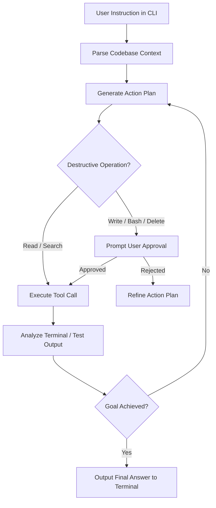

Anthropic's **Claude Code** represents a paradigm shift from chat-based AI assistants to autonomous terminal agents. Unlike traditional IDE plugins that suggest code snippets, Claude Code operates as an interactive shell agent capable of reading multi-file project structures, executing CLI commands, editing source files, and running test suites.

Understanding the internal execution loop and security permissions of Claude Code is essential for engineering teams deploying AI agents in production environments.

## The Autonomous Terminal Execution Loop

Claude Code follows a stateful **Observe-Plan-Act-Verify** loop operating directly over your local workspace filesystem:

## Architectural Breakdown

### 1. Context Collection & Indexing
When launched in a directory, Claude Code scans `.gitignore` files to exclude build artifacts (`node_modules/`, `dist/`, `.git/`). It builds a lightweight local AST and file map to pass structured context into Anthropic's Claude 3.5 / Claude 3.7 Sonnet API endpoints.

### 2. Native Tool Calling System
Claude Code relies on structured JSON tool calling schema including:
* **`FileRead` / `FileWrite`:** Inspects and writes code files atomically.
* **`DirectoryList` / `GrepSearch`:** Rapidly navigates unfamiliar repositories.
* **`BashRun`:** Executes tests (`npm test`, `pytest`), linter checks, and git operations.

### 3. Human-in-the-Loop Permission Guardrails
Security is built into the CLI runtime. Read-only operations (`cat`, `ls`, `grep`) run transparently, while state-changing commands (`git commit`, `rm`, file overwrites) pause execution to display exact diffs for human confirmation.

## Token & Cost Management for Long Sessions

Because autonomous agent loops re-read updated context after every action, token consumption can accumulate rapidly during extended debugging sessions.

| Session Type | Estimated Context Window | Recommended Optimization Strategy |
| :--- | :--- | :--- |
| **Single Function Bugfix** | 10k – 30k tokens | Use targeted prompts targeting specific filenames |
| **Multi-File Refactoring** | 50k – 150k tokens | Compact chat history periodically using `/compact` |
| **Full Suite Test Debugging** | 150k – 200k+ tokens | Use explicit file filters to limit context accumulation |

## Image Asset Specifications

* **Hero Visual**:
  - **Prompt**: "Minimalist architectural diagram showing autonomous agent loops with glowing node paths and soft violet accents on light grey canvas"
  - **Filename**: "claude-agent-hero.jpg"
  - **Alt text**: "Minimalist architectural diagram showing autonomous agent loops with glowing node paths"
  - **Placement**: Hero header section

## Related Guides & Workflows

* For installation instructions, read [How to Install and Set Up Claude Code CLI](/tutorials/how-to-install-claude-code-cli).
* For multi-agent state architectures, see [The SQLite State-Sharing Pattern for Multi-Agent Architectures](/frameworks/sqlite-state-sharing-multi-agent-architecture).
* For API token budget strategies, explore [LLM Autonomous Loops: Token and Cost Management](/best-practices/llm-autonomous-loop-cost-management).
