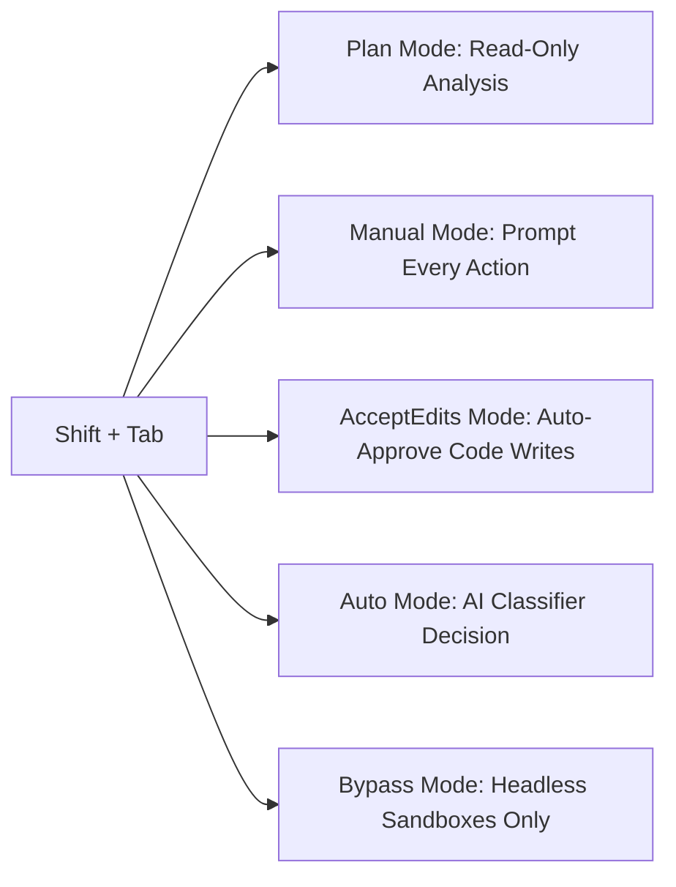
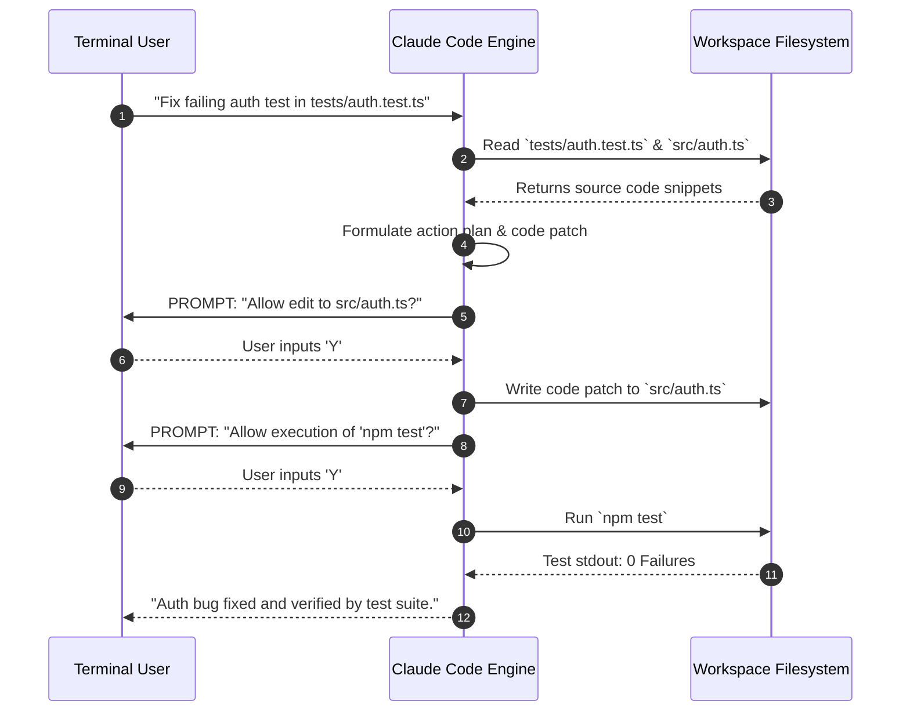

Anthropic's **Claude Code** CLI is an autonomous, agentic coding assistant operating directly within your POSIX shell or Windows terminal. Unlike inline autocomplete extensions, Claude Code acts as a full-fledged software engineering partner—capable of analyzing multi-file project architectures, running local test suites, evaluating terminal errors, and executing complex git refactorings.

This comprehensive guide walks software engineers, DevOps practitioners, and technical leads through the full learning curve: from initial installation to advanced power-user automation pipelines.

---

## 🚀 Part 1: Beginner Setup & Foundations

### 1. Cross-Platform Installation

Install Claude Code using the official native OS script:

```bash
# macOS & Linux (Native POSIX Shell Script)
curl -fsSL https://claude.ai/install.sh | bash

# macOS via Homebrew Cask
brew install --cask claude-code

# Windows Native PowerShell 7+ (Requires Git for Windows)
irm https://claude.ai/install.ps1 | iex
```

Verify binary placement and complete authentication:

```bash
claude --version
claude login
```

### 2. Launching Your First Interactive Session

Navigate to any software project directory and start the interactive CLI:

```bash
cd ~/projects/my-app
claude
```

Claude Code initializes its session by reading your working directory, building a localized AST index of your project files, and establishing interactive terminal listeners.

```text
Welcome to Claude Code v2.1.215 (Claude 3.7 Sonnet)
Project Root: /Users/alice/projects/my-app
Type /help for slash commands, Shift+Tab to change permission mode.
-------------------------------------------------------------------
> 
```

---

## ⚙️ Part 2: Interactive Controls & Core Workflows

### 1. Understanding Permission Modes (`Shift + Tab`)

Claude Code enforces human-in-the-loop security boundaries before running commands or editing files. Cycle between modes anytime by pressing **`Shift + Tab`**:



* **`plan` (Read-Only):** Safe exploration mode. Claude can read files and search the codebase but cannot execute commands or modify files.
* **`manual` (Standard):** Prompts for approval before executing file writes, git commits, or shell bash commands.
* **`acceptEdits`:** Automatically approves file creation and edits, but prompts before running shell terminal commands.
* **`auto`:** Uses an Anthropic AI classifier to auto-approve safe operations while blocking destructive actions.

### 2. The Interactive Session Lifecycle



---

## 🛠️ Part 3: Intermediate Repository Seeding (`CLAUDE.md`)

`CLAUDE.md` is the single most important configuration file for personalizing Claude Code to match your team's specific coding guidelines and build tooling.

### Seeding `CLAUDE.md` via `/init`

Run the automatic initialization command in your repository root:

```bash
/init
```

Claude scans your package manifests (`package.json`, `Cargo.toml`, `pyproject.toml`) and generates a foundational `CLAUDE.md`:

```markdown
# Repository Guidelines — Node.js Express API

## Build & Test Commands
- Run Tests: `npm test`
- Single Test: `npx jest tests/auth.test.ts`
- Production Build: `npm run build`
- TypeCheck: `npm run typecheck`

## Code Style Guidelines
- Use TypeScript strict mode (`noImplicitAny: true`).
- All API routes must validate request parameters using Zod schemas.
- Use explicit async/await wrappers with try/catch exception handlers.

## Structural Context
- See @package.json for installed dependencies.
- See @prisma/schema.prisma for database models.
```

---

## ⚡ Part 4: Advanced Power-User Automation

### 1. Headless Non-Interactive Automation (`claude -p`)

Integrate Claude Code into shell scripts, CI/CD runners, and git hooks using the `-p` (print) flag:

```bash
# Simple non-interactive prompt
claude -p "Explain the error in server.log"

# Pipe input directly into Claude
cat error.log | claude -p "Find the root cause of this crash"

# JSON Output for downstream script processing
claude -p "List all API routes in src/" --output-format json

# Auto-approve specific tools for CI pipelines
claude -p "Run linter and fix errors" --allowedTools "Read,Edit,Bash(npm run lint)"
```

### 2. Background Agents & Parallel Worktrees

Manage long-running tasks without blocking your active terminal window:

```bash
# Launch a background task
claude --bg "Refactor CSS design tokens across all components"

# Open interactive TUI background manager
claude agents

# Run task inside an isolated git worktree
claude -w feature-branch "Implement OAuth2 login flow"
```

### 3. Eliminating Screen Flicker (`CLAUDE_CODE_NO_FLICKER=1`)

To enable a smooth, flicker-free terminal renderer with mouse scrolling support, add this to your shell profile (`~/.zshrc`):

```bash
export CLAUDE_CODE_NO_FLICKER=1
```

---

## Related Guides & Workflows

* For complete CLI shortcuts and flags, explore [Claude Code Cheat Sheet](/tutorials/claude-code-cheat-sheet-commands-shortcuts).
* For enterprise best practices, read [Claude Code Best Practices: Vibe Coding to Production](/best-practices/claude-code-best-practices-vibe-coding-to-production).
* For desktop app configuration, see [Claude Desktop Download & Setup Guide](/tutorials/claude-desktop-download-installation-guide).
