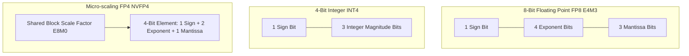

# FP4 vs FP8 vs INT4 Quantization: Performance & Accuracy

Scaling enterprise LLM serving pipelines requires balancing **Inference Speed (Tokens/Second)**, **Hardware VRAM Memory Footprint**, and **Model Accuracy (Perplexity)**.

While previous generations of GPU inference relied heavily on integer quantization (**INT8** and **INT4** via AWQ and GPTQ), modern GPU architectures (such as NVIDIA Hopper H100 and Blackwell B200) introduce native floating-point micro-scaling formats: **FP8** (E4M3 / E5M2) and **FP4** (NVFP4 / MXFP4).

In this technical guide, we evaluate the numerical dynamic range, hardware Tensor Core support, memory bandwidth efficiency, and accuracy trade-offs across **FP4**, **FP8**, and **INT4**.

---

## Dynamic Range & Numerical Representation Math

Quantization formats differ in how they divide available bit budgets between sign ($S$), exponent ($E$), and mantissa ($M$) bits.

### Format Specification Comparison

| Quantization Format | Sign Bits ($S$) | Exponent Bits ($E$) | Mantissa Bits ($M$) | Dynamic Range | Relative Max Precision |
|---|---|---|---|---|---|
| **FP16** | 1 | 5 | 10 | $6.10 \times 10^{-5} \dots 65,504$ | High Baseline |
| **FP8 (E4M3)** | 1 | 4 | 3 | $0.00195 \dots 448$ | High Dynamic Range |
| **FP8 (E5M2)** | 1 | 5 | 2 | $0.000015 \dots 57,344$ | Extreme Dynamic Range |
| **INT4** | 1 (Implicit) | 0 | 3 | $-8 \dots 7$ | Fixed Linear Scale |
| **NVFP4 (E2M1)** | 1 | 2 | 1 | Micro-scaled Block | Dynamic Block Scale |

---

## Micro-Scaling Mechanics: Why FP4 Outperforms INT4

Traditional **INT4** quantizes weight tensors by applying a global or channel-wise scale factor $S$:

$$W_{\text{quantized}} = \text{clamp} \left( \text{round} \left( \frac{W}{S} \right), -8, 7 \right)$$

Because weight distributions in large language models contain extreme outlier activations, global linear scaling forces most weights into a narrow set of integer bins, causing significant accuracy degradation.

### Micro-Scaling (MX / NVFP4) Architecture

**NVFP4** divides weight matrices into tiny **16-element vector blocks**. Each block shares a high-precision 8-bit scale factor ($E8M0$), allowing individual 4-bit elements ($E2M1$) to adapt dynamically to local activation spikes:

$$W_{\text{element}} = (-1)^S \times 2^{E - 1} \times \left( 1 + \frac{M}{2} \right) \times S_{\text{block}}$$

> **Impact**: NVFP4 achieves the memory density of INT4 while retaining over 99.0% of FP8 accuracy.

---

## Hardware Tensor Core Support Matrix

| GPU Architecture | Architecture Generation | Native FP8 Tensor Cores | Native FP4 Tensor Cores | INT4 Tensor Cores |
|---|---|---|---|---|
| **NVIDIA Ampere (A100 / RTX 3090)** | Generation 8 | No | No | Yes (INT4 Matrix) |
| **NVIDIA Ada Lovelace (RTX 4090 / L40S)** | Generation 9 | Yes (Transformer Engine) | No | Yes |
| **NVIDIA Hopper (H100 / H200)** | Generation 9.5 | **Yes (1,979 TFLOPS)** | No | Yes |
| **NVIDIA Blackwell (B200 / GB200)** | Generation 10 | **Yes (4,500 TFLOPS)** | **Yes (9,000 TFLOPS)** | Yes |

---

## Accuracy & Throughput Benchmark: Llama 3.3 70B Serving

Evaluated across high-volume production inference serving benchmarks:

```mermaid
gantt
    title Relative FLOPS Throughput on NVIDIA Blackwell B200
    dateFormat X
    axisFormat %s
    section Native FP16 Baseline
    FLOPS (2,250 TFLOPS) : 0, 2250
    section FP8 (E4M3)
    FLOPS (4,500 TFLOPS) : 0, 4500
    section NVFP4 Micro-scaling
    FLOPS (9,000 TFLOPS) : 0, 9000
```

| Quantization Format | Target Hardware | Relative VRAM Required | MMLU Score Retention | GSM8K Math Accuracy |
|---|---|---|---|---|
| **FP16** | 4x H100 80GB | 141 GB | 86.4% (Baseline) | 92.1% (Baseline) |
| **FP8 (E4M3)** | 2x H100 80GB | 72 GB | **86.2% (-0.2%)** | **91.8% (-0.3%)** |
| **INT4 (AWQ)** | 1x H100 80GB | 38 GB | 83.1% (-3.3%) | 87.4% (-4.7%) |
| **NVFP4 (Micro-scale)** | 1x B200 180GB | **36 GB** | **85.9% (-0.5%)** | **91.2% (-0.9%)** |

---

## Summary & Deployment Recommendations

1. **For Hopper H100 / H200 Workloads**: Deploy **FP8 (E4M3)** via vLLM or TensorRT-LLM for 2x throughput with zero calibration overhead.
2. **For Blackwell B200 Workloads**: Deploy **NVFP4** to achieve 4x FLOPS throughput over FP16 while preserving 99%+ accuracy.
3. **For Legacy Consumer Hardware (RTX 3090 / 4090)**: Use **INT4 (AWQ / GGUF Q4_K_M)** for maximum VRAM memory reduction.
