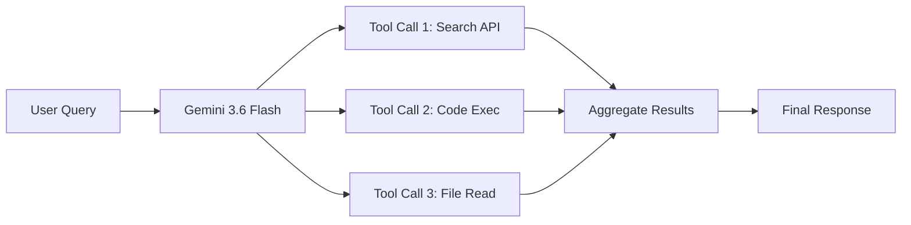

Google released Gemini 3.6 Flash on July 21, 2026, positioning it as the definitive *workhorse* model in the Gemini 3 series. Built for developers who need fast, precise, and cost-effective AI across coding, knowledge work, and complex multimodal tasks, 3.6 Flash replaces 3.5 Flash as the default recommended model for production agentic workloads.

This guide provides a thorough analysis of the model's architecture improvements, benchmark performance, developer integration pathways, pricing structure, and practical implementation patterns.

---

## What Makes Gemini 3.6 Flash Different

Gemini 3.6 Flash is not a generational leap — it is a surgical optimization of the 3.5 Flash architecture designed to reduce waste while increasing accuracy in the scenarios that matter most to professional developers.

### Core Improvements Over 3.5 Flash

| Metric | Gemini 3.5 Flash | Gemini 3.6 Flash | Improvement |
| :--- | :---: | :---: | :---: |
| Output Token Efficiency | Baseline | **−17% tokens** | Fewer tokens for equivalent quality |
| Reasoning Steps (Multi-Step) | Baseline | **Fewer steps** | Reduced tool call chains |
| Code Generation Precision | Good | **Higher precision** | Fewer unwanted edits and loops |
| Knowledge Cutoff | Dec 2025 | **March 2026** | 3 months fresher |
| Agentic Task Completion | Good | **Improved** | Better long-horizon task handling |

The efficiency gains are not just about speed — they directly reduce API costs. If your application makes thousands of completions per day, a 17% reduction in output tokens translates to meaningful savings at scale.

---

## Architecture and Design Philosophy

Gemini 3.6 Flash was designed for what Google calls the *agentic era* — applications where models operate semi-autonomously, chaining tool calls, processing long contexts, and maintaining coherent state across multi-step workflows.

### Key Architectural Decisions

**Parallel Tool Use:** The model natively supports issuing multiple tool calls in a single generation step. This eliminates the serial bottleneck where previous Flash models would call one tool, wait for a result, then call the next.



**Reduced Reasoning Loops:** In benchmark testing, 3.6 Flash completes complex agentic tasks with fewer intermediate reasoning steps. This means fewer API round-trips, lower latency, and reduced token consumption.

**Improved Code Generation:** The model produces more surgically precise code edits — targeting only the lines that need to change rather than regenerating entire functions or files. This is particularly valuable in agentic coding tools like GitHub Copilot and Cursor.

---

## Benchmark Performance

Gemini 3.6 Flash posts significant improvements on the benchmarks that matter most for real-world developer workflows:

### DeepSWE (Agentic Software Engineering)

DeepSWE evaluates a model's ability to navigate codebases, understand issue descriptions, and produce working patches — the kind of task that agentic coding tools perform daily. Gemini 3.6 Flash shows a measurable jump in accuracy while using fewer tool calls per resolution.

### MLE Bench (Machine Learning Engineering)

MLE Bench tests a model's ability to design, implement, and debug machine learning pipelines. 3.6 Flash demonstrates improved performance in experiment design and hyperparameter reasoning.

### Practical Implications

For developers using Gemini 3.6 Flash via API or through tools like GitHub Copilot, these benchmark improvements translate to:

- **Fewer failed code generation attempts** that require re-prompting
- **More accurate multi-file edits** in complex repositories
- **Better understanding of project context** across long conversations
- **Reduced API costs** due to fewer tokens and fewer round-trips

---

## Pricing and Cost Analysis

Google has positioned Gemini 3.6 Flash as one of the most cost-effective frontier models available:

| Model | Input (per 1M tokens) | Output (per 1M tokens) | Context Window |
| :--- | :---: | :---: | :---: |
| **Gemini 3.6 Flash** | **$1.50** | **$7.50** | 1M tokens |
| Gemini 3.5 Flash | $1.25 | $5.00 | 1M tokens |
| GPT-4.1 | $2.00 | $8.00 | 1M tokens |
| Claude Sonnet 4 | $3.00 | $15.00 | 200K tokens |

While the per-token price is slightly higher than 3.5 Flash, the 17% reduction in output tokens means the effective cost per task is often *lower*. For applications that generate high volumes of output — code generation, document summarization, agentic workflows — the total spend typically decreases.

### Cost Optimization Tips

1. **Use structured output schemas** to prevent the model from generating verbose explanations when you only need JSON.
2. **Enable parallel tool use** to reduce the number of API round-trips in agentic chains.
3. **Set appropriate `max_tokens`** limits to prevent runaway generation on open-ended prompts.
4. **Cache system prompts** using Google's context caching feature to reduce input token costs on repeated calls.

---

## Getting Started with the API

### Prerequisites

- A Google Cloud account or Google AI Studio API key
- Node.js 18+ or Python 3.10+

### JavaScript / TypeScript Setup

```javascript
import { GoogleGenAI } from "@google/genai";

const ai = new GoogleGenAI({ apiKey: process.env.GEMINI_API_KEY });

async function generateCode(prompt) {
  const response = await ai.models.generateContent({
    model: "gemini-3.6-flash",
    contents: prompt,
    config: {
      temperature: 0.2,
      maxOutputTokens: 4096,
      responseMimeType: "application/json",
    },
  });

  return response.text;
}

// Example: Generate a React component
const result = await generateCode(
  "Create a responsive pricing card component in React with Tailwind CSS"
);
console.log(result);
```

### Python Setup

```python
import google.generativeai as genai

genai.configure(api_key="YOUR_API_KEY")

model = genai.GenerativeModel("gemini-3.6-flash")

response = model.generate_content(
    "Explain the difference between async/await and Promises in JavaScript",
    generation_config=genai.GenerationConfig(
        temperature=0.3,
        max_output_tokens=2048,
    ),
)

print(response.text)
```

### Using with Google AI Studio

For rapid prototyping, [Google AI Studio](https://aistudio.google.com) provides a browser-based interface where you can:

1. Select **Gemini 3.6 Flash** from the model dropdown
2. Configure temperature, top-k, top-p, and safety settings
3. Test prompts with real-time streaming
4. Export your configuration as API code in Python, JavaScript, or cURL

---

## GitHub Copilot Integration

Gemini 3.6 Flash is available as a model option in GitHub Copilot for Pro, Business, and Enterprise subscribers.

### How to Enable

1. Open your IDE (VS Code, JetBrains, or Neovim)
2. Open the Copilot Chat panel
3. Click the model selector dropdown
4. Choose **Gemini 3.6 Flash** from the list
5. Start coding — completions will now be powered by Gemini 3.6 Flash

### When to Use Gemini 3.6 Flash in Copilot

- **Multi-file refactoring tasks** where you need the model to understand cross-file dependencies
- **Agentic coding sessions** where Copilot needs to search, read, and edit multiple files
- **Complex debugging** where the model needs to reason through stack traces and log outputs
- **Large context windows** — Gemini 3.6 Flash supports up to 1M tokens, far exceeding most competitors

---

## Best Practices for Production

### 1. System Prompt Engineering

Keep system prompts focused and structured. Gemini 3.6 Flash responds well to clear role definitions and output format specifications:

```text
You are a senior backend engineer. Generate production-ready code only.
Follow these rules:
- Use TypeScript with strict types
- Include error handling for all async operations
- Add JSDoc comments for public functions
- Return JSON responses with consistent error formatting
```

### 2. Structured Output Mode

Use `responseMimeType: "application/json"` with a JSON schema to get deterministic, parseable output:

```javascript
const response = await ai.models.generateContent({
  model: "gemini-3.6-flash",
  contents: "Analyze this error log and identify the root cause",
  config: {
    responseMimeType: "application/json",
    responseSchema: {
      type: "object",
      properties: {
        rootCause: { type: "string" },
        severity: { type: "string", enum: ["low", "medium", "high", "critical"] },
        suggestedFix: { type: "string" },
        affectedFiles: { type: "array", items: { type: "string" } },
      },
    },
  },
});
```

### 3. Context Caching for Repeated Workflows

If your application sends the same system prompt or reference documents with every request, use Google's context caching to store them server-side. This can reduce input token costs by up to 90% for cached content.

### 4. Safety and Guardrails

Configure safety settings appropriate for your use case. For developer tools, you may want to relax code-related safety filters while keeping other categories strict:

```javascript
config: {
  safetySettings: [
    { category: "HARM_CATEGORY_DANGEROUS_CONTENT", threshold: "BLOCK_ONLY_HIGH" },
  ],
}
```

---

## Gemini 3.6 Flash vs Competitors

### For Coding Tasks

Gemini 3.6 Flash excels at **multi-step agentic coding** — tasks where the model needs to search a codebase, understand context, and produce precise edits. Its parallel tool use capability gives it a significant speed advantage over models that process tool calls serially.

### For Cost-Sensitive Applications

At $1.50/$7.50 per million tokens with 17% fewer output tokens, Gemini 3.6 Flash is among the most cost-effective frontier models for high-volume applications.

### For Context-Heavy Workflows

With a 1M token context window, Gemini 3.6 Flash can ingest entire codebases, documentation sets, or conversation histories without truncation — a significant advantage over models limited to 128K or 200K tokens.

---

## Key Takeaways

- **Gemini 3.6 Flash** is Google's latest optimized workhorse model, released July 21, 2026
- It consumes **17% fewer output tokens** than 3.5 Flash for equivalent tasks
- Pricing is **$1.50 input / $7.50 output** per million tokens with a **1M token context window**
- Available via **Gemini API, Vertex AI, Google AI Studio, and GitHub Copilot**
- Built for the **agentic era** with parallel tool use, improved code precision, and reduced reasoning loops
- Knowledge cutoff is **March 2026**, providing fresher world knowledge than most competitors

---

## What's Next

Google has signaled that Gemini 3.6 Flash is the foundation for upcoming specialized variants. The simultaneously announced **Gemini 3.5 Flash-Lite** targets high-throughput, low-latency batch processing, while **Gemini 3.5 Flash Cyber** is a purpose-built cybersecurity model available to select enterprise partners.

For developers building agentic applications, Gemini 3.6 Flash represents the current sweet spot of capability, speed, and cost — making it the recommended starting point for new projects in the Gemini ecosystem.
