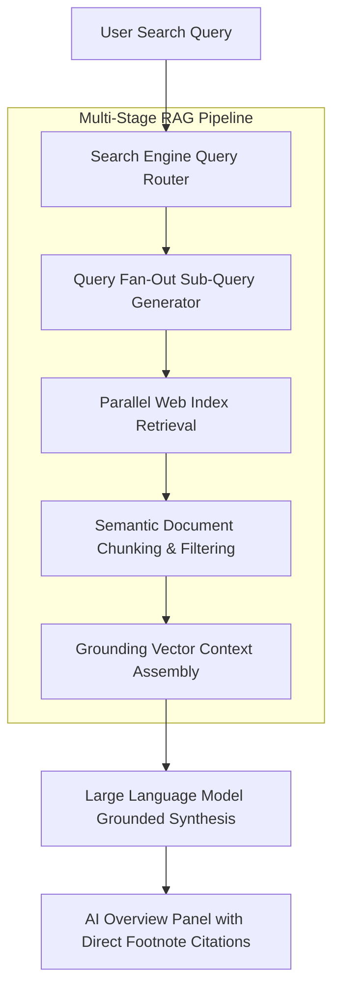
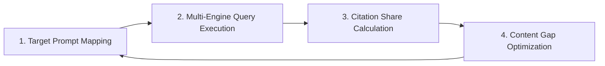

# Generative Engine Optimization (GEO): Technical Architecture and Ranking Protocols

Search engines have evolved from passive indexers of ranked hyperlinks into active synthesis platforms powered by artificial intelligence. Generative search systems—such as **Google AI Overviews**, **Perplexity AI**, and **ChatGPT Search**—use Retrieval-Augmented Generation (RAG) to dynamically extract, cross-reference, and summarize authoritative web documents directly inside answer interfaces.

To capture search visibility in this AI-native landscape, developers, SEO architects, and content strategists must adopt **Generative Engine Optimization (GEO)**. GEO is the discipline of engineering web content so that AI engines select, extract, and cite your pages during RAG synthesis.

This enterprise guide breaks down the multi-stage technical architecture of GEO, query fan-out retrieval mechanics, JSON-LD schema patterns, and citation audit frameworks.

---

## The Mechanical Shift: Traditional SEO vs. GEO Architecture

Traditional search relies on inverted document indexes, TF-IDF vector space scoring, and PageRank link graphs to evaluate domain authority and match user queries against static URL lists.

Generative engines add a synthesis layer on top of classical search indexes:



### Comparative Architectural Analysis

| Structural Pillar | Traditional SEO | Generative Engine Optimization (GEO) |
|---|---|---|
| **Target Interface** | Ranked 10 Blue Links | AI Overview Panel, Footnote Cards, Conversational UI |
| **Retrieval Engine** | Inverted Index & PageRank Graph | Vector Similarity Search & RAG Grounding Pipelines |
| **Query Processing** | Exact & Semantic Keyword Matching | Multi-Stream Query Fan-Out Sub-Query Extraction |
| **Content Evaluation** | Backlink Profile & Title Keyword Densities | Technical Authority, Empirical Data, Table Structure |
| **Primary Metric** | Organic Click-Through Rate (CTR) | Grounding Citation Share & Synthetic Brand Impressions |

---

## Retrieval-Augmented Generation (RAG) and Query Fan-Out Mechanics

Understanding how modern search engines process technical queries is essential for optimizing web assets for AI engines.

### The Query Fan-Out Pipeline

When a user enters a multi-layered technical query—such as *"How to deploy DeepSeek R1 locally with Ollama on 24GB VRAM"*—the search engine does not execute a single database lookup. Instead, it triggers **query fan-out**:

1. **Sub-Query Generation**: The system deconstructs the user prompt into concurrent sub-queries:
   - `Sub-Query A`: *"DeepSeek R1 Ollama installation commands"*
   - `Sub-Query B`: *"DeepSeek R1 32B VRAM requirements Q4_K_M"*
   - `Sub-Query C`: *"RTX 4090 local LLM token generation speed"*
2. **Parallel Index Fetching**: The engine queries vector databases and core indexes simultaneously across all sub-queries.
3. **Semantic Chunking & Relevance Scoring**: Retrieved HTML documents are stripped of DOM noise (headers, footers, scripts) and converted into raw semantic chunks.
4. **LLM Context Synthesis**: High-density chunks meeting verification thresholds are fed into the context window of the generator model.
5. **Footnote Citation Attribution**: URL sources providing the highest factual density are rendered as clickable citations.

> **Key Takeaway**: Web pages covering only a single narrow aspect of a topic fail multi-query fan-out evaluation. Comprehensive assets addressing every sub-query facet achieve maximum citation share.

---

## Technical Indexability & Preview Directive Controls

Before an AI engine can ingest content for RAG synthesis, your web pages must pass baseline technical crawlability checks.

```html
<!-- Recommended HTML Head Meta Directives for Maximum GEO Extraction -->
<meta name="robots" content="index, follow, max-snippet:-1, max-image-preview:large, max-video-preview:-1" />
<link rel="canonical" href="https://nadhebe.com/guides/generative-engine-optimization-geo-guide" />
```

### Critical Directives Matrix

| Meta Directive | Optimal Value | Function in GEO Retrieval |
|---|---|---|
| `max-snippet` | `-1` (Unlimited) | Allows RAG chunkers to extract full paragraph contexts without token clipping. |
| `max-image-preview` | `large` | Enables generative engines to feature visual architecture diagrams inside citation cards. |
| `nosnippet` | **DO NOT USE** | Setting `nosnippet` completely excludes the URL from being used as RAG grounding context. |
| `robots.txt` | `User-agent: * Allow: /` | Restricting AI crawlers (like `Google-Extended` or `GPTBot`) prevents citation indexing. |

---

## Empirical Content Structuring for Maximum Citation Probability

AI synthesis engines favor structured, authoritative, and data-backed text. Empirical research on RAG extraction confirms three structural patterns that significantly increase citation probability:

### 1. The Answer-First Structural Pattern

Every main section should start with a clear summary answer, followed by concrete data, implementation code, and trade-off matrices.

```markdown
### Bad Example (Vague, Filler Text):
When thinking about model quantization, there are many things to consider. Quantization is important because models are big and GPUs are expensive...

### Good GEO Pattern (Answer-First + Direct Empirical Benchmark):
**Q4_K_M quantization reduces DeepSeek R1 VRAM consumption by 62% while preserving 97.4% of FP16 reasoning accuracy.** For 32B parameter models, Q4_K_M reduces memory footprint from 65 GB (FP16) down to 20.4 GB, enabling full deployment on a single 24GB VRAM GPU.
```

### 2. Formatted Data Tables and Code Snippets

RAG chunking algorithms preserve structured HTML elements (`<table>`, `<pre><code>`, `<ol>`) with higher weight than generic unstructured prose:

```html
<!-- RAG Chunkers preserve structured HTML tables with high priority -->
<table class="geo-data-table">
  <thead>
    <tr>
      <th>Framework</th>
      <th>Throughput (tok/sec)</th>
      <th>Prefix Caching</th>
    </tr>
  </thead>
  <tbody>
    <tr>
      <td>vLLM</td>
      <td>142.8</td>
      <td>PagedAttention</td>
    </tr>
    <tr>
      <td>SGLang</td>
      <td>184.2</td>
      <td>RadixAttention</td>
    </tr>
  </tbody>
</table>
```

---

## JSON-LD Schema Engineering for AI Overview Citations

Structured data provides direct, unambiguous context to search engine ingestion pipelines. Utilizing `TechArticle`, `SoftwareApplication`, and `FAQPage` schemas helps AI models verify technical claims without risking extraction errors.

```json
{
  "@context": "https://schema.org",
  "@type": "TechArticle",
  "headline": "Generative Engine Optimization (GEO): Technical Architecture and Ranking Protocols",
  "description": "Definitive technical guide to Generative Engine Optimization (GEO). Learn RAG grounding mechanics, query fan-out deconstruction, and JSON-LD schema engineering.",
  "inLanguage": "en-US",
  "mainEntityOfPage": {
    "@type": "WebPage",
    "@id": "https://nadhebe.com/guides/generative-engine-optimization-geo-guide"
  },
  "author": {
    "@type": "Organization",
    "name": "Nadhebe Team",
    "url": "https://nadhebe.com"
  },
  "publisher": {
    "@type": "Organization",
    "name": "Nadhebe",
    "logo": {
      "@type": "ImageObject",
      "url": "https://nadhebe.com/logo.png"
    }
  },
  "datePublished": "2026-08-06",
  "dateModified": "2026-08-06",
  "about": [
    {
      "@type": "Thing",
      "name": "Generative Engine Optimization"
    },
    {
      "@type": "Thing",
      "name": "Retrieval-Augmented Generation"
    }
  ],
  "proficiencyLevel": "Advanced"
}
```

---

## The GEO Audit and Citation Visibility Protocol

To track and measure your domain's performance in generative search engines, implement a continuous 4-step auditing workflow:



### 1. Target Prompt Mapping
Build a repository of high-intent developer prompts across your core topics (e.g., *"Best local LLMs for 8GB VRAM"*, *"vLLM vs SGLang benchmarks"*).

### 2. Multi-Engine Query Execution
Run target prompts across generative search platforms:
- **Google AI Overviews** (Search Console & live SERP monitoring)
- **Perplexity AI** (Pro Search mode)
- **ChatGPT Search** (Web browsing mode)

### 3. Citation Share Calculation

$$C_{\text{share}} = \left( \frac{N_{\text{cited}}}{N_{\text{total\_queries}}} \right) \times 100$$

Where $N_{\text{cited}}$ is the number of AI panels featuring your URL as a footnote citation, and $N_{\text{total\_queries}}$ is the total number of tested target prompts.

### 4. Content Gap Optimization
If competitor URLs are cited instead of your content, analyze the cited chunks. Add precise empirical metrics, update outdated benchmark tables, and structure clear answer-first summaries to capture the citation.

---

## Summary & Action Plan

1. **Adopt Answer-First Architecture**: Lead every technical section with a direct, data-backed summary.
2. **Optimize Meta Directives**: Ensure `max-snippet:-1` and `max-image-preview:large` are present across all pages.
3. **Deploy Schema**: Use rich `TechArticle` and `FAQPage` JSON-LD schema to structure core claims.
4. **Audit Citation Share**: Monitor AI Overview footnote presence continuously to refine content depth.
