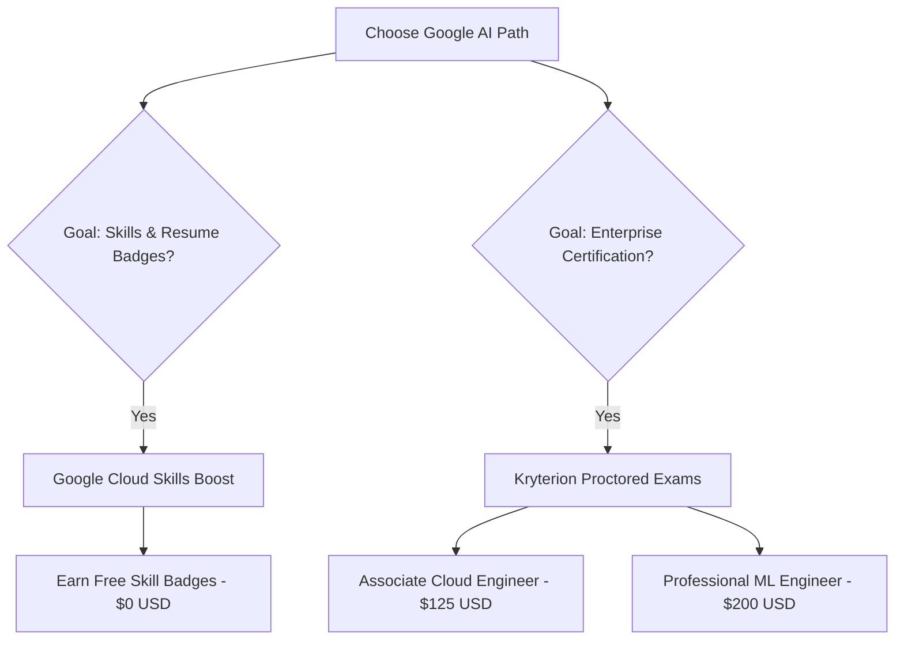
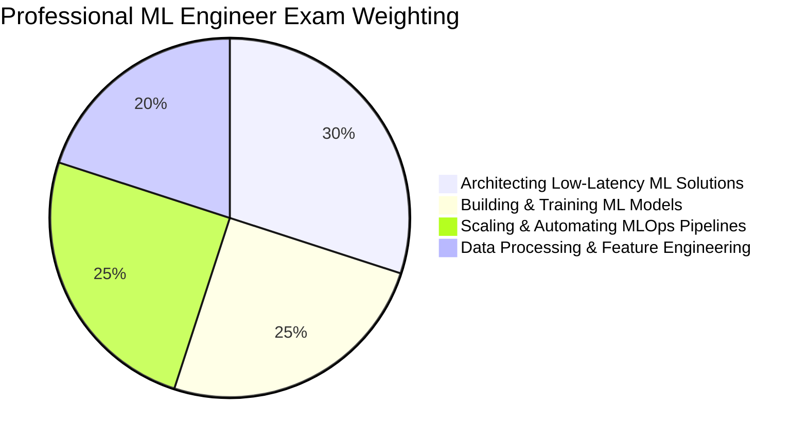
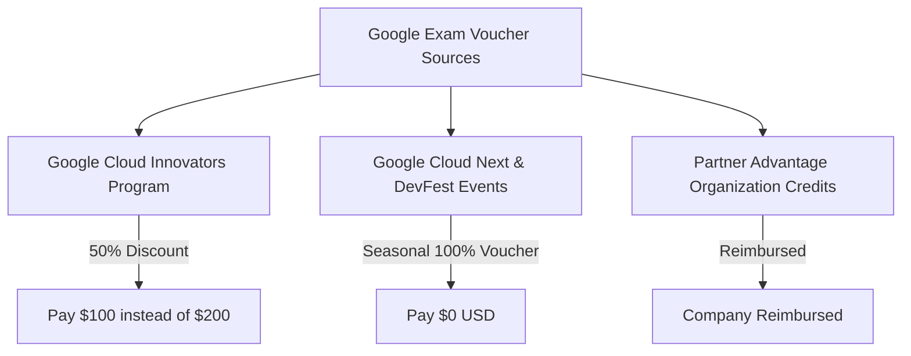

Navigating Google's AI credential ecosystem can be confusing. Developers and engineering managers searching for *"Google AI certification cost"* frequently encounter conflicting claims—some portals advertise Google AI training as 100% free, while formal proctored certification portals list registration fees up to $200 USD.

The distinction lies in understanding the difference between **Free Self-Paced Training & Skill Badges** versus **Official Proctored Google Cloud Certifications**.

This guide provides a transparent breakdown of all Google AI learning pathways, registration fees, exam structures, voucher discount programs, and career ROI analysis.

---

## Executive Summary: Google AI Credentials Compared



### Complete Price & Tier Comparison Matrix

| Credential Tier | Official Name | Registration Fee | Exam Format | Retake Fee | Industry Recognition Level | Official URL |
| :--- | :--- | :---: | :--- | :---: | :--- | :--- |
| **Free Skill Badge** | Generative AI Fundamentals | **$0 USD** | Unproctored hands-on labs | $0 | Entry-Level / Social Profile | `cloudskillsboost.google` |
| **Free Course Badge** | Inspect Rich Documents with Gemini | **$0 USD** | Self-paced lab assessment | $0 | Skill Verification | `cloudskillsboost.google` |
| **Associate Certification** | Cloud Digital Leader / Associate | **$125 USD** | Proctored (50 Questions / 90 min) | $62.50 | Recognized Foundations Tier | `cloud.google.com/learn/certification` |
| **Professional Certification** | Professional Machine Learning Engineer | **$200 USD** | Proctored (60 Questions / 120 min) | $100.00 | **High Enterprise Value** | `cloud.google.com/learn/certification` |
| **Professional Certification** | Professional Data Engineer | **$200 USD** | Proctored (60 Questions / 120 min) | $100.00 | **High Enterprise Value** | `cloud.google.com/learn/certification` |

---

## Free Track: Google Cloud Skills Boost & Skill Badges

Google offers over 50+ free learning paths and hands-on lab modules through **Google Cloud Skills Boost** (formerly Qwiklabs).

### 1. Generative AI Learning Path ($0 USD)

The **Generative AI Fundamentals** path includes 10 interactive modules that require no credit card or subscription fee:

* **Introduction to Large Language Models (LLMs):** Fundamental architecture of transformer models.
* **Introduction to Generative AI:** Core concepts of Gemini, PaLM 2, and Diffusion models.
* **Introduction to Responsible AI:** Google's 7 AI Principles and safety evaluation frameworks.
* **Generative AI Studio & Vertex AI:** Hands-on labs building prompt templates, tuning parameters (temperature, Top-K, Top-P), and deploying API endpoints.

```text
Free Skill Badge Earning Process:
-----------------------------------------------------------------
1. Enroll on cloudskillsboost.google with your Google account.
2. Complete video lectures and hands-on lab scenarios.
3. Pass the unproctored end-of-course quiz (80%+ required).
4. Receive a verifiable digital skill badge on your profile.
-----------------------------------------------------------------
```

### 2. What Value Do Free Skill Badges Provide?

While Skill Badges do not carry the formal weight of proctored exams, they demonstrate active skill acquisition to recruiters and employers:
* **Verifiable Metadata:** Badges include cryptographic completion verification hosted on Google Cloud Skills Boost profiles.
* **Hands-on Lab Verification:** Unlike text-only multiple-choice quizzes, Skill Badges require completing real terminal tasks inside temporary Google Cloud sandbox environments.

---

## Paid Track: Proctored Google Cloud Certifications

For enterprise architects, ML engineers, and cloud consultants, Google administers formal proctored certifications through **Kryterion** testing environments (online or at physical testing centers).

### 1. Professional Machine Learning Engineer ($200 USD)

The **Professional Machine Learning Engineer** certification is Google's flagship credential for AI professionals.



#### Detailed Exam Specifications:
* **Cost:** **$200 USD** plus applicable local taxes.
* **Format:** 60 multiple-choice and multiple-select items.
* **Time Limit:** 120 minutes (2 hours).
* **Delivery:** Online proctored exam via Kryterion Webassessor or at local testing facilities.
* **Validity:** Valid for 2 years before recertification is required.

#### Tested Technical Domains:
1. **Architecting ML Solutions (30%):** Designing Vertex AI pipelines, selecting appropriate pre-trained foundation models (Gemini 1.5/2.0), and choosing between fine-tuning vs RAG.
2. **Building & Training Models (25%):** Custom model training using TensorFlow, PyTorch, and JAX on Google Cloud TPU/GPU clusters.
3. **MLOps Pipeline Automation (25%):** Automated model monitoring, drift detection, continuous training (CT) with Vertex AI Pipelines, and model registry governance.
4. **Data Processing & Feature Engineering (20%):** BigQuery ML, Dataflow processing pipelines, and Feature Store management.

---

## How to Access Free & Discounted Exam Vouchers

You do not always have to pay full price ($125–$200) for proctored Google Cloud certifications. Several official programs provide 50% to 100% discount vouchers:



### 1. Google Cloud Innovators Program (50% Off)
Joining the **Google Cloud Innovators** program (`cloud.google.com/innovators`) is 100% free for all developers. Innovators receive:
* Periodic **50% discount vouchers** for Associate and Professional exams.
* Free monthly access passes to Google Cloud Skills Boost labs.

### 2. Google Cloud Next & Seasonal Skills Challenges (100% Off)
Google regularly hosts global challenges (such as the *Cloud Skills Challenge* or *Get Certified* campaigns) around events like Google Cloud Next:
* Complete a designated 4-course learning path within 30 days.
* Receive a **100% free exam voucher** redeemable on Kryterion Webassessor.

### 3. Google Partner Advantage Reimbursements
If your employer is an official Google Cloud Partner, your company receives annual allocation tokens that cover 100% of employee certification registration costs.

---

## Career Value & ROI Analysis: Are Paid Google AI Certifications Worth It?

Investing $200 and 50+ hours of preparation time yields measurable career benefits depending on your career stage:

```text
Return on Investment (ROI) Matrix:
-------------------------------------------------------------------
Career Goal            Recommended Path      Estimated ROI
-------------------------------------------------------------------
Entry Developer        Free Skill Badges     High (Zero Cost)
Cloud Consultant       Associate Engineer    High (Client Trust)
Enterprise ML Lead     Professional ML Cert  Extremely High ($15k+ Salary Premium)
-------------------------------------------------------------------
```

### 1. Corporate Partner Specialization Requirements
Google Cloud Partner companies must maintain a strict quota of certified **Professional ML Engineers** and **Data Engineers** to retain Premier Partner status and qualify for Google co-sell incentives. Certified engineers are highly sought after by enterprise consultancies.

### 2. Salary Premiums for Certified ML Engineers
Independent industry surveys indicate that professionals holding active Google Cloud Professional Machine Learning Engineer credentials command an average salary premium of **$12,000 to $18,000 USD** above non-certified peers.

---

## Frequently Asked Questions

### Is the Google Generative AI Certification completely free?
The learning modules and digital skill completion badges on Google Cloud Skills Boost are 100% free, but formal proctored certifications (like Professional ML Engineer) cost $125 to $200 USD.

### What is the difference between a Google Skill Badge and a Google Cloud Certification?
Skill Badges are free, unproctored digital badges earned by completing hands-on online labs, while Google Cloud Certifications are proctored, industry-recognized credentials verified via Kryterion.

### How long are Google Cloud AI Certifications valid?
Google Cloud Certifications remain valid for 2 years from the date of passing, requiring a recertification exam thereafter to maintain active status.

---

## Image Asset Specifications

* **Hero Visual**:
  - **Prompt**: "Minimalist vector illustration of Google Cloud certificate badge with clean geometric lines, soft blue and yellow pastel tones on white canvas"
  - **Filename**: "google-ai-cert-hero.jpg"
  - **Alt text**: "Minimalist vector illustration of Google Cloud certificate badge with clean geometric lines"
  - **Placement**: Hero header section
  - **Aspect Ratio**: 16:9

---

## Related Guides & Workflows

* For Anthropic credentials breakdown, read [Anthropic Claude Certification Guide: Exams & Credentials](/guides/anthropic-claude-certification-developer-guide).
* For enterprise AI tools, explore [Google Flow & Storyboard Studio Overview](/tools/google-flow-storyboard-studio-overview).
* For terminal coding agent mechanics, see [Inside Claude Code Agent: Terminal Loop Architecture](/guides/claude-code-agent-loop-architecture).
