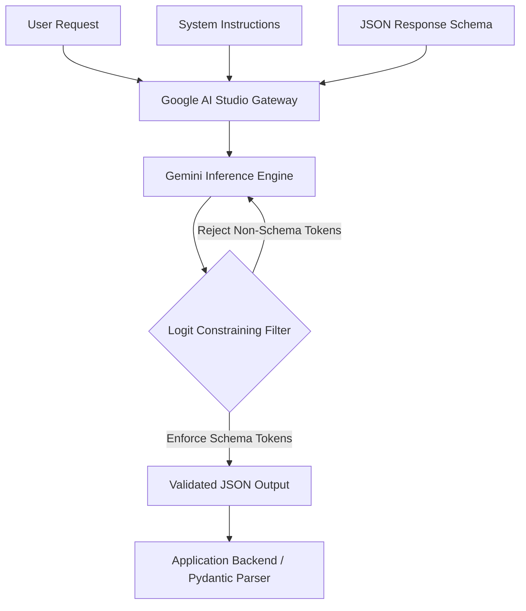

Google AI Studio provides enterprise developers and AI engineers with a rapid prototyping sandbox and production API gateway for the Gemini model family. While basic prompt engineering relies on natural language instructions, production-grade applications require **deterministic response formats**, **guaranteed JSON schema compliance**, and **strict system prompt boundaries**.

This guide covers the architecture of **Google AI Studio System Instructions**, **JSON Schema Enforcement**, and **Function Calling Workflows** for production deployments.

---

## Key Takeaways

> [!TIP]
> - **System Instructions Priming**: Injected ahead of conversation history to enforce role boundaries, safety constraints, and formatting rules.
> - **Strict Logit Constraining**: `response_mime_type="application/json"` combined with `response_schema` guarantees syntactically valid JSON responses directly from the decoder.
> - **Pydantic & TypeScript Integration**: Native SDK support allows passing Pydantic classes (Python) or Zod/OpenAPI definitions (TypeScript) directly to `generation_config`.
> - **Function Calling Synergy**: Structured outputs can be combined with tool declarations to return typed function arguments for multi-agent workflows.

---

## Architectural Overview: Structured Generation Pipeline

When executing requests through Google AI Studio or the underlying Gemini API, system instructions and schema definitions govern the logit sampling phase of model inference:



By constraining logit probabilities during output token generation, the Gemini model cannot emit syntax errors, trailing commas, or markdown backticks when structured mode is active.

---

## System Instructions vs. User Prompts

Understanding where to place context in Google AI Studio is critical for latency and token optimization:

| Parameter | Execution Priority | Cache Persistence | Primary Use Case |
| :--- | :--- | :--- | :--- |
| **System Instructions** | Highest (Attention Root) | Compatible with Context Caching | Role definition, JSON rules, guardrails, API response schemas |
| **User Prompt** | Standard Context | Dynamic per request | Specific task inputs, user queries, dynamic document payload |
| **System Tools / Functions** | Parallel Execution | Cached in Session | API function signatures, database query declarations |

---

## Implementation: Python SDK with Pydantic & Gemini 2.5 / 3.0

Below is a production-ready Python implementation using the official Google GenAI SDK (`@google/genai`) to enforce strict Pydantic structured outputs.

```python
from google import genai
from google.genai import types
from pydantic import BaseModel, Field
from typing import List, Optional

# 1. Define target response structure via Pydantic
class KeyInsight(BaseModel):
    category: str = Field(description="Architecture category: Performance, Security, or Cost")
    title: str = Field(description="Concise summary title")
    impact_score: int = Field(description="Numerical severity from 1 (low) to 10 (critical)")
    remediation_steps: List[str] = Field(description="Step-by-step developer remediation actions")

class CodeAuditReport(BaseModel):
    repository_name: str
    overall_health: str = Field(description="Status: PASS, WARNING, or CRITICAL")
    insights: List[KeyInsight]
    estimated_refactor_hours: float

# 2. Initialize Gemini Client
client = genai.Client()

# 3. Configure System Instruction and Response Schema
system_instruction = """
You are an Enterprise AI Security & Performance Auditor.
Analyze the provided system specifications and code snippets.
Always output findings adhering strictly to the required JSON schema.
Do not wrap responses in markdown backticks or extra text.
"""

config = types.GenerateContentConfig(
    system_instruction=system_instruction,
    temperature=0.1,  # Low temperature for deterministic outputs
    response_mime_type="application/json",
    response_schema=CodeAuditReport,
)

# 4. Generate Content
response = client.models.generate_content(
    model="gemini-2.5-pro",
    contents="Audit our Kubernetes deployment configuration: 5 replicas, root privileges enabled, public ingress on port 8080.",
    config=config
)

# Output is guaranteed to be valid JSON parsing directly into Pydantic
audit_data = CodeAuditReport.model_validate_json(response.text)
print(f"Overall Health: {audit_data.overall_health}")
print(f"Remediation: {audit_data.insights[0].remediation_steps}")
```

---

## Node.js / TypeScript Integration

For full-stack TypeScript projects, define the JSON schema using standard schema definitions:

```typescript
import { GoogleGenAI, Type } from '@google/genai';

const ai = new GoogleGenAI({});

const responseSchema = {
  type: Type.OBJECT,
  properties: {
    featureName: { type: Type.STRING },
    status: { type: Type.STRING, enum: ['STABLE', 'BETA', 'DEPRECATED'] },
    latencyMs: { type: Type.NUMBER },
    tags: {
      type: Type.ARRAY,
      items: { type: Type.STRING }
    }
  },
  required: ['featureName', 'status', 'latencyMs']
};

async function runAudit() {
  const response = await ai.models.generateContent({
    model: 'gemini-2.5-flash',
    contents: 'Analyze the latency metrics for our vector search indexing service.',
    config: {
      systemInstruction: 'You are a Cloud Telemetry Analyzer. Output strictly valid JSON.',
      responseMimeType: 'application/json',
      responseSchema: responseSchema,
      temperature: 0.2,
    }
  });

  console.log(JSON.parse(response.text));
}

runAudit();
```

---

## Best Practices & Tradeoffs

> [!IMPORTANT]
> - **Avoid Prompt Inflation**: Keep system instructions focused on rules and role definitions. Use context caching for large reference manuals or API specs.
> - **Logit Locking Latency**: Extremely complex JSON schemas with nested objects add a negligible latency overhead during prefill, but save time by preventing malformed output retry loops.
> - **Enum Restrictions**: Utilize strict string `enum` lists in schema definitions to prevent hallucinated status fields.

---

## Frequently Asked Questions

### How does System Instruction differ from prompt prefixing in Gemini models?
System instructions are injected into the model's core attention mechanism prior to the user query context, establishing strict behavioral boundaries, output schemas, and persona definitions that remain stable throughout multi-turn conversations.

### Can Google AI Studio enforce strict JSON Schema validation without post-processing?
Yes. By specifying `response_mime_type='application/json'` alongside a strict `response_schema` (Pydantic model or OpenAPI schema spec), Gemini models constrain logit generation to produce 100% valid JSON matching your schema.

### What is the token overhead of using JSON Schema in Google AI Studio?
The schema definition itself is counted as part of the system instruction context prompt tokens, but logit-level schema enforcement reduces retry loops and invalid response tokens by up to 95%.

---

## Related Articles

- [Gemini 3.6 Flash Complete Developer Guide](/guides/gemini-3-6-flash-complete-guide)
- [NotebookLM Pro Developer Workflows](/guides/notebooklm-pro-developer-workflows)
- [How to Get a Gemini API Key & Rate Limits](/guides/gemini-api-pricing-free-tier-rate-limits)
