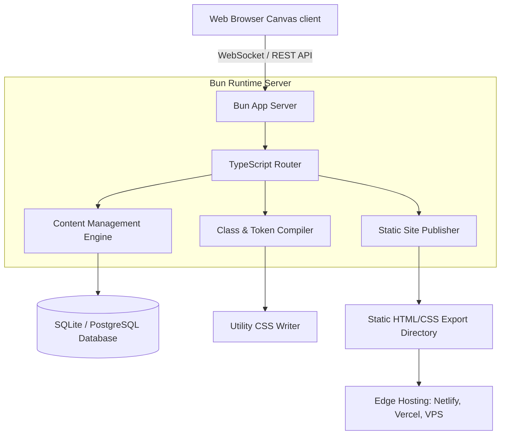

Modern web teams often struggle to balance designer autonomy with technical performance. Closed visual builders yield proprietary page layouts, while headless CMS frameworks require developers to build custom editors for clients.

**Instatic** addresses this by serving as an open-source, self-hosted visual CMS built on **Bun** and **TypeScript**. This guide provides a detailed look at Instatic's system architecture, class compilation pipeline, and deployment models.

---

## Complete System Architecture

Instatic consolidates the visual editor, content engine, and file publisher into a single server process:



By packaging all services within a single runtime, Instatic avoids network latency during design changes and handles static site generation directly on the host server.

---

## Detailed Tech Stack Analysis

### 1. Bun Runtime Environment
Instatic uses **Bun** instead of Node.js. This provides several key advantages:
- **Built-in TypeScript Execution**: Eliminates the compilation step needed before running server code.
- **High-Performance File I/O**: Speeds up site updates and asset management.
- **Fast Database Drivers**: Optimizes query performance when saving page metadata and content changes.

### 2. Database Flexibility
Instatic supports both SQLite and PostgreSQL:
- **SQLite**: Best for small marketing sites and single-developer workflows. The database is saved directly inside a local volume, making backups straightforward.
- **PostgreSQL**: Designed for larger teams and collaborative projects that require redundant storage and concurrent connection handling.

---

## Design System Token Compilation

When you define styling values in the Instatic design panel, the engine converts your settings into utility classes and CSS variables:

```css
:root {
  --accent-color: var(--color-indigo-500);
  --spacing-base: 8px;
}

.card-container {
  display: flex;
  flex-direction: column;
  padding: calc(var(--spacing-base) * 3); /* 24px */
  border: 1px solid var(--border-color);
  border-radius: var(--radius-12);
}
```

This utility CSS file is compiled alongside your semantic HTML, ensuring the output site loads quickly and contains no unused styling definitions.

---

## Editor Walkthrough

Watch the complete design system configuration and database architecture setup in this visual demo:

<div class="video-wrapper aspect-video">
  <iframe src="https://www.youtube.com/embed/O88lL2v3JkA" title="YouTube video player" frameborder="0" allow="accelerometer; autoplay; clipboard-write; encrypted-media; gyroscope; picture-in-picture" allowfullscreen class="w-full h-full"></iframe>
</div>

---

## Key Takeaways
- **All-in-One Runtime**: Instatic bundles the page builder, CMS, and static site publisher into a single Bun server.
- **Flexible Databases**: Choose betweenSQLite for simplicity or PostgreSQL for scaling collaborative projects.
- **Optimized Exports**: Static compiler outputs clean semantic HTML and utility CSS without runtime framework bloat.
