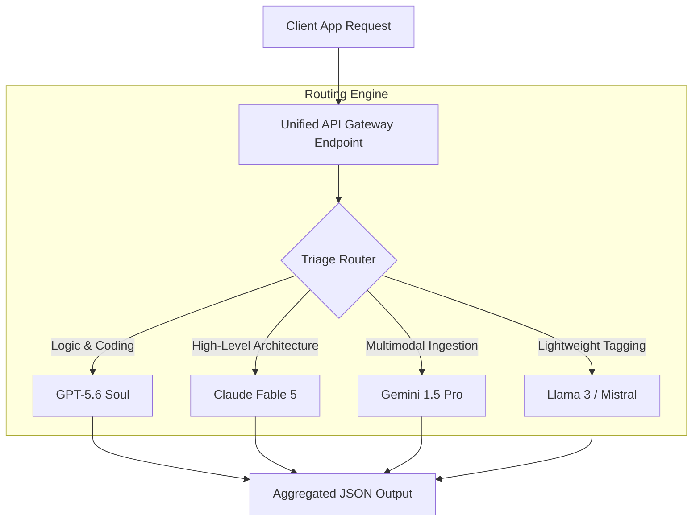

Delivering high-quality AI features at scale has historically forced development teams to select a single frontier model. While this simplifies integration, it leaves applications vulnerable to provider outages, shifts in capability, and high token costs.

With the release of **GPT-5.6's tiered architecture** and specialized engines like **Claude Fable 5**, modern software teams are moving toward **multi-model orchestration**. In this guide, we explore how to build cost-optimized routing pipelines and configure API gateways.

---

## The Unified API Gateway Architecture

A multi-model architecture routes tasks dynamically by introducing a gateway layer between client requests and AI providers:



By consolidating access through a single routing engine, developers can swap providers behind the scenes without modifying the front-end application code.

---

## Designing Routing Rules

To maximize efficiency, the gateway must evaluate incoming tasks and route them based on specific complexity criteria:

| Task Type | Key Requirement | Primary Route | Fallback Route |
| :--- | :--- | :--- | :--- |
| **Logic & CLI Execution** | Deep reasoning and command-line accuracy | GPT-5.6 Soul Ultra | Claude Myths 5 |
| **Software Architecture** | High-level planning and layout structure | Claude Fable 5 | GPT-5.6 Soul |
| **Multimodal Analysis** | Audio, video, and document ingestion | Gemini 1.5 Pro | GPT-5.6 Terra |
| **Triage & Classification** | Sub-millisecond response and low cost | GPT-5.6 Luna | Llama 3 (Self-Hosted) |

---

## Practical Implementation: Building the Routing Engine

Below is a JavaScript implementation of a basic routing engine. The gateway triages the task complexity first, and then routes the payload to the most cost-effective provider:

```javascript
import { OpenAI } from "openai";
import { Anthropic } from "@anthropic-ai/sdk";

const openai = new OpenAI();
const anthropic = new Anthropic();

async function executeOrchestrationGateway(taskText, metadata) {
  // Step 1: Triage complexity using budget-friendly model
  const triageResponse = await openai.chat.completions.create({
    model: "gpt-5.6-luna",
    messages: [
      { role: "system", content: "Categorize task complexity as: logic, layout, or triage." },
      { role: "user", content: taskText }
    ]
  });

  const category = triageResponse.choices[0].message.content.trim().toLowerCase();

  // Step 2: Route request based on classification
  if (category === "logic") {
    // Route to reasoning flagship
    const response = await openai.chat.completions.create({
      model: "gpt-5.6-soul",
      messages: [{ role: "user", content: taskText }]
    });
    return response.choices[0].message.content;
  } else if (category === "layout") {
    // Route to design planning specialist
    const response = await anthropic.messages.create({
      model: "claude-5-fable",
      max_tokens: 1024,
      messages: [{ role: "user", content: taskText }]
    });
    return response.content[0].text;
  } else {
    // Default fallback to budget model
    return triageResponse.choices[0].message.content;
  }
}
```

---

## Handling Gateway Failures & Retries

Unified endpoints must handle provider outages gracefully. When building a gateway:
1. **Configure Short Timeouts**: If a frontier provider does not return headers within 3000ms, abort the request.
2. **Execute Dynamic Fallbacks**: Immediately route the identical payload to a backup model tier (such as falling back from Soul to Claude Fable 5).
3. **Log Token Metrics**: Track cost per solved task across different models to adjust routing rules dynamically.

---

## Editorial Image Asset Checklist

### 1. Hero Image
- **Prompt**: Minimalist, clean 3D render of a routing switchboard distributing glowing light rays to different cloud servers. White background, sky blue and warm natural light highlights, soft shadows, magazine quality.
- **Filename**: `/images/guides/multi-model-orchestration-hero.png`
- **Alt Text**: Routing switchboard distributing connection paths.
- **Caption**: Figure 1: Unified API gateways route tasks dynamically to minimize latency.
- **Placement**: Directly below the frontmatter title.
- **Purpose**: Represents the routing and gateway infrastructure theme of the article.
- **Aspect Ratio**: 16:9

### 2. Supporting Visual 1
- **Prompt**: Sleek 3D illustration of a dynamic fallback path showing a red signal switching to green and routing to an alternative server card. Pure white workspace.
- **Filename**: `/images/guides/fallback-routing.png`
- **Alt Text**: Gateway routing alternative connection path during a server fallback.
- **Caption**: Figure 2: Automated fallback routing sequence.
- **Placement**: Under the "Handling Gateway Failures & Retries" section.
- **Purpose**: Visualizes the fallback routing process.
- **Aspect Ratio**: 16:9

### 3. Supporting Visual 2
- **Prompt**: Modern UI chart displaying latency metrics for multiple model providers, styled as clean floating card layout. Soft light cyan highlight borders.
- **Filename**: `/images/guides/provider-latency-chart.png`
- **Alt Text**: Comparison chart displaying model API latency averages.
- **Caption**: Figure 3: Comparing response latency by model provider.
- **Placement**: Under the "Designing Routing Rules" section.
- **Purpose**: Displays latency metrics for developer analysis.
- **Aspect Ratio**: 16:9

---

## Key Takeaways
- **Dynamic Routing**: Shift away from single-model dependencies by introducing a gateway layer to route tasks dynamically.
- **Workload Routing**: Route reasoning tasks to Soul, architectural tasks to Claude, and high-volume triage to Luna.
- **Outage Protection**: Configure short timeouts and automatic fallbacks to ensure application uptime during provider outages.
- **Cost Efficiency**: Unified gateways balance task accuracy with API token burn, reducing development costs.

---

## Internal Linking Opportunities
- Check out the launch highlights in our [GPT-5.6 Autonomous Engine launch explainer](file:///c:/Users/jasva/Nadhebe/src/content/youtube-articles/gpt-5-6-autonomous-engine.md).
- Understand safety regulations in our [GPT-5.6 Safety Delay analysis](file:///c:/Users/jasva/Nadhebe/src/content/news/gpt-5-6-trump-administration-safety-delay.md).
- Compare performances in our [GPT-5.6 vs. Claude Fable 5 Benchmark Review](file:///c:/Users/jasva/Nadhebe/src/content/comparisons/gpt-5-6-vs-claude-fable-5-benchmarks.md).
- Review [Programmatic Tool Calling Developer Guide](file:///c:/Users/jasva/Nadhebe/src/content/tools/gpt-5-6-programmatic-tool-calling.md) to configure sub-agent scripts.
