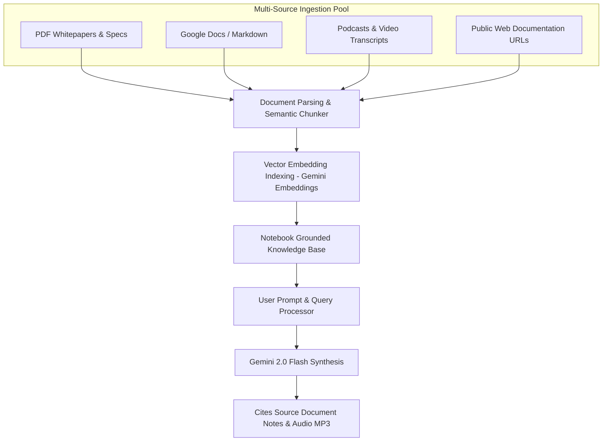
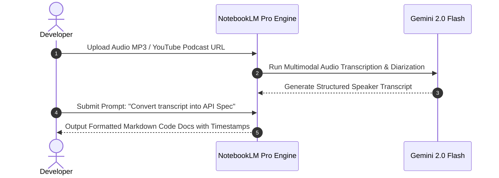

# Google NotebookLM Pro 2026 Developer Workflows and Integration Protocols

Modern engineering teams, researchers, and technical product managers deal with an overwhelming influx of documentation: API specifications, architectural decision records (ADRs), PDF whitepapers, GitHub pull requests, and technical podcasts. Standard large language model interfaces often suffer from hallucination and loss of source context when ingesting large document repositories.

**Google NotebookLM Pro** addresses this by using **Gemini 2.0 Flash** as a grounded knowledge engine. NotebookLM constrains answer generation strictly to your uploaded source materials, offering footnote citation matching, multi-source synthesis, and automated **Audio Overview** podcast creation.

In this developer guide, we explore NotebookLM Pro's architecture, document ingestion limits, programmatic API workflows, and strategies for transforming audio podcasts into structured developer documentation.

---

## Architectural Framework: How NotebookLM Ingests Knowledge

NotebookLM functions as a private, closed-world RAG system built on top of Google Cloud infrastructure.



### NotebookLM Pro vs Standard Tier Limits

| Capability Parameter | NotebookLM Free Tier | NotebookLM Pro Enterprise Tier |
|---|---|---|
| **Max Sources per Notebook** | 20 sources | **50 sources** |
| **Max Words per Source** | 500,000 words | **500,000 words** |
| **Total Notebook Word Capacity** | 10 million words | **25 million words** |
| **Audio Overview Customization** | Standard 2-Speaker | **Custom Focus Prompts & Multi-Voice** |
| **API Access Available** | No | **Yes (Google Cloud Vertex AI / AI Studio)** |

---

## Ingestion Workflows for Developer Repositories

To maximize NotebookLM Pro's extraction precision when loading codebases and documentation, format your inputs into structured markdown bundles before uploading.

### 1. Bundling Source Repositories into Ingestion Files

Instead of uploading hundreds of individual code files, use a single command to bundle core repository definitions into structured Markdown chunks:

```bash
# Bundle TypeScript/Python codebase into a single formatted Markdown file for NotebookLM
npx repomix --output notebooklm-ingest.md --include "src/**/*.ts,docs/**/*.md"
```

### 2. Formatted Context Structuring Pattern

When adding custom notes or architectural decision records, use clear heading tags:

```markdown
# Architectural Decision Record: Local RAG Vector Store

## Status: Approved
## Date: 2026-08-06

### Context
We evaluated ChromaDB, Qdrant, and PGVector for local desktop vector search.

### Decision
We selected ChromaDB due to its zero-dependency local Python bindings and low memory footprint (< 120 MB idle).
```

---

## Programmatic Audio Overview Generation via API

One of NotebookLM Pro's standout features is its **Audio Overview engine**, which turns complex technical whitepapers into engaging two-host developer podcasts.

```python
import os
from google import genai
from google.genai import types

# 1. Initialize Gemini 2.0 Client via Google AI Studio API key
client = genai.Client(api_key=os.environ["GEMINI_API_KEY"])

def generate_notebook_audio_summary(source_document_path: str):
    # 2. Upload source technical document to Gemini File API
    uploaded_file = client.files.upload(file=source_document_path)
    print(f"Uploaded source file: {uploaded_file.name}")
    
    # 3. Request Audio Synthesis with specific technical focus prompt
    prompt = (
        "Generate a deep-dive developer discussion focusing on the architectural trade-offs "
        "and benchmark figures described in the source document."
    )
    
    response = client.models.generate_content(
        model='gemini-2.0-flash',
        contents=[uploaded_file, prompt],
        config=types.GenerateContentConfig(
            response_mime_type="audio/mp3",
        )
    )
    
    # 4. Save generated audio payload
    output_filename = "notebooklm_audio_summary.mp3"
    with open(output_filename, "wb") as f:
        f.write(response.candidates[0].content.parts[0].inline_data.data)
        
    print(f"Audio summary generated successfully: {output_filename}")

# Execute generation
if __name__ == "__main__":
    generate_notebook_audio_summary("./notebooklm-ingest.md")
```

---

## Transforming Technical Podcasts into Code Documentation

NotebookLM Pro also works in reverse: converting technical audio podcasts, conference talks, and team meeting recordings into clean Markdown developer documentation.



### Prompt Template for Audio-to-Code Transformation

Submit the following prompt after ingesting an audio file:

```text
Act as a Principal Technical Writer. Analyze the uploaded audio transcript and generate a structured developer guide with the following sections:
1. Executive Summary & Architecture Goals
2. Code Snippets & CLI Commands Mentioned (with exact timestamps)
3. Key Technical Trade-offs Discussed
4. Action Items & Open Engineering Questions
```

---

## Summary & Best Practices

- **Ingest Clean Bundles**: Pre-process repository files into single Markdown bundles using tools like `repomix` before uploading.
- **Enforce Grounding**: Verify every answer's footnote numbers to ensure facts come strictly from source files.
- **Automate Podcast Generation**: Use the Gemini 2.0 Flash API to generate audio summaries of weekly tech reports.
