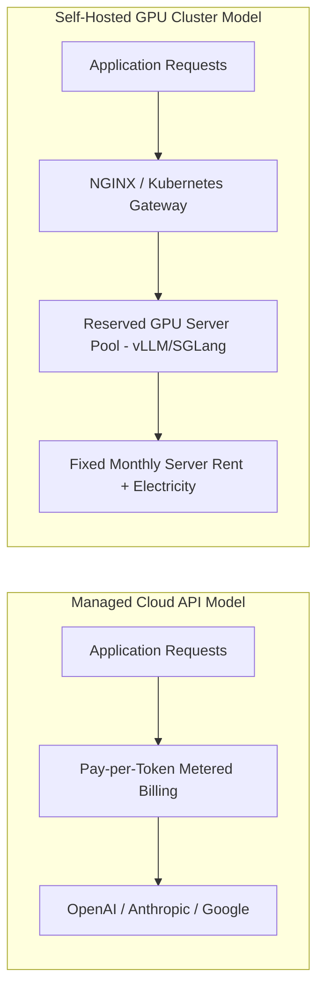
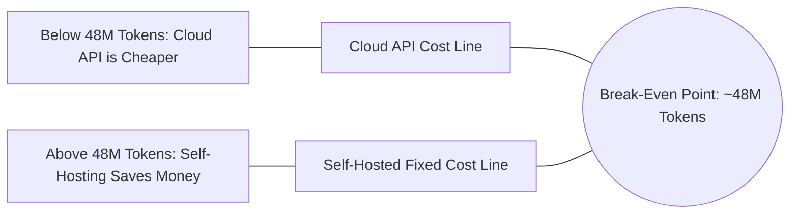

# Self-Hosting LLMs vs API Costs: Break-Even Math Guide

Engineering managers, AI architects, and CTOs face a critical infrastructure decision when scaling production AI applications: **Should you rely on managed cloud APIs (like OpenAI, Anthropic, or Google Gemini) or deploy self-hosted open-weights models (like DeepSeek R1, Llama 3.3, or Qwen 2.5) on reserved GPU servers?**

While managed APIs provide zero initial setup overhead and instant scalability, recurring token usage costs grow linearly with request volume. Conversely, self-hosted GPU infrastructure requires fixed upfront server investments but offers near-zero marginal cost per additional generated token.

This enterprise guide provides the exact financial equations, Total Cost of Ownership (TCO) models, break-even token volume matrices, and deployment strategies required to make data-driven AI infrastructure decisions.

---

## The Financial Landscape: Managed APIs vs. Self-Hosted Infrastructure

Choosing between cloud APIs and self-hosted GPU servers represents a classic trade-off between Operational Expenditure (OpEx) and Capital Expenditure (CapEx).

### Comparative Financial Model Matrix

| Cost Vector | Managed API Endpoints | Self-Hosted Open-Source Models |
|---|---|---|
| **Billing Structure** | Variable (Per 1M Input/Output Tokens) | Fixed Monthly Reservation + Egress |
| **Upfront Setup Investment** | $0 | Low to Moderate (DevOps configuration) |
| **Marginal Cost per 1M Tokens** | Linear ($0.50 to $15.00 / 1M tokens) | Decreases toward $0 as utilization reaches 100% |
| **Data Privacy & Security** | Data processed by 3rd-party vendors | Complete isolation (SOC2 / HIPAA compliant) |
| **Latency & SLA Control** | Dependent on vendor queue throttling | Dedicated hardware guarantees sub-50ms TTFT |

---

## Total Cost of Ownership (TCO) Mathematical Formulation

To calculate the exact break-even point, you must formulate the Total Cost of Ownership ($TCO_{\text{Monthly}}$) for self-hosted GPU infrastructure.

### The Complete GPU Infrastructure TCO Equation

$$TCO_{\text{Monthly}} = C_{\text{Hardware}} + C_{\text{Power}} + C_{\text{Network}} + C_{\text{Engineering}}$$

Where:
1. **Hardware Reservation Cost ($C_{\text{Hardware}}$)**:
   $$C_{\text{Hardware}} = N_{\text{GPU}} \times R_{\text{GPU\_hourly}} \times 730$$
   *(Where $N_{\text{GPU}}$ is the GPU count, $R_{\text{GPU\_hourly}}$ is the hourly rate, and 730 represents hours per month).*
2. **Power & Cooling Infrastructure Cost ($C_{\text{Power}}$)**:
   $$C_{\text{Power}} = \left( \frac{W_{\text{Server}} \times 730}{1000} \right) \times PUE \times R_{\text{kWh}}$$
   *(Where $W_{\text{Server}}$ is server wattage, $PUE$ is Power Usage Effectiveness scalar typically 1.2, and $R_{\text{kWh}}$ is electricity rate per kWh).*
3. **Egress Network Cost ($C_{\text{Network}}$)**:
   $$C_{\text{Network}} = T_{\text{Egress\_GB}} \times R_{\text{GB\_transfer}}$$
4. **DevOps Engineering Maintenance Allocation ($C_{\text{Engineering}}$)**:
   Fixed monthly allocation for system administration and cluster maintenance.

---

## Financial Benchmarking: Managed APIs vs. Self-Hosted Server Clusters

Let's evaluate a concrete scenario: Serving a 70B parameter model (e.g., Llama 3.3 70B or DeepSeek R1 Distill 70B) at scale.

### Scenario Parameters
- **Daily Request Volume**: 5,000,000 requests / day
- **Average Prompt Tokens**: 1,000 tokens / request
- **Average Completion Tokens**: 300 tokens / request
- **Monthly Volume**: 30 billion total tokens (23B Input, 7B Output)

```mermaid
gantt
    title Monthly Total Cost Comparison at 30 Billion Tokens
    dateFormat X
    axisFormat %s
    section Managed API (Claude 3.5 / GPT-4o Class)
    API Billing Cost ($105,000) : 0, 105000
    section Self-Hosted 4x H100 Node
    Hardware & Operations ($14,200) : 0, 14200
```

### Monthly Cost Breakdown Matrix (30 Billion Tokens/Month)

| Solution Provider | Architecture / Instance Type | Monthly Cost | Cost per 1M Combined Tokens |
|---|---|---|---|
| **Proprietary Managed API A** | Proprietary GPT-4o Endpoint | $122,500 | $4.08 |
| **Proprietary Managed API B** | Proprietary Claude 3.5 Sonnet | $114,000 | $3.80 |
| **Commodity API Gateway** | DeepSeek R1 Hosted Endpoint | $24,000 | $0.80 |
| **Self-Hosted Cloud GPU** | 1x Node (4x NVIDIA H100 80GB SXM) | $14,200 | **$0.47** |
| **Self-Hosted On-Premise GPU** | Owned 4x H100 Server (3-yr Amortization) | **$8,600** | **$0.28** |

> **Financial Insight**: At 30 billion tokens per month, self-hosting on reserved cloud GPUs yields an **87.5% monthly cost reduction** compared to tier-1 proprietary APIs, saving over $99,000 per month ($1.19M annually).

---

## Calculating Your Break-Even Token Volume Threshold

To determine when your organization should transition from cloud APIs to self-hosted hardware, calculate your **Break-Even Token Volume ($V_{\text{Break-Even}}$)**.

$$V_{\text{Break-Even}} = \frac{TCO_{\text{Self-Hosted\_Monthly}}}{P_{\text{API\_Per\_Million}} - C_{\text{Marginal\_Per\_Million}}}$$

### Break-Even Curves Across Model Scale Categories

### Break-Even Threshold Matrix

| Model Parameter Class | Hardware Required | Monthly GPU Server Cost | Managed API Equivalent | Monthly Break-Even Threshold |
|---|---|---|---|---|
| **Small Models (7B–8B)** | 1x RTX 4090 / 1x A10G | $350 – $650 / mo | GPT-4o-mini / Haiku | **12 Million Tokens** |
| **Medium Models (14B–32B)** | 1x A100 80GB / 2x L40S | $1,200 – $2,100 / mo | Gemini Flash / Claude Haiku | **28 Million Tokens** |
| **Large Models (70B MoE)** | 4x H100 80GB / 8x A100 | $9,500 – $14,500 / mo | GPT-4o / Claude Sonnet | **48 Million Tokens** |

---

## Executive Action Plan & Strategic Recommendations

1. **Start on Managed APIs During Prototyping**: Below 20 million tokens per month, the operational overhead of managing GPU infrastructure outweighs server cost savings.
2. **Standardize Open-Weights Evaluation**: Benchmark Llama 3.3 70B and DeepSeek R1 distilled models early to ensure your application prompts work seamlessly on open models.
3. **Transition to Reserved Instances at 50M Tokens/Month**: When monthly API spend exceeds $3,000/month, deploy a reserved vLLM or SGLang cluster on cloud GPU providers (such as RunPod, Modal, or Lambda Labs).
4. **Leverage Quantization to Cut Hardware Footprint**: Enforce `Q4_K_M` or `FP8` precision to fit 70B parameter models onto smaller, lower-cost GPU clusters.
