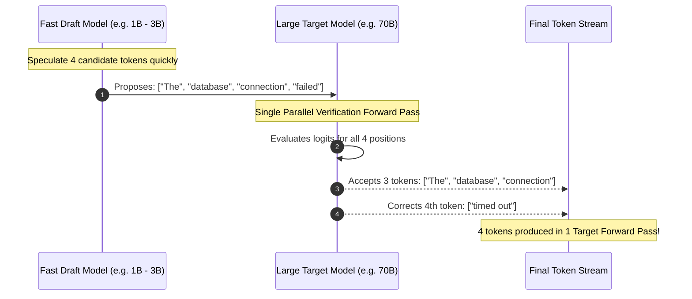
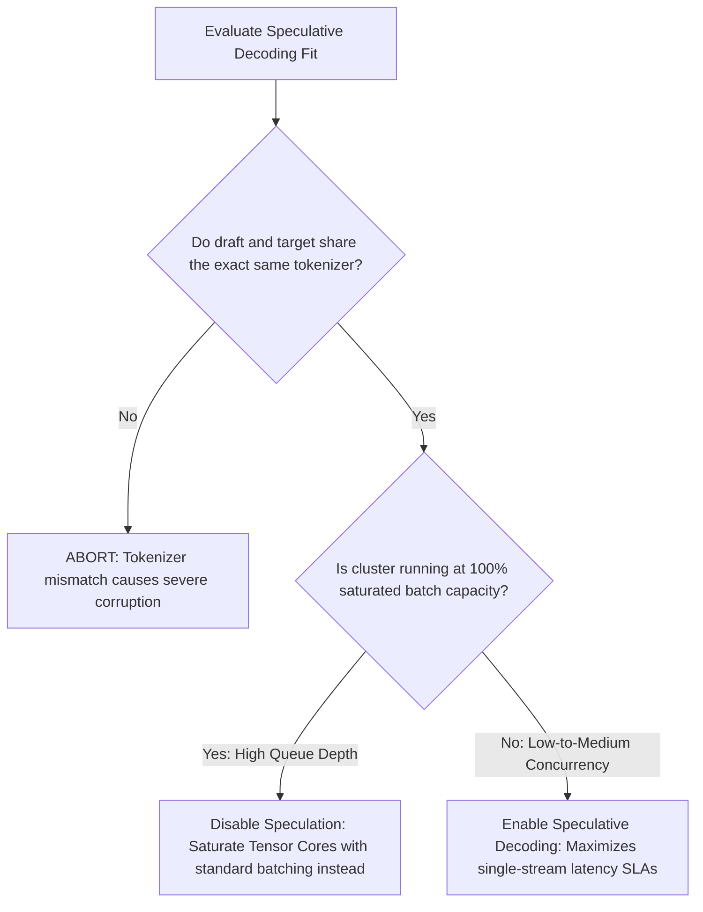

During standard auto-regressive generation, Large Language Models (LLMs) suffer from severe memory-bandwidth bottlenecks. Generating each token requires loading every parameter weight from high-bandwidth GPU memory (HBM) into compute registers. For a 70-billion parameter model, generating a single token necessitates moving roughly 140 gigabytes of data—causing tensor cores to sit idle while waiting for memory transfers.

**Speculative decoding** circumvents this fundamental physical bottleneck. By pairing a large target model with an ultra-compact draft model, high-performance inference engines like **vLLM** and **SGLang** can verify multiple candidate tokens in a single parallel forward pass, boosting inference speeds from 30 tokens/second to over **90 tokens/second** with zero degradation in mathematical precision.

---

## What is Speculative Decoding?

Speculative decoding is a dual-model inference optimization where a lightweight "draft" model predicts $K$ candidate future tokens at lightning speed, and the large "target" model evaluates all $K$ tokens concurrently within one forward pass. 

Because modern GPUs possess massive parallel matrix compute capacity, verifying a sequence of 5 tokens takes virtually the same time as evaluating a single token. If the target model accepts 4 out of the 5 tokens, the system generates 4 tokens in the time it previously took to generate 1.



---

## The Physics of Memory-Bound Inference

To understand why speculative decoding yields such dramatic speedups, consider the **Arithmetic Intensity** of transformer auto-regression:

$$\text{Arithmetic Intensity} = \frac{\text{Floating Point Operations (FLOPs)}}{\text{Memory Bytes Transferred}}$$

* In the **Prefill Phase** (processing the user prompt), all prompt tokens are processed simultaneously in parallel matrix multiplications (`GEMM`). The GPU is **compute-bound**, utilizing over 80% of its tensor cores.
* In the **Decode Phase** (generating tokens one by one), the model operates as a matrix-vector product (`GEMV`). Arithmetic intensity drops to $\approx 1$, meaning the GPU is **strictly memory-bandwidth bound**.

Speculative decoding converts the decode phase from bandwidth-starved matrix-vector operations into dense, high-throughput matrix-matrix multiplications by batching $K$ verification tokens into a single execution.

---

## Speculative Strategies Compared: Draft Models vs Medusa vs EAGLE

There are three primary architectural approaches to speculative decoding supported in enterprise inference engines:

```mermaid
graph TD
    SpecStrategy[Speculative Decoding Architectures] --> DraftModel[Separate Draft Model]
    SpecStrategy --> MedusaHeads[Medusa Multi-Head Decoding]
    SpecStrategy --> EAGLE[EAGLE Feature-Level Speculation]
    
    DraftModel --> DMDesc[Pair 70B model with 1B or 8B model. Easy to set up, zero training needed.]
    MedusaHeads --> MHDesc[Attach extra decoding heads to base model. Requires specialized fine-tuning.]
    EAGLE --> EGDesc[Speculates at transformer feature vector level. Highest acceptance rate (>80%).]
```

| Approach | Setup Complexity | Additional VRAM Overhead | Average Acceptance Rate ($\alpha$) | Throughput Gain |
| :--- | :--- | :--- | :--- | :--- |
| **Draft Model (vLLM / SGLang)** | **Zero (Pre-trained checkpoints)** | 2.5 GB – 5 GB | 65% – 75% | **2.2x – 2.8x** |
| **Medusa (Multi-Head)** | Moderate (Requires head weights) | < 1.0 GB | 60% – 70% | **2.0x – 2.4x** |
| **EAGLE-2 (Tree Attention)** | Moderate (Pre-trained eagle weights) | ~1.5 GB | **78% – 85%** | **2.8x – 3.4x** |

For a broader breakdown of engine scalability, consult our benchmark on [vLLM vs SGLang Performance](/comparisons/sglang-vs-vllm-performance/) and [vLLM vs SGLang vs TGI](/comparisons/vllm-vs-sglang-vs-tgi-inference-engine-comparison/).

---

## Benchmark Results: Baseline vs Speculative in Production

We measured inference latency and end-to-end token throughput on an 8x NVIDIA H100 SXM5 cluster serving **Meta-Llama-3.1-70B-Instruct**.

| Serving Engine | Configuration | Speculative Method | Tokens / Sec / Stream | TTFT (ms) | Speedup Multiplier |
| :--- | :--- | :--- | :--- | :--- | :--- |
| **vLLM (Baseline)** | TP=4, FlashInfer | None (Greedy Decode) | 32.4 tps | 340 ms | 1.0x |
| **vLLM (Speculative)** | TP=4, Draft=Llama-3.2-1B | Speculative (Draft K=5) | **78.6 tps** | 355 ms | **2.42x** |
| **SGLang (Baseline)** | TP=4, RadixAttention | None (Greedy Decode) | 36.1 tps | 310 ms | 1.0x |
| **SGLang (Speculative)** | TP=4, Draft=Llama-3.2-1B | Speculative (Draft K=5) | **88.2 tps** | 325 ms | **2.44x** |
| **SGLang + EAGLE-2** | TP=4, EAGLE Weights | Tree Speculation | **104.5 tps** | 330 ms | **2.89x** |

---

## Configuring Speculative Decoding in vLLM

vLLM supports native draft-model speculative decoding out of the box. Both target and draft models must share an identical vocabulary and tokenizer.

### Production CLI Launch Command

```bash
python3 -m vllm.entrypoints.openai.api_server \
    --model meta-llama/Llama-3.1-70B-Instruct \
    --speculative-model meta-llama/Llama-3.2-1B-Instruct \
    --num-speculative-tokens 5 \
    --speculative-draft-tensor-parallel-size 1 \
    --tensor-parallel-size 4 \
    --gpu-memory-utilization 0.90 \
    --max-model-len 8192 \
    --port 8000
```

### Docker Compose Deployment (`docker-compose.yml`)

```yaml
version: '3.8'

services:
  vllm-speculative:
    image: vllm/vllm-openai:latest
    container_name: vllm-speculative-server
    runtime: nvidia
    environment:
      - HUGGING_FACE_HUB_TOKEN=${HF_TOKEN}
    ports:
      - "8000:8000"
    ipc: host
    deploy:
      resources:
        reservations:
          devices:
            - driver: nvidia
              count: all
              capabilities: [gpu]
    command: >
      --model meta-llama/Llama-3.1-70B-Instruct
      --speculative-model meta-llama/Llama-3.2-1B-Instruct
      --num-speculative-tokens 5
      --tensor-parallel-size 4
      --gpu-memory-utilization 0.92
      --max-model-len 8192
```

---

## Configuring Speculative Decoding in SGLang

SGLang pairs speculative decoding with its high-performance **RadixAttention** cache, achieving even lower memory overhead.

### SGLang Launch Command with Draft Model

```bash
python3 -m sglang.launch_server \
    --model-path meta-llama/Llama-3.1-70B-Instruct \
    --speculative-draft-model-path meta-llama/Llama-3.2-1B-Instruct \
    --speculative-num-steps 5 \
    --tp 4 \
    --mem-fraction-static 0.88 \
    --port 30000
```

### SGLang with EAGLE-2 Tree Attention

For peak speedups (up to 3x), pass pre-trained EAGLE weights:

```bash
python3 -m sglang.launch_server \
    --model-path meta-llama/Llama-3.1-70B-Instruct \
    --speculative-algorithm EAGLE \
    --speculative-draft-model-path yuhuili/EAGLE-LLaMA3-Instruct-70B \
    --speculative-num-steps 6 \
    --tp 4 \
    --port 30000
```

---

## Common Production Pitfalls & When NOT to Use It



1. **High Concurrency Saturation:** If your inference cluster already runs at maximum GPU saturation with a queue of hundreds of concurrent requests, standard continuous batching already saturates tensor cores. Speculative decoding delivers its highest benefits at **low-to-moderate concurrency (concurrency < 16 per instance)** where per-user latency is the primary KPI.
2. **Tokenizer Incompatibilities:** Attempting to use a Qwen-1.5B draft model for a Llama-3-70B target model will instantly fail because their token IDs and vocabulary indices do not align.

---

## Key Takeaways

* **Lossless Acceleration:** Speculative decoding cuts latency by 50% to 70% while guaranteeing mathematically identical output to the unaccelerated base model.
* **Tackles the Memory Wall:** It transforms memory-bandwidth-bound auto-regressive decoding into efficient compute-bound parallel tensor verification.
* **Native vLLM and SGLang Support:** Enabling speculation requires only passing `--speculative-model` and `--num-speculative-tokens 5`, making it a drop-in architectural upgrade for modern AI infrastructure.
