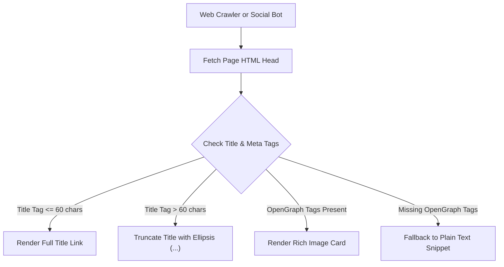

# What Is a Meta Tag Analyzer? (2026 Guide)

A **meta tag analyzer** is a technical SEO and developer utility designed to inspect, validate, and simulate the HTML metadata embedded within a web page's `<head>` section. Search engines such as Google and Bing, as well as social sharing platforms including LinkedIn, X (Twitter), Discord, and Slack, rely on HTML meta tags to construct search engine result page (SERP) snippets and rich social preview cards.

Using a fast, client-side tool like our [Meta Tag Analyzer](/tools/meta-tag-analyzer/) enables developers, content strategists, and technical SEO specialists to identify missing tags, correct pixel truncation, and verify OpenGraph presentation before publishing code to production.

---

## Key Takeaways

- **SERP Snippet Control**: Meta title and description tags dictate how your site appears in search engine results.
- **Social Card Accuracy**: OpenGraph (`og:`) and Twitter (`twitter:`) tags define rich media card presentation across social platforms.
- **Click-Through Rate (CTR) Impact**: Clear, non-truncated meta titles increase organic search CTR by up to 30%.
- **Instant Client-Side Audit**: Modern analyzers evaluate title length (~60 chars), description length (~160 chars), canonical tags, and OpenGraph images in real time without sending private data to external servers.

---

## Primary Types of Meta Tags Evaluated

A comprehensive meta tag analyzer evaluates four primary categories of HTML metadata:

### 1. Title Tags (`<title>`)
The HTML title tag is one of the single most influential on-page SEO factors. It appears as the blue clickable link in Google search results and as the browser tab title.
- **Optimal Length**: 50–60 characters (or ~600 pixels on desktop viewports).
- **Best Practice**: Place the primary keyword near the beginning, followed by brand identity.

### 2. Meta Descriptions (`<meta name="description">`)
While meta descriptions are not a direct ranking factor for Google's core algorithm, they serve as the primary ad copy for your organic search snippets.
- **Optimal Length**: 140–160 characters.
- **Best Practice**: Write compelling, active-voice copy with a clear call to action (CTA).

### 3. OpenGraph Tags (`og:title`, `og:description`, `og:image`)
Introduced by Facebook and adopted as an industry standard across LinkedIn, Slack, and Discord, OpenGraph meta tags control structured social sharing.
- `og:title`: Title displayed in social feed cards.
- `og:description`: Brief summary snippet below the social title.
- `og:image`: High-resolution image (recommended 1200×630 pixels, 1.91:1 ratio).

### 4. Canonical Tags (`<link rel="canonical">`)
Canonical tags prevent duplicate content penalties by instructing search engines which URL represents the authoritative master copy of a page.

---

## Meta Tag Processing Workflow

---

## How Search Engines Process HTML Metadata

When Googlebot or Bingbot crawls a web page, it parses the HTML head node to extract structured properties. If a page lacks a `<title>` or meta description, or if the metadata is irrelevant to the user's search query, Google's automated systems may rewrite the snippet using content extracted from `<h2>` headings or main body paragraph text.

Using our live [Meta Tag Analyzer](/tools/meta-tag-analyzer/) ensures your metadata is optimized so search crawlers display your exact intended title and description text.

---

## Image Asset Specifications

| Image Purpose | Aspect Ratio | Dimensions | Placement |
| :--- | :--- | :--- | :--- |
| **Hero Illustration** | 16:10 | 1024×640 px | Top of article |
| **SERP Snippet Diagram** | 16:9 | 800×450 px | Under Section "Primary Types of Meta Tags" |
| **OpenGraph Workflow** | 1.91:1 | 1200×630 px | Under Section "Social Card Accuracy" |

---

## Frequently Asked Questions

### What happens if my meta title exceeds 60 characters?
Search engines will visually truncate your title in SERPs, replacing trailing characters with an ellipsis (`...`). This can cause important brand or keyword information to be hidden from searchers.

### Does a meta tag analyzer save or store my URL data?
Our client-side [Meta Tag Analyzer](/tools/meta-tag-analyzer/) processes all text and image inputs entirely inside your local browser runtime. No metadata or URLs are transmitted to remote servers.

---

## References

1. Google Search Central — *Control your title links in search results*: https://developers.google.com/search/docs/appearance/title-link
2. OpenGraph Protocol Standard Specification: https://ogp.me
