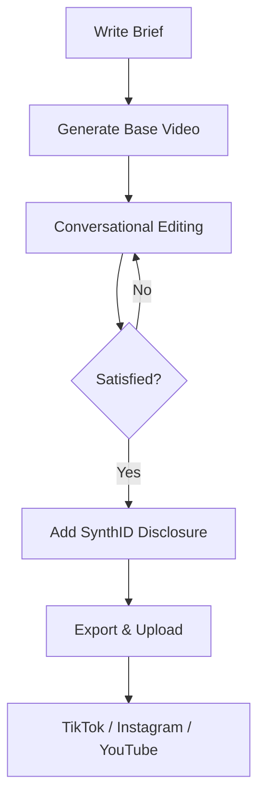

Google has fundamentally restructured its approach to AI video generation. As of mid-2026, the standalone Veo model has been absorbed into the broader Gemini ecosystem through two new models: **Gemini Omni** and **Gemini Omni Flash**. These models do not just generate video clips from text — they enable *conversational video editing*, where you iteratively refine footage through natural language dialogue.

This guide covers the full landscape of Gemini video generation capabilities, from consumer app features to developer API integration.

---

## The Shift from Veo to Gemini Omni

Previously, Google offered video generation through the Veo model, accessible primarily through AI Studio and select consumer features. The transition to Gemini Omni represents a strategic consolidation:

| Aspect | Veo (Previous) | Gemini Omni (Current) |
| :--- | :--- | :--- |
| Interaction Model | One-shot generation | Conversational, multi-turn |
| Editing | Limited post-generation | Full natural language editing |
| Audio | Separate pipeline | Native audio generation |
| Integration | Standalone | Embedded in Gemini App & Vids |
| Avatar Support | No | Yes — selfie-based digital avatars |

The key philosophical shift is from *generation* to *collaboration*. Gemini Omni treats video creation as an ongoing conversation rather than a single prompt-to-output transaction.

---

## Gemini Omni Flash: The Creative Engine

Gemini Omni Flash is the high-performance variant optimized for fast video generation and editing. Released in late June 2026, it is the model that powers most consumer-facing video features in the Gemini app.

### Generation Capabilities

- **Output quality:** 720p video at up to 24 fps
- **Duration:** 3–10 seconds per generation
- **Input types:** Text descriptions, still images, or existing video clips
- **Audio:** Native audio generation synchronized with visual content
- **Styles:** Photorealistic, animation, cinematic, documentary, abstract

### How to Generate a Video

1. Open the Gemini app (web or mobile)
2. Describe the video you want to create:
   ```text
   "Create a 5-second video of a golden retriever running through
   autumn leaves in slow motion, with warm afternoon sunlight
   filtering through the trees"
   ```
3. Gemini generates the clip and presents it inline
4. Review and iterate with follow-up instructions

---

## Conversational Video Editing

The most distinctive feature of Gemini Omni is **conversational editing** — the ability to modify generated or uploaded video clips through natural language instructions.

### What You Can Edit

| Edit Type | Example Prompt |
| :--- | :--- |
| **Background** | "Change the background to a tropical beach" |
| **Lighting** | "Make the lighting more dramatic with golden hour tones" |
| **Characters** | "Replace the person with an animated cartoon character" |
| **Wardrobe** | "Change their outfit to a formal business suit" |
| **Camera** | "Apply a slow zoom-in effect" |
| **Color Grade** | "Apply a vintage film grain look" |
| **Weather** | "Add falling snow to the scene" |
| **Speed** | "Make the motion 50% slower" |

### Multi-Turn Editing Workflow

The conversational model maintains context across turns, so you can progressively refine a clip:

```text
Turn 1: "Create a video of a modern office space with people working"
Turn 2: "Change the lighting to warm evening"
Turn 3: "Add rain visible through the windows"
Turn 4: "Make the camera slowly pan from left to right"
Turn 5: "Remove the person in the background"
```

Each turn modifies the previous result, building up to a polished final clip without starting from scratch.

---

## Google Vids Integration and Digital Avatars

Gemini Omni has been integrated into **Google Vids**, Google's AI-powered video creation tool for Workspace.

### Digital Avatar Generation

One of the most practical features is the ability to create a personalized digital avatar:

1. Take a selfie using the Gemini or Google Vids app
2. Record a brief voice sample (30 seconds)
3. The system generates a photorealistic digital avatar that matches your appearance and voice
4. Use the avatar to deliver presentations, messages, or educational content

### Use Cases for Avatars

- **Internal communications:** Record company updates without scheduling video shoots
- **Training content:** Create instructional videos at scale with consistent presenter quality
- **Asynchronous meetings:** Send video messages that look and sound like you without actually recording
- **Multilingual content:** Generate avatar presentations in multiple languages using your likeness

### Quality and Limitations

- Avatars are currently limited to upper-body framing (head and shoulders)
- Lip sync accuracy is high but not perfect for all languages
- Custom gestures and expressions are limited to a predefined set
- All avatar-generated content includes SynthID watermarking

---

## Developer API Access

For developers and content platforms, Gemini Omni Flash is accessible through the Gemini API and Google AI Studio.

### Pricing

| Operation | Cost |
| :--- | :--- |
| Video generation (per second of output) | ~$0.10 |
| Image-to-video animation | ~$0.08/second |
| Video editing (per modification) | ~$0.05/edit |

### API Example

```python
import google.generativeai as genai

genai.configure(api_key="YOUR_API_KEY")

model = genai.GenerativeModel("gemini-omni-flash")

# Generate a video from text
response = model.generate_content(
    "Create a 5-second product showcase video of a sleek smartwatch "
    "rotating on a reflective surface with soft studio lighting",
    generation_config=genai.GenerationConfig(
        response_modalities=["VIDEO"],
        video_config={
            "duration_seconds": 5,
            "resolution": "720p",
            "fps": 24,
        },
    ),
)

# Save the generated video
video_data = response.candidates[0].content.parts[0].video
with open("product_showcase.mp4", "wb") as f:
    f.write(video_data)
```

### Batch Processing

For applications that need to generate video at scale (e-commerce product videos, social media content pipelines), use the batch API to submit multiple generation requests and receive results asynchronously.

---

## Content Transparency and Watermarking

All AI-generated video content from Gemini includes **SynthID** — Google DeepMind's invisible digital watermark technology.

### How SynthID Works

- The watermark is embedded in the pixel data of every generated frame
- It is invisible to the human eye and does not affect visual quality
- The watermark survives common post-processing operations (compression, cropping, color adjustments)
- Google provides a free detector tool to verify whether a video contains SynthID

### Why This Matters

- **Content authenticity:** Viewers and platforms can verify whether footage was AI-generated
- **Platform compliance:** Major social media platforms are increasingly requiring disclosure of AI-generated content
- **Legal protection:** The watermark provides evidence of AI origin in case of disputes

---

## Practical Content Creation Workflows

### Social Media Content Pipeline



### Product Marketing

1. Upload product images as source material
2. Ask Gemini to animate them into showcase videos
3. Edit lighting, angles, and backgrounds conversationally
4. Export at platform-specific aspect ratios (9:16 for Reels, 16:9 for YouTube)

### Educational Content

1. Describe the concept you want to illustrate
2. Generate animated explainer clips
3. Create avatar presentations with your digital likeness
4. Combine clips in Google Vids for a complete lesson

---

## Availability and Subscription Requirements

| Feature | Free Tier | Google AI Pro | Google AI Ultra |
| :--- | :---: | :---: | :---: |
| Basic video generation | Limited | ✅ | ✅ |
| Conversational editing | ❌ | ✅ | ✅ |
| Digital avatar creation | ❌ | ❌ | ✅ |
| Google Vids integration | ❌ | ❌ | ✅ |
| API access | ❌ | ✅ | ✅ |

---

## Key Takeaways

- **Gemini Omni** replaces Veo as Google's primary video generation model, now embedded in the Gemini App
- **Conversational editing** lets you modify videos through natural language — change backgrounds, lighting, wardrobe, and more
- **Gemini Omni Flash** generates 3–10 second clips at 720p with native audio
- **Digital avatars** can be created from a selfie + voice sample for presentations and messaging
- **Developer API** pricing starts at ~$0.10 per second of generated video
- All content includes **SynthID watermarks** for transparency and authenticity verification
