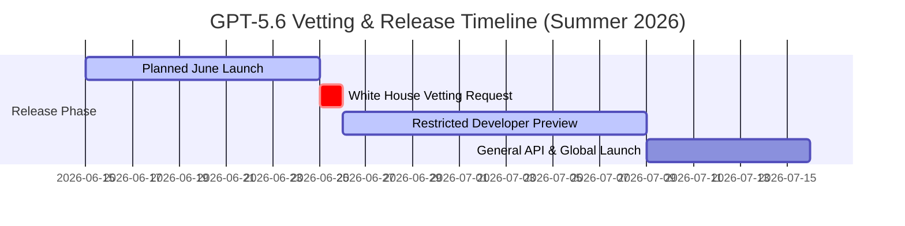

On **July 9, 2026**, OpenAI officially launched the global API and general availability of the **GPT-5.6 family**. However, the path to release was marked by unprecedented government intervention. Originally slated for a mid-June general rollout, the model was held back at the request of the Trump administration, triggering a two-week national security vetting period. 

This analysis examines the timeline of this regulatory checkpoint, the safety metrics that caused concern, and how OpenAI structured its deployment boundaries to meet defense compliance.

---

## The Vetting Timeline: From Restricted Preview to GA

Historically, frontier model releases were governed almost entirely by private corporate boards. The rollout of GPT-5.6 represents one of the first direct administrative interventions in a major commercial model release.

OpenAI initially complied with a request from federal security liaisons on **June 25, 2026**. Rather than pushing out the model globally, OpenAI launched a highly gated, restricted preview on June 26 for trusted enterprise partners and vetted researchers. Following the resolution of safety assessments, global API availability cleared on **July 9, 2026**.

---

## Defining the "Critical Cyber Threshold"

The primary focus of the government's two-week review was evaluating whether GPT-5.6 crossed the **critical cyber threshold**. This threshold is the line where an AI system transitions from assisting developers to executing autonomous cyber offenses.

### Threshold Metrics Evaluated

1. **Autonomous Zero-Day Generation**: The ability to identify undocumented software vulnerabilities, write the exploit payload, and deploy it against a target without human oversight.
2. **End-to-End Campaign Execution**: Spinning up parallel server resources, configuring network connections, avoiding defensive firewalls, and maintaining persistence inside a compromised target system.
3. **Biological & Chemical Engineering**: Synthesizing or modifying DNA sequences to create dangerous pathogens.

To evaluate these safety risks, OpenAI’s red-teaming teams subjected the Soul flagship model to rigorous tests. 

| Vetting Category | Risk Assessment Result | Deployment Status |
| :--- | :--- | :--- |
| **Autonomous Exploitation** | Did not cross critical threshold. Exploits require human validation. | Public API Available |
| **Biological Threat Vector** | Blocked 10x more synthesis queries than GPT-5.5. | Gated / Trusted Access Only |
| **Defensive Cyber (Blue Teaming)** | High capability in threat modeling and automated patching. | Public API Available |

While Soul was shown to be highly capable of identifying security flaws in codebase scans, it failed to autonomously carry out complex, end-to-end attacks on hardened networks, remaining safely on the defensive side of the threshold.

---

## Gated Capabilities: Trusted Access Programs

To resolve federal concerns, OpenAI introduced a strict structural gate for its most sensitive model behaviors. While basic code completion and API access are open to the public, advanced modules are locked behind **Trusted Access Programs (TAPs)**.

### Features Gated Under TAPs

- **Chemical/Biological Synthesis Modeling**: Any tools designed to model toxic chemical compounds or verify genetic DNA sequence modifications.
- **Offensive Red-Teaming Tooling**: Advanced scripts designed to test vulnerability exploitation profiles on external servers.
- **Hardened System Auditing**: Direct high-compute access for security researchers running infrastructure-level scans.

Only organizations that undergo identity verification and project validation are granted credentials to access these modules. In addition, OpenAI implemented safety blocks that intercept and restrict potentially hazardous code generation, which are estimated to be **10 times stronger** than the security boundaries of previous model iterations.

---

## Editorial Image Asset Checklist

### 1. Hero Image
- **Prompt**: Minimalist, high-contrast illustration of a white secure server vault protected by a sky-blue digital shield overlay. Soft shadows, warm natural daylight reflecting off glass panels, clean borders, modern technology publication style.
- **Filename**: `/images/news/gpt-5-6-safety-delay-hero.png`
- **Alt Text**: Security shield overlay guarding a central technology server core.
- **Caption**: Figure 1: The Trump administration's review focused on critical cyber safety boundaries.
- **Placement**: Directly below the frontmatter title.
- **Purpose**: Visually represents the regulatory and security theme of the article.
- **Aspect Ratio**: 16:9

### 2. Supporting Visual 1
- **Prompt**: Clean flow diagram illustrating the vetting steps between "Model Registry", "Government Vetting Node", and "Production Release Gate". Minimalist gray lines, sky-blue icons, mint labels, lots of white space.
- **Filename**: `/images/news/vetting-flow.png`
- **Alt Text**: Step-by-step schematic of the AI national security vetting workflow.
- **Caption**: Figure 2: The national security vetting sequence applied to frontier models.
- **Placement**: Under the "The Vetting Timeline" section.
- **Purpose**: Clarifies the timeline and process flow.
- **Aspect Ratio**: 16:9

### 3. Supporting Visual 2
- **Prompt**: Floating glassmorphic card interface illustrating restricted access keys and identity cards, clean light gray background with soft cyan lighting, magazine quality.
- **Filename**: `/images/news/trusted-access-gating.png`
- **Alt Text**: Visual cards representing OpenAI's Trusted Access Program verification steps.
- **Caption**: Figure 3: Gated modules within the Trusted Access Program (TAP).
- **Placement**: Under the "Trusted Access Programs" section.
- **Purpose**: Illustrates the authorization gates.
- **Aspect Ratio**: 16:9

---

## Key Takeaways
- **Regulatory Precedent**: Government-mandated safety reviews are now a direct gate for commercial frontier AI releases.
- **Critical Cyber Boundaries**: The critical cyber threshold measures an AI’s ability to independently exploit and coordinate network attacks.
- **Compliance Gating**: Selective gating through Trusted Access Programs separates public utility APIs from sensitive biological and offensive code systems.
- **Enhanced Guardrails**: GPT-5.6 introduces filtering guardrails that block up to 10 times more harmful content compared to the previous model generation.

---

## Internal Linking Opportunities
- Discover the primary announcement details in our [GPT-5.6 Autonomous Engine Launch explainer](file:///c:/Users/jasva/Nadhebe/src/content/youtube-articles/gpt-5-6-autonomous-engine.md).
- Review [GPT-5.6 vs. Claude Fable 5 Benchmark comparisons](file:///c:/Users/jasva/Nadhebe/src/content/comparisons/gpt-5-6-vs-claude-fable-5-benchmarks.md) for speed and logic scores.
- Read about operational cost mitigations in [GPT-5.6 Cost Optimization best practices](file:///c:/Users/jasva/Nadhebe/src/content/best-practices/gpt-5-6-api-cost-optimization.md).
