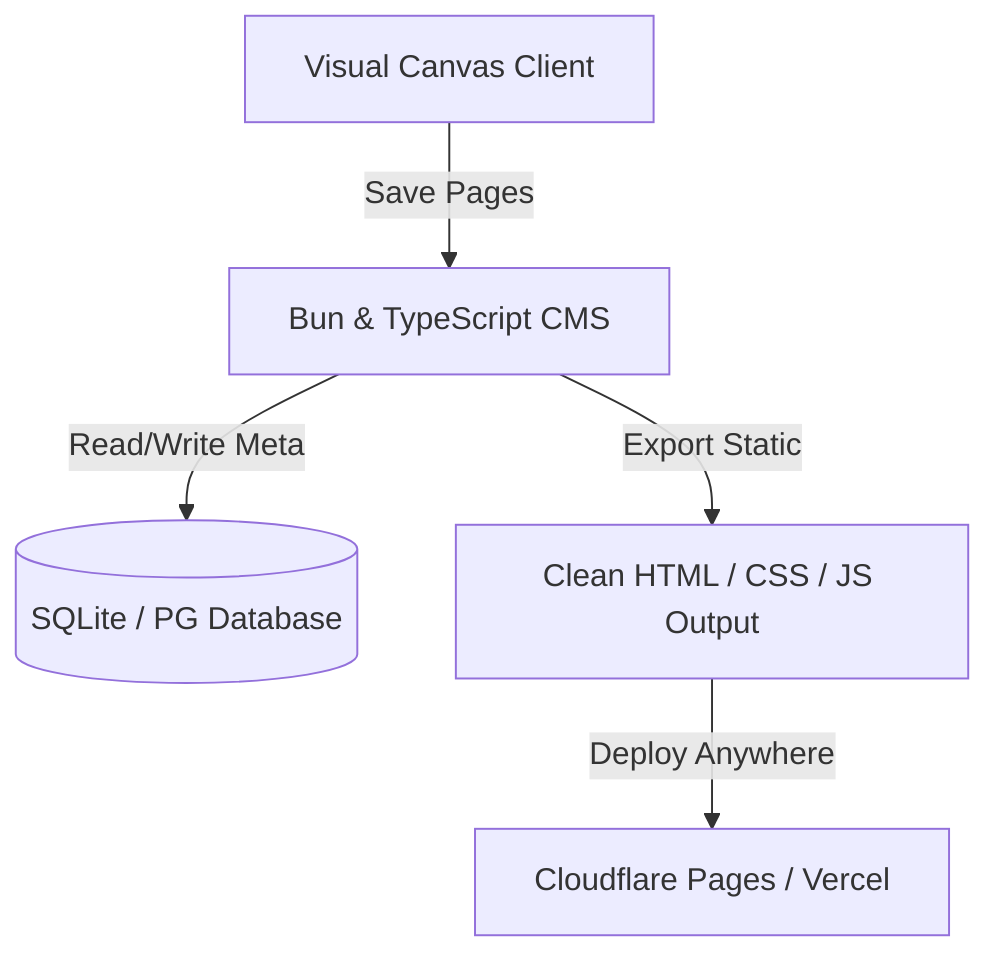

The visual web development space has long been dominated by closed-source, proprietary platforms. Platforms like Webflow and Framer lock developer data behind paywalls, enforce strict hosting plans, and export bloated markup. 

The web development community now has an open-source alternative. **Instatic**, a self-hosted visual page builder and content management system, has officially debuted under the **MIT license**.

Built entirely on **Bun** and **TypeScript**, Instatic is designed from the ground up for modern web development, combining high-velocity backend scripting with visual UI composition tools.

---

## Why the Tech Stack Matters

Instatic separates itself from legacy PHP-based content management systems (like WordPress) through its execution platform:

By leveraging **Bun** as the runtime, Instatic editors load and save pages near-instantaneously. The publisher compiles static semantic HTML and CSS, which loads faster and yields higher core web vitals than typical JavaScript-heavy exports.

---

## Direct Competitor Analysis

| Capability | Webflow | WordPress | Instatic |
| :--- | :--- | :--- | :--- |
| **License** | Proprietary | GPL v2 | **MIT** |
| **Self-Hosting** | No (Enforced Cloud) | Yes | **Yes (Docker / VPS)** |
| **Clean Code Export** | Moderate (some bloat) | Poor (legacy HTML) | **Excellent (Pure semantic)** |
| **AI Workflows** | Add-on | Plugin-dependent | **Built-in (Bring Your Key)** |

---

## Future Roadmap

Although Instatic is in early development, its GitHub repository shows active commit progress. CoreBunch plans to expand on:
- Global layout syncing across team projects.
- Rich ecosystem SDKs for advanced plugin extensions.
- Comprehensive website import templates.

Watch the release walkthrough detailing the editor features:

  <iframe src="https://www.youtube.com/embed/O88lL2v3JkA" title="YouTube video player" frameborder="0" allow="accelerometer; autoplay; clipboard-write; encrypted-media; gyroscope; picture-in-picture" allowfullscreen class="w-full h-full"></iframe>

---

## Key Takeaways
- **No Licensing Fees**: Instatic is fully open-source under the MIT license.
- **Modern Performance**: Bun runtime ensures editor interactions are lightweight and responsive.
- **Pure Semantic Output**: Eliminates proprietary CSS frameworks to ship native HTML structure.
