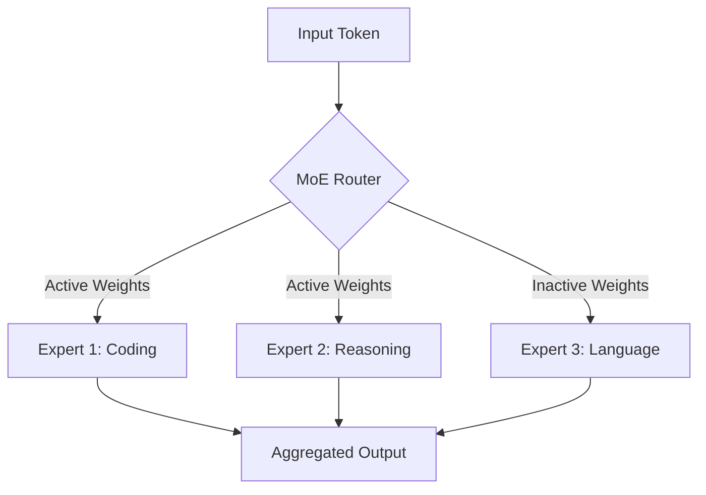

On **July 16, 2026**, Moonshot AI shook the artificial intelligence landscape by officially launching **Kimi K3**. Positioned as the company's new flagship model, Kimi K3 is officially the world's largest open-weight AI model to date, boasting an unprecedented **2.8 trillion parameters** structured as a Mixture of Experts (MoE). 

Kimi K3 represents a significant milestone in open-source AI, offering native multimodality, advanced reasoning capabilities, and an expansive **1 million token context window** that rivals closed-source state-of-the-art systems.

---

## Architectural Scaling: 2.8T Mixture of Experts (MoE)

Scaling a model to 2.8 trillion parameters requires intelligent design to remain computationally viable. Moonshot AI achieved this through a highly optimized Mixture of Experts architecture coupled with a new attention mechanism:

At its core, Kimi K3 uses a hybrid linear attention mechanism named **Kimi Delta Attention (KDA)** and **Attention Residuals** to dramatically lower memory bandwidth requirements during long-context inference. While the model has 2.8T total parameters, only a small fraction of these weights are active per query, maximizing throughput and reducing cost.

---

## Frontier Capabilities & API Pricing

Kimi K3 natively supports vision inputs alongside text, allowing it to interpret images, schematics, and screenshots directly. The model is available in two main configurations:
* **K3 Max**: Tailored for general conversational interface and agentic logic.
* **K3 Swarm Max**: Designed for massively parallel workflows and swarm orchestrations.

### Model Cost Comparison Matrix

| Model | Parameter Access | Input Cost / Million | Output Cost / Million | Context Window |
| :--- | :--- | :--- | :--- | :--- |
| **Kimi K3** | Open-Weight / API | **$3.00** | **$15.00** | **1,000,000** |
| **GPT-5.6 Soul** | Proprietary API | $6.00 | $30.00 | 1,000,000 |
| **Claude Fable 5**| Proprietary API | $10.00 | $50.00 | 200,000 |

While Kimi K3 is priced higher than standard developer-focused open-weight models, it undercuts the leading proprietary flagships (GPT-5.6 Soul and Claude Fable 5) by more than 50% on API costs. Moonshot AI intends to publish the full open-weights on **July 27, 2026**, enabling developers to self-host and customize the model directly.

---

## Image Asset Specifications

* **Hero Image**:
  - **Prompt**: "Premium clean developer editorial illustration. A glowing abstract neural network cloud with Mixture-of-Experts routers, light background, pastel colors (blue, lavender, white), vector-like clean gradients."
  - **Filename**: "kimi-k3-news-hero.png"
  - **Alt text**: "Kimi K3 open-weight model announcement illustration"
  - **Caption**: "Kimi K3 scales open-weights to 2.8 trillion parameters using Mixture-of-Experts."
  - **Placement**: Top of page
  - **Purpose**: Hero image introducing Kimi K3 release
  - **Aspect ratio**: 16:9
* **Supporting Visual 1**:
  - **Prompt**: "Minimalist UI displaying routing paths and database layers, clean vector card design on a soft grey canvas with pastel violet details."
  - **Filename**: "kimi-k3-moe-structure.png"
  - **Alt text**: "Mixture of Experts routing schematic"
  - **Caption**: "Kimi K3 uses a Mixture-of-Experts (MoE) routing layout to selectively activate parameters."
  - **Placement**: Under 'Architectural Scaling' section
  - **Purpose**: Clarify MoE parameter routing logic
  - **Aspect ratio**: 4:3
* **Supporting Visual 2**:
  - **Prompt**: "Modern clean comparison table styling, financial data visualization with soft blue and green graphs, editorial style."
  - **Filename**: "kimi-k3-pricing-comparison.png"
  - **Alt text**: "API token pricing comparison bar chart"
  - **Caption**: "Kimi K3 provides frontier-class reasoning at a fraction of the cost of proprietary counterparts."
  - **Placement**: Under 'Frontier Capabilities & API Pricing' section
  - **Purpose**: Highlight Kimi K3 cost savings compared to closed-source flagships
  - **Aspect ratio**: 4:3
