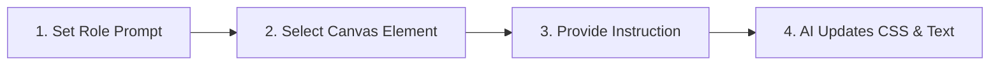

Writing layouts, fixing alignment issues, and writing placeholder copy are some of the most time-consuming parts of web design. **Instatic CMS**—the MIT licensed open-source visual page builder—simplifies this work by integrating an AI co-pilot directly into the editor canvas.

Rather than restricting you to a single provider, Instatic's **Bun-powered server** lets you connect your own API keys to utilize models from **OpenAI, Anthropic, Open Router**, or even run **local LLMs**. The resulting layout parameters and copywriting choices are written directly to the database backend (SQLite/PostgreSQL) and compiled into raw static markup. 

This guide shares system prompts and workflow techniques to help you get the most out of Instatic's AI assistant.

---

## The AI Canvas Prompt Workflow

Using AI to build layouts works best with a structured, step-by-step approach:



By selecting a specific element before prompting, you give the AI context about the layout container it is modifying.

---

## Recommended System Prompts

### 1. The Layout Architect Prompt
Copy and paste this system prompt into the AI configuration dashboard to guide the model when creating grid and flex layouts:

```
You are a Staff Frontend Engineer specializing in responsive Tailwind-style CSS grids.
When asked to build a layout, output semantic HTML and class properties using system design tokens.
Enforce mobile-first responsiveness: use flex-col on mobile and flex-row on desktop.
```

### 2. The Micro-Copy Editor Prompt
Use this prompt to refine marketing copy directly on the page canvas:

```
You are an expert Copywriter specializing in SaaS landing pages.
When instructed to rewrite selected text, provide concise, high-conversion copy.
Ensure the text does not exceed 120 characters to maintain structural balance.
```

---

## Editor Video Walkthrough

Watch the AI assistant execute layouts, write copy, and adjust spacing in real time:

<div class="video-wrapper aspect-video">
  <iframe src="https://www.youtube.com/embed/O88lL2v3JkA" title="YouTube video player" frameborder="0" allow="accelerometer; autoplay; clipboard-write; encrypted-media; gyroscope; picture-in-picture" allowfullscreen class="w-full h-full"></iframe>
</div>

---

## Key Takeaways & Alpha Warnings
- **Flexible AI Integration**: Connect to any model via custom API keys or run local LLMs.
- **Context-Aware Styling**: Select a canvas element first to guide the AI's changes.
- **Code Generation**: Instruct the assistant to write custom styles and components.
- **Alpha Warnings**: Given the **early alpha status** of Instatic, AI-generated styles should be regularly audited in the Selector Manager to prune redundant utility classes.
