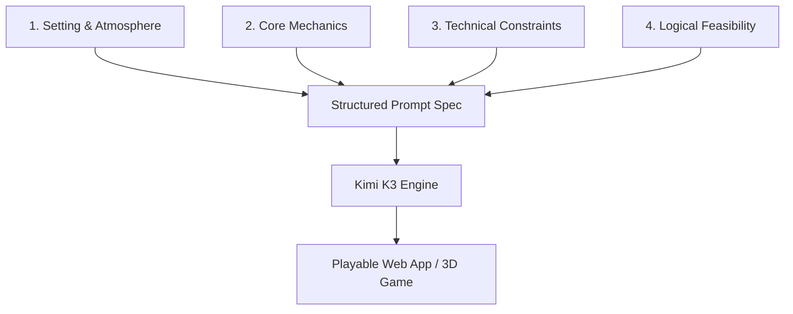

When working with frontier-scale LLMs like Moonshot AI's **Kimi K3**, it is tempting to credit high-quality application output purely to the model's 2.8 trillion parameter count. However, evaluation shows that output quality depends just as heavily on the structure of the prompt. 

A vague, single-line instruction will result in boilerplate or half-baked code. To generate complex, production-ready outputs—such as playable 3D games, browser utilities, or visual mockups—you must adopt a structured scripting method: **The 4-Pillar Prompt Engineering Framework**.



---

## Breakdown of the 4 Pillars

### 1. Setting and Atmosphere
Describe the environment, context, and aesthetic before anything else. Instead of asking for a generic "shooter game," specify the exact thematic elements:
* **Generic**: "A retro room."
* **Structured**: "A late 1990s desktop computer setup inside a dimly lit bedroom, CRT glass curvature, flickering power indicator, dust particles visible under a desk lamp."

Providing specific sensory details gives the model a concrete visual anchor, translating directly into precise styling variables and customized CSS layouts.

### 2. Core Mechanics
Define the precise functional specifications, rules, inputs, and states. Treat this as a game design document:
* Define controls (e.g., WASD for movement, Mouse to aim).
* Outline scoring parameters and state progression (how points are scored, levels increment, and win/lose states trigger).
* Specify dynamic micro-interactions (e.g., screen shake on hit, active UI button scaling on hover).

### 3. Technical Constraints
This is the most critical pillar for getting code that actually compiles and runs on the first try. You must force the model to solve problems from first principles rather than relying on heavy frameworks:
* **Deliverable Format**: Restrict output to a single, self-contained `index.html` file.
* **Dependencies**: Enforce "no external packages, no CDN script imports, use vanilla JavaScript and inline canvas APIs."
* **Scope**: Require all CSS, logic, and assets to be embedded directly inside the single file.

### 4. Logical and Physical Feasibility
Ensure the generated object respects physical or structural constraints. For software, this means logic path safety; for physical designs (like 3D printing specs), this means physical tolerances:
* Require support-free geometry and specify moving-part tolerances (e.g., "leave 0.4mm gap between gears").
* Mandate proper aspect ratios, container nesting rules, and screen resolution safety margins.

---

## The Master Game Developer Prompt Template

Use the following template to prompt Kimi K3 when generating browser-based apps or mini-games:

```markdown
Role: Senior Creative Technologist & Game Architect

Act as an expert frontend game developer. Construct a fully playable game based on the following spec:

1. SETTING & ATMOSPHERE:
   - Visual style: [Describe aesthetic, e.g., neon synthwave, monochrome wireframe]
   - Colors: [List exact hex or color family]
   - Sound/Visual Feedback: [Describe screen shake, particles, color flashes]

2. CORE MECHANICS:
   - Primary Control Scheme: [e.g., mouse click, arrow keys]
   - Mechanics: [Describe how to play, target spawning, scoring, and life counts]
   - State Handling: [Start screen, gameplay loop, game over screen with restart button]

3. TECHNICAL CONSTRAINTS:
   - Output: Return ONLY one valid, clean, self-contained HTML file.
   - Code Style: Vanilla JS inside script tags, Vanilla CSS inside style tags. Zero external asset URLs or CDNs.

4. LOGICAL FEASIBILITY:
   - Maintain a stable 60 FPS requestAnimationFrame game loop.
   - Ensure boundary collisions are resolved cleanly without clipping.
```

By structuring your prompts using these four pillars, Kimi K3 can compile, organize, and output highly functional applications without getting lost in open-ended logic paths.

---

## Image Asset Specifications

* **Hero Image**:
  - **Prompt**: "Isometric high-end editorial graphic showing glowing translucent prompt blocks aligning into a clean pillar architecture, pastel blue and violet lights."
  - **Filename**: "structured-prompts-hero.png"
  - **Alt text**: "4-Pillar prompt engineering model schema"
  - **Caption**: "The 4-Pillar framework transforms loose ideas into rigorous specs for Kimi K3."
  - **Placement**: Top of page
  - **Purpose**: Title hero asset
  - **Aspect ratio**: 16:9
* **Supporting Visual 1**:
  - **Prompt**: "Minimalist workflow infographic, showing steps 1 to 4 with clean circular nodes and lines, soft pastel colors, clean vector design."
  - **Filename**: "prompt-workflow-diagram.png"
  - **Alt text**: "Prompting workflow sequence diagram"
  - **Caption**: "Sequence flowchart demonstrating the prompt ingestion and code compilation pipeline."
  - **Placement**: Under 'Breakdown of the 4 Pillars' section
  - **Purpose**: Visual step guide
  - **Aspect ratio**: 4:3
* **Supporting Visual 2**:
  - **Prompt**: "Modern clean user interface mockup of a 3D retro arcade game dashboard, neon cyan grid elements, high-tech pastel style."
  - **Filename**: "fps-game-screen.png"
  - **Alt text**: "UI mockup of generated browser arcade game"
  - **Caption**: "A playable retro arcade simulation built entirely with Kimi K3 using structured scripting."
  - **Placement**: Under 'The Master Game Developer Prompt Template' section
  - **Purpose**: Illustrate output feasibility
  - **Aspect ratio**: 4:3
