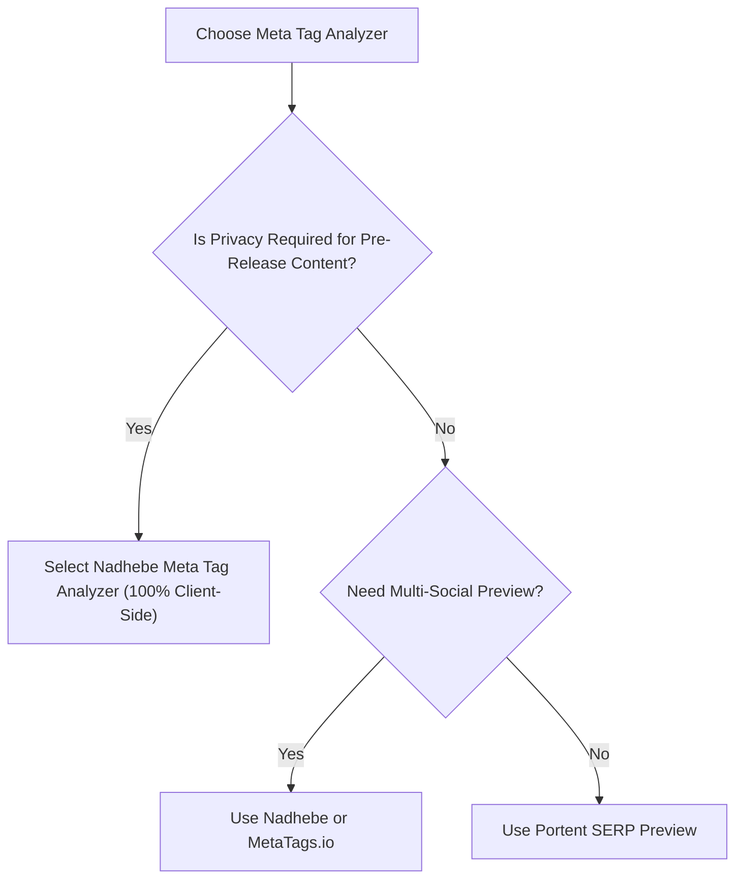

# 7 Best Free Meta Tag Analyzer Tools in 2026 (Tested & Ranked)

Optimizing title tags, meta descriptions, and social sharing cards is vital for organic search CTR and brand perception. However, not all meta tag analysis tools offer real-time visual previews or respect developer data privacy.

In this roundup, we review and rank the top 7 free meta tag analyzers available in 2026 based on speed, preview accuracy, client-side processing, and usability.

---

## Tool Comparison Summary

| Tool Name | Real-Time Preview | Client-Side Privacy | Code Generator | Overall Rating |
| :--- | :--- | :--- | :--- | :--- |
| **1. Nadhebe Meta Tag Analyzer** | **Yes (SERP + Social)** | **100% Client-Side** | **Yes (One-Click)** | **9.6 / 10** |
| **2. HeyMeta** | Yes (Social Only) | Server-Dependent | Partial | 8.2 / 10 |
| **3. LocalSEOChecklist Meta Inspector** | Basic Text Readout | Server-Dependent | No | 7.8 / 10 |
| **4. SmallSEOTools Meta Checker** | Text List | Server-Dependent | No | 7.5 / 10 |
| **5. Portent SERP Preview Tool** | SERP Only | Client-Side | No | 8.4 / 10 |
| **6. MetaTags.io** | Yes (Multi-Social) | Server-Dependent | Yes | 9.0 / 10 |
| **7. Counting Characters Meta Tool** | Text Counters | Client-Side | No | 7.2 / 10 |

---

## 1. Nadhebe Meta Tag Analyzer (Top Pick)

Our own [Meta Tag Analyzer](/tools/meta-tag-analyzer/) is built specifically for modern web developers, technical SEOs, and content strategists who demand speed, visual precision, and privacy.

### Key Highlights:
- **Simultaneous Previews**: Displays live Google Search SERP snippets alongside OpenGraph and Twitter/X social media card previews.
- **100% Private Client-Side Engine**: All calculations occur in your browser; no draft text or URLs leave your machine.
- **Pixel-Precise Truncation Logic**: Calculates title length against Google's desktop 600px boundary.
- **Clean HTML Generator**: Instantly produces formatted, copy-pasteable `<head>` code.

Try it now: [Nadhebe Meta Tag Analyzer](/tools/meta-tag-analyzer/)

---

## 2. MetaTags.io

MetaTags.io is a popular tool for experimenting with social media previews across platforms like Google, Facebook, Twitter, and LinkedIn.
- **Pros**: Clean UI, multi-platform preview cards.
- **Cons**: Requires active server fetching for remote image URLs.

---

## 3. Portent SERP Preview Tool

Portent's utility focuses exclusively on Google search snippet pixel widths.
- **Pros**: Accurate pixel ruler for desktop titles.
- **Cons**: Lacks OpenGraph and Twitter Card social preview capabilities.

---

## Selection Criteria Diagram

---

## Frequently Asked Questions

### Why choose a client-side meta tag analyzer over a server-based crawler?
Client-side tools evaluate draft text instantly without needing a live, published URL. They also prevent unreleased headlines or confidential campaign URLs from being logged on third-party servers.

---

## References

1. Google Search Central — *Control your search snippets*: https://developers.google.com/search/docs/appearance/snippet
2. OpenGraph Protocol: https://ogp.me
