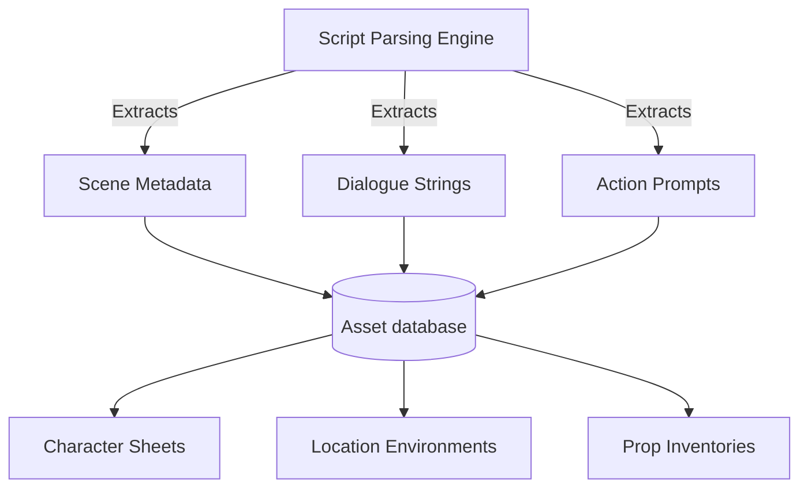

Modern creative workflows are undergoing a rapid transformation. In AI-powered filmmaking, the challenge is no longer generating a single impressive image, but rather orchestrating hundreds of sequential shots while maintaining consistency.

Google Flow’s **Storyboard Studio** is built specifically to address this challenge. In this feature review, we analyze its automated script parser, evaluate its asset database structure, and compare its generation modes.

---

## Traditional vs. Storyboard Studio Workflows

Before analyzing its features, we compare how Storyboard Studio simplifies the pre-production workflow:

| Pipeline Stage | Legacy AI Video Workflow | Storyboard Studio Workflow |
| :--- | :--- | :--- |
| **Script Breakdown** | Manual copy-pasting of scene descriptions | Automatic parsing of actions and dialogues |
| **Asset Consistency** | Re-typing prompts with character seed values | Re-using linked profile reference sheets |
| **Frame Planning** | Ad-hoc text prompting for each shot | Automatic render based on scene actions |
| **Voice Over** | Separate generation and video editing | Gated voice selection inside the workspace |

---

## Technical Feature Breakdown



### 1. Script Segmentation Engine
When you paste a script into Storyboard Studio, the engine runs a parsing routine. It evaluates script formatting to separate description blocks from dialogue, outputting structured JSON cards:

```json
{
  "scene_id": 1,
  "location": "INT. LAB - DAY",
  "action": "A scientist adjusts a glassmorphic interface card.",
  "dialogue": [
    {
      "character": "Sophia",
      "text": "The initialization sequence is complete."
    }
  ]
}
```

This parsed data is then used to autofill character reference sheets and coordinate location settings automatically.

### 2. Gated Asset Database
The Assets panel manages project assets. It splits items into:
- **Characters**: Facial features, expressions, and clothing styles.
- **Locations**: Lighting parameters, background colors, and composition styles.
- **Props**: Handheld objects, tools, and technical devices.

Linking character and environment profiles to your storyboard panels ensures consistent visuals across subsequent generations.

### 3. Prompt Optimization Modes
During the final animation step, users can choose between **Standard Mode** and **Agent Mode**:
- **Standard Mode**: Requires developers to write detailed camera angles, lighting conditions, and rendering parameters manually.
- **Agent Mode**: Automatically constructs optimized rendering instructions. The user simply copies the script block and pastes it into the prompt box, and the system handles the camera movements, styling, and frame composition.

---

## Pros & Cons

### Pros
- Saves significant pre-production time by automating script breakdowns.
- Asset database maintains character, location, and prop consistency.
- Voice assignments and preview controls are integrated directly into the workspace.
- Agent Mode simplifies prompt generation.

### Cons
- Lacks dynamic auto-save; closing the browser window can cause data loss.
- Custom style models are limited compared to standalone image generation platforms.

---

## Editorial Image Asset Checklist

### 1. Hero Image
- **Prompt**: Minimalist, clean 3D render of an editor screen showing timeline panels and character profile templates. Sky blue and mint gradients, lots of white space, daylight look.
- **Filename**: `/images/tools/google-flow-studio-hero.png`
- **Alt Text**: Interface dashboard showing timeline and character reference assets.
- **Caption**: Figure 1: Storyboard Studio's asset editor canvas.
- **Placement**: Directly below the frontmatter title.
- **Purpose**: Establishes the layout structure of Storyboard Studio.
- **Aspect Ratio**: 16:9

### 2. Supporting Visual 1
- **Prompt**: Visual card representing visual style presets, displaying "3D Animation", "Sketch Art", and "Photorealistic" icons on a soft gray background.
- **Filename**: `/images/tools/visual-presets-panel.png`
- **Alt Text**: Display of visual preset options in Storyboard Studio.
- **Caption**: Figure 2: Visual styling preset cards.
- **Placement**: Under the "Visual presets" FAQ section.
- **Purpose**: Illustrates the interface styling presets.
- **Aspect Ratio**: 16:9

### 3. Supporting Visual 2
- **Prompt**: Clean schematic diagram displaying a parsed script block alongside a generated storyboard frame, white background, soft shadow.
- **Filename**: `/images/tools/parsed-frame-relation.png`
- **Alt Text**: Visual mapping of a script segment to a rendered panel.
- **Caption**: Figure 3: Linking parsed script data to generated storyboard panels.
- **Placement**: Under the "Script Segmentation Engine" section.
- **Purpose**: Visualizes the relationship between text inputs and visual outputs.
- **Aspect Ratio**: 16:9

---

## Key Takeaways
- **Pipeline Optimization**: Storyboard Studio consolidates script parsing, asset tracking, and rendering into a single workflow.
- **Consistent Assets**: The integrated database maintains design consistency across characters, locations, and props.
- **Interactive Prototyping**: Autofill features allow creators to prototype scenes quickly before generating final animations.
- **Smart Prompting**: Agent Mode handles prompt configuration, reducing manual writing for filmmakers.

---

## Internal Linking Opportunities
- Watch the tutorial walkthrough in our [Google Flow Storyboard Studio video guide](file:///c:/Users/jasva/Nadhebe/src/content/youtube-articles/google-flow-storyboard-studio-tutorial.md).
- Follow our complete, step-by-step filmmaking process in the [Google Flow AI Filmmaking Tutorial](file:///c:/Users/jasva/Nadhebe/src/content/tutorials/google-flow-storyboard-studio-ai-filmmaking.md).
- Learn about system orchestration in [Multi-Model Gateways Guide](file:///c:/Users/jasva/Nadhebe/src/content/guides/multi-model-orchestration-api-gateways.md).
