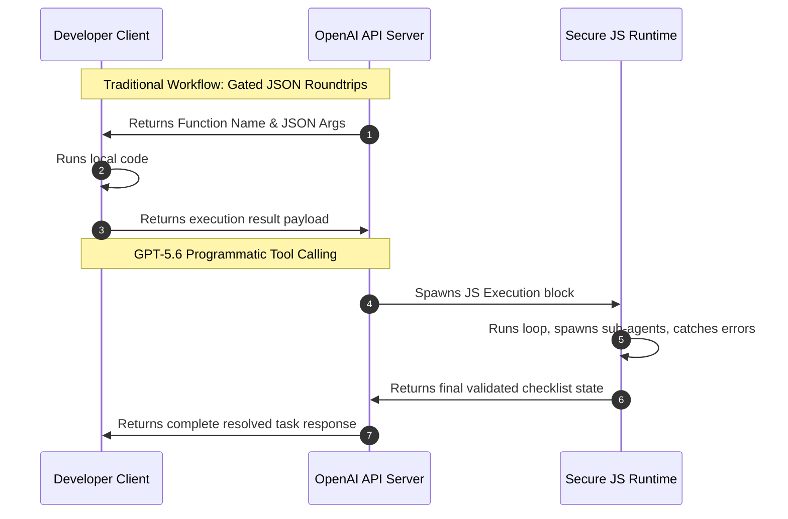

One of the most significant developer updates in OpenAI's **GPT-5.6 Autonomous Engine** is the shift from client-side JSON parsing to **programmatic tool calling**. 

In this guide, we explore the mechanics of programmatic tool calling, show how to configure native sub-agent workflows, and analyze the financial impact of explicit prompt cache breakpoints.

---

## The Evolution of Tool Interaction

Traditional function calling required a constant round-trip between the API server and the developer's client application. The model outputted a structured JSON target, the client executed the function, sent the result back, and waited for the next step.



GPT-5.6 bypasses client-side gating by executing orchestration code directly inside a secure JavaScript sandbox. Instead of return-and-receive steps, the model writes complete, logical blocks that run, check errors, and resolve workflows autonomously.

---

## Native Multi-Agent Orchestration

Using programmatic tool execution, developers can invoke parallel processing. The model can divide a large task by spawning a pool of sub-agents to handle specific sub-tasks simultaneously:

```javascript
// Native API structure for spawning and monitoring sub-agents
import { OpenAI } from "openai";

const client = new OpenAI();

const response = await client.agents.orchestrate({
  model: "gpt-5.6-soul",
  instructions: "Refactor the authentication module and patch any security leaks.",
  tools: [
    { type: "file_system_access" },
    { type: "shell_sandbox" }
  ],
  agentPool: {
    maxWorkers: 3,
    strategy: "parallel"
  }
});

console.log(`Task resolved with code: ${response.summary}`);
```

### Workflow Execution Strategy

1. **Analysis**: The primary model analyzes the workspace and creates a step-by-step checklist.
2. **Worker Allocation**: It spawns up to 3 sub-agents to scan files, extract schemas, and fetch logs in parallel.
3. **Validation Loop**: It aggregates worker outputs and runs tests. If a test fails, the primary model self-corrects and reruns the process.
4. **Final Commit**: The client receives a clean patch only after all internal validation checks pass.

---

## Managing Costs: Explicit Prompt Cache Breakpoints

Processing large contexts (up to 1 million tokens) over multi-step agent loops can quickly become expensive. To address this, OpenAI introduced **explicit prompt cache breakpoints**.

Unlike previous implicit caches, which could expire unpredictably, GPT-5.6 allows developers to set strict cache breakpoints in their API payloads. These blocks are guaranteed to persist for a **minimum of 30 minutes**.

```json
{
  "model": "gpt-5.6-soul",
  "messages": [
    { "role": "system", "content": "Analyze codebase..." },
    { "role": "user", "content": "..." }
  ],
  "cache_breakpoints": [
    { "index": 0, "label": "system_instructions" },
    { "index": 1, "label": "repository_index" }
  ]
}
```

By caching the system prompt and code repository structures at explicit checkpoints, subsequent API requests avoid reprocessing unchanged tokens, reducing input costs by up to **80%**.

---

## Comparison: Programmatic vs. Gated Tool Execution

| Capabilities | Programmatic Tool Calling (GPT-5.6) | Gated Function Calling (Legacy) |
| :--- | :---: | :---: |
| **Execution Host** | OpenAI Secure JS Sandbox | Client Application |
| **Round-Trip Delay** | Low (Internal loops) | High (Client-server hops) |
| **Error Correction** | Autonomous (Self-try/catch) | Client-driven instructions |
| **Multi-Agent Pools** | Native (Parallel allocation) | Custom framework required |
| **Prompt Caching** | Explicit (30-min minimum) | Implicit (Vague lifetime) |

---

## Editorial Image Asset Checklist

### 1. Hero Image
- **Prompt**: Minimalist, clean 3D illustration of structured JavaScript codeblocks translating into execution arrows and server ports. Soft sky-blue and white gradients, glassmorphism panel overlay, daylight look.
- **Filename**: `/images/tools/gpt-5-6-tool-calling-hero.png`
- **Alt Text**: JavaScript codeblocks executing inside an API pipeline container.
- **Caption**: Figure 1: Programmatic tool calling executes code loops inside a secure sandbox.
- **Placement**: Directly below the frontmatter title.
- **Purpose**: Represents the code execution and script orchestration theme of the article.
- **Aspect Ratio**: 16:9

### 2. Supporting Visual 1
- **Prompt**: Visual layout of prompt caching layers, showing "Prompt Cache Hit" highlighted in bright mint, floating over a light gray digital card structure.
- **Filename**: `/images/tools/prompt-cache-layers.png`
- **Alt Text**: Schematic of explicit prompt caching breakpoints.
- **Caption**: Figure 2: Breakpoints preserve context states to reduce API costs.
- **Placement**: Under the "Explicit Prompt Cache Breakpoints" section.
- **Purpose**: Clarifies how prompt cache optimization functions.
- **Aspect Ratio**: 16:9

### 3. Supporting Visual 2
- **Prompt**: Clean, simple visual diagram showing one central circular node branching into three parallel rectangular workers, white background, soft shadows.
- **Filename**: `/images/tools/multi-agent-branching.png`
- **Alt Text**: Diagram of parent agent dividing tasks to three parallel worker agents.
- **Caption**: Figure 3: Native parallel execution framework.
- **Placement**: Under the "Native Multi-Agent Orchestration" section.
- **Purpose**: Illustrates the native multi-agent hierarchy.
- **Aspect Ratio**: 16:9

---

## Key Takeaways
- **Self-Contained Execution**: Programmatic tool calling allows models to execute code and handle errors inside a secure sandbox, reducing client round-trips.
- **Native Multi-Agent Pools**: Developers can coordinate parallel tasks directly through the API, bypassing complex external libraries.
- **Cache Optimization**: Explicit breakpoints guarantee a 30-minute cache lifetime, significantly reducing costs for large context files.
- **Validation-Driven DX**: The model's ability to run internal verification loops results in more reliable outputs.

---

## Internal Linking Opportunities
- Discover the launch announcement in our [GPT-5.6 Autonomous Engine review](file:///c:/Users/jasva/Nadhebe/src/content/youtube-articles/gpt-5-6-autonomous-engine.md).
- Understand safety regulations in our [GPT-5.6 Safety Delay analysis](file:///c:/Users/jasva/Nadhebe/src/content/news/gpt-5-6-trump-administration-safety-delay.md).
- Learn benchmark scores in [GPT-5.6 vs. Claude Fable 5 Comparison](file:///c:/Users/jasva/Nadhebe/src/content/comparisons/gpt-5-6-vs-claude-fable-5-benchmarks.md).
- Read how to use routing gateways in our [Multi-Model Orchestration Guide](file:///c:/Users/jasva/Nadhebe/src/content/guides/multi-model-orchestration-api-gateways.md).
