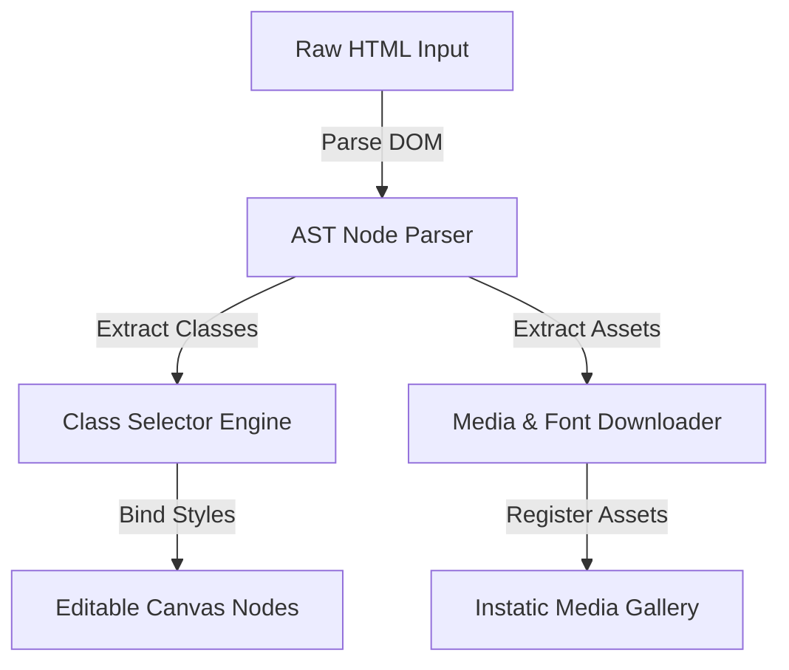

Migrating an existing website into a new content management system often requires rebuilding the layout from scratch. However, **Instatic CMS** simplifies this transition with its built-in website and HTML importing engines.

Rather than just copying raw code into an iframe, Instatic converts incoming markup directly into editable canvas elements, class selectors, and design tokens. This guide explains the mechanics behind the importer and how to manage site migrations.

---

## The Importer AST Pipeline

The importer parses incoming markup through a multi-step pipeline to make the elements visually editable:

This translation layer processes standard CSS rules and assets, making the imported page fully compatible with the visual styling panel.

---

## Step-by-Step HTML Section Migration

If you only need to migrate a single section (like a pricing grid or card layout), follow these steps:

1. **Copy the Source Code**: Inspect the source site and copy the wrapper container's outer HTML.
2. **Paste into the Importer**: Open the Instatic canvas, select the target parent node, and open the HTML block importer. Paste your snippet.
3. **Resolve Design Tokens**: Open the **Selector Manager** to merge any imported styling rules with your project's design system tokens.
4. **Optimize Assets**: Replace absolute image URLs with files uploaded to the Instatic media manager for faster loading.

---

## Platform Video Overview

Watch the importer process and convert external layouts into clean, editable visual elements:

  <iframe src="https://www.youtube.com/embed/O88lL2v3JkA" title="YouTube video player" frameborder="0" allow="accelerometer; autoplay; clipboard-write; encrypted-media; gyroscope; picture-in-picture" allowfullscreen class="w-full h-full"></iframe>

---

## Key Takeaways
- **No Rebuilding Required**: Convert raw HTML and CSS into editable canvas elements.
- **Unified Style Rules**: Use the Selector Manager to map imported classes to your design system.
- **Fast Block Imports**: Paste code snippets directly into the canvas to populate layouts instantly.
