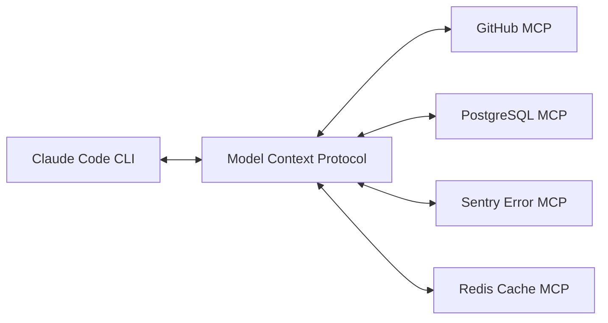

The ecosystem surrounding Anthropic's **Claude Code** CLI is expanding rapidly. Through the **Model Context Protocol (MCP)**, custom skills, subagent personas, and terminal extensions, developers can turn Claude Code into a customized agentic workstation integrated with databases, issue trackers, CI/CD pipelines, and cloud APIs.

This curated resource directory indexes the top verified **MCP Servers**, **Custom Skills**, **Subagent Personas**, and **IDE Integrations** available for Claude Code.

---

## 🔌 1. Top Verified Model Context Protocol (MCP) Servers

MCP servers provide standardized protocols for Claude Code to execute tools and read context from external infrastructure.

### Developer Infrastructure & Version Control

| MCP Server Name | Transport | Installation Command | Core Functionality |
| :--- | :--- | :--- | :--- |
| **GitHub MCP** | `stdio` | `claude mcp add github -- npx -y @modelcontextprotocol/server-github` | Inspect issues, pull requests, commit histories, and review comments. |
| **GitLab MCP** | `stdio` | `claude mcp add gitlab -- npx -y @modelcontextprotocol/server-gitlab` | Query GitLab merge requests, pipeline logs, and repository files. |
| **Docker MCP** | `stdio` | `claude mcp add docker -- npx -y @modelcontextprotocol/server-docker` | Inspect running containers, tail container logs, and analyze Dockerfiles. |

### Database & Storage Systems

| MCP Server Name | Transport | Installation Command | Core Functionality |
| :--- | :--- | :--- | :--- |
| **PostgreSQL MCP** | `stdio` | `claude mcp add postgres -- npx -y @modelcontextprotocol/server-postgres` | Inspect database schemas, execute parameterized SQL queries, and analyze query performance. |
| **SQLite MCP** | `stdio` | `claude mcp add sqlite -- npx -y @modelcontextprotocol/server-sqlite` | Query local SQLite database files (`.db`/`.sqlite`) directly inside your repository. |
| **Redis MCP** | `stdio` | `claude mcp add redis -- npx -y @modelcontextprotocol/server-redis` | Inspect Redis cache keys, TTL expiration, and data structures. |

### Observability & API Tools

| MCP Server Name | Transport | Installation Command | Core Functionality |
| :--- | :--- | :--- | :--- |
| **Sentry MCP** | `http` | `claude mcp add --transport http sentry https://mcp.sentry.io/query` | Fetch recent exception stack traces, error frequencies, and affected user sessions. |
| **Puppeteer MCP** | `stdio` | `claude mcp add puppeteer -- npx -y @modelcontextprotocol/server-puppeteer` | Headless browser automation: capture screenshots, scrape SPA rendered DOMs, and audit UI flows. |
| **Fetch/Web MCP** | `stdio` | `claude mcp add fetch -- npx -y @modelcontextprotocol/server-fetch` | Fetch and convert web pages into clean markdown context for Claude analysis. |

---

## 🛠️ 2. Essential Custom Skills (`.claude/skills/`)

Custom skills add reusable slash commands to interactive Claude Code sessions.

| Slash Command | File Location | Operational Blueprint Summary |
| :--- | :--- | :--- |
| **`/deploy`** | `.claude/skills/deploy/SKILL.md` | Runs tests, builds bundle, executes deployment script, and verifies health check endpoints. |
| **`/security-audit`** | `.claude/skills/security-audit/SKILL.md` | Audits uncommitted git diff for OWASP Top 10 vulnerabilities and hardcoded secrets. |
| **`/db-migrate`** | `.claude/skills/db-migrate/SKILL.md` | Generates non-breaking database migration scripts and updates ORM schema definitions. |
| **`/generate-docs`** | `.claude/skills/generate-docs/SKILL.md` | Scans exported functions and generates standard TSDoc/JSDoc block comments. |

---

## 🤖 3. Dedicated Custom Subagents (`.claude/agents/`)

Subagents define specialized AI worker personas with restricted toolsets.

| Subagent Name | Invocation Syntax | Specialized Persona Scope |
| :--- | :--- | :--- |
| **`code-reviewer`** | `@code-reviewer` | Senior code reviewer enforcing TypeScript strict mode, error handling, and test coverage. |
| **`qa-engineer`** | `@qa-engineer` | QA automation specialist generating comprehensive unit, integration, and E2E test suites. |
| **`docs-architect`** | `@docs-architect` | Documentation technical writer maintaining `CLAUDE.md`, API specs, and README references. |

---

## 💻 4. IDE Extensions & Shell Integrations

* **VS Code Extension:** Official *Claude Code* extension available on the VS Code Marketplace. Features side-by-side terminal integration, interactive diff previews, and `@editor` context sharing.
* **JetBrains Plugin:** Official plugin for IntelliJ IDEA, PyCharm, WebStorm, and GoLand.
* **Flicker-Free Terminal Config (`CLAUDE_CODE_NO_FLICKER=1`):** Adds smooth streaming line-by-line rendering and mouse scrolling to Zsh and Bash terminals.

---

## Related Guides & Workflows

* For complete command cheat sheets, explore [Claude Code Cheat Sheet](/tutorials/claude-code-cheat-sheet-commands-shortcuts).
* For custom skill authoring walkthroughs, read [How to Build Custom Claude Code Skills](/tutorials/how-to-build-custom-claude-code-skills).
* For desktop app configuration, see [Claude Desktop Download & Setup Guide](/tutorials/claude-desktop-download-installation-guide).
